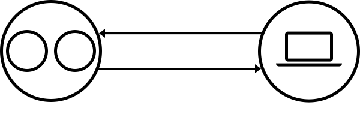

# webserv

**Веб-сервер на C++98 — проект School 42**

[](https://isocpp.org/) 
[](https://42.fr)

**webserv** — это учебная реализация высокопроизводительного веб-сервера, написанная строго по стандарту **C++98** в рамках проекта школы 42.

---

# Оглавление

1. [Общая информация](#общая-информация)
2. [Разбор требований к проекту](#разбор-требований-к-проекту)
3. [Конфигурационный файл (nginx-style)](#конфигурационный-файл)
4. [Файловая структура проекта](#файловая-структура-проекта)
5. [Разбор модулей проекта и flow программы](#разбор-модулей-проекта-и-flow-программы)
6. [Итоги и выводы](#итоги)

---

# Общая информация

## Что такое веб-сервер?

**Веб-сервер** — это программа (или аппаратно-программный комплекс), которая принимает по сети **HTTP-запросы** от клиентов (браузеры, мобильные приложения, другие сервисы), обрабатывает их согласно логике и возвращает **HTTP-ответы**.
Понятие «веб-сервер» может относиться как к аппаратной начинке, так и к программному обеспечению. Или даже к обеим частям, работающим совместно.

С точки зрения hardware, «веб-сервер» — это компьютер, который хранит файлы сайта (HTML-документы, CSS-стили, JavaScript-файлы, картинки и другие) и доставляет их на устройство конечного пользователя (веб-браузер и т.д.). Он подключён к сети Интернет и может быть доступен через доменное имя, подобное mozilla.org.

С точки зрения software, веб-сервер включает в себя несколько компонентов, которые контролируют доступ веб-пользователей к размещённым на сервере файлам, как минимум — это HTTP-сервер. HTTP-сервер — это часть ПО, которая понимает URL-адреса (веб-адреса) и HTTP (протокол, который ваш браузер использует для просмотра веб-страниц).

На самом базовом уровне, когда браузеру нужен файл, размещённый на веб-сервере, браузер запрашивает его через HTTP-протокол. Когда запрос достигает нужного физического веб-сервера, сервер HTTP (ПО) принимает запрос, находит запрашиваемый документ (если нет, то сообщает об ошибке 404) и отправляет обратно, также через HTTP.


<div align="center" style="padding: 20px; border-radius: 12px;">
    
</div>


Чтобы опубликовать веб-сайт, необходим либо статический, либо динамический веб-сервер.

Статический веб-сервер, или стек, состоит из компьютера ("железо") с сервером HTTP (ПО). Мы называем это «статикой», потому что сервер посылает размещённые файлы в браузер «как есть».

Динамический веб-сервер состоит из статического веб-сервера и дополнительного программного обеспечения, чаще всего сервера приложения и базы данных. Мы называем его «динамическим», потому что сервер приложений изменяет исходные файлы перед отправкой в ваш браузер по HTTP.

Например, для получения итоговой страницы, которую вы просматриваете в браузере, сервер приложений может заполнить HTML-шаблон данными из базы данных. Такие сайты, как MDN или Википедия, состоят из тысяч веб-страниц, но они не являются реальными HTML документами — лишь несколько HTML-шаблонов и гигантские базы данных. Эта структура упрощает и ускоряет сопровождение веб-приложений и доставку контента.

#### Типичный сценарий работы

Когда пользователь вводит в адресную строку браузера `https://example.com`:

1. Браузер обращается к **DNS**-серверу и получает IP-адрес сайта.
2. Устанавливается **TCP-соединение** с сервером (порт 80 для HTTP или 443 для HTTPS).
3. При использовании HTTPS выполняется **TLS Handshake** (согласование шифрования и проверка сертификата).
4. Браузер отправляет **HTTP-запрос**.
5. Веб-сервер (в нашем случае — **webserv**) принимает соединение, парсит запрос, определяет, что нужно вернуть, и формирует ответ.
6. Сервер отправляет **HTTP-ответ** (HTML, CSS, JS, JSON, изображение и т.д.).
7. Браузер получает ответ и отображает страницу пользователю.

---

## Где используются веб-серверы

Веб-серверы лежат в основе практически всего современного интернета:

- **Веб-сайты** — новостные порталы, интернет-магазины, блоги, социальные сети.
- **Backend API** — мобильные приложения, SPA (React, Vue, Angular), микросервисы.
- **Раздача статических файлов** — HTML, CSS, JavaScript, изображения, видео, документы.
- **Reverse Proxy** — посредник между клиентом и backend-приложением.
- **Load Balancer** — распределение нагрузки между несколькими серверами.
- **Встраиваемые системы**, IoT, внутренние корпоративные сервисы.

## Популярные веб-серверы и их различия

| Веб-сервер     | Язык      | Архитектура              | Сильные стороны                                      | Слабые стороны                          | Основное применение                     |
|----------------|-----------|--------------------------|------------------------------------------------------|-----------------------------------------|-----------------------------------------|
| **Apache**     | C         | Process/Thread-based     | Огромная экосистема модулей, .htaccess, гибкость    | Высокое потребление ресурсов            | Универсальные хостинги, PHP-проекты    |
| **Nginx**      | C         | Event-driven             | Высочайшая производительность, низкое потребление памяти, отличный reverse proxy | Более сложная конфигурация динамики    | Высоконагруженные проекты, CDN, API    |
| **Lighttpd**   | C         | Event-driven             | Лёгковесность, низкое потребление ресурсов          | Меньше функций                          | Встраиваемые системы, роутеры          |
| **Caddy**      | Go        | Event-driven             | Автоматический HTTPS из коробки, простота           | Относительно молодой проект             | Современные веб-проекты                |
| **Node.js**    | JS        | Event-driven (libuv)     | JavaScript на всём стеке, отличная экосистема      | Single-threaded, легко создать bottleneck | Real-time приложения, REST API         |
| **IIS**        | C#        | Thread-based             | Глубокая интеграция с Windows и .NET                | Только Windows                          | Корпоративная среда Microsoft          |


Наш проект **webserv** по архитектуре ближе всего к **Nginx** — event-driven модель с неблокирующими сокетами.

## Архитектуры веб-серверов

#### 1. Process-based (Apache Prefork)
Каждому клиенту — отдельный процесс.  
**Минусы**: огромный расход памяти, плохая масштабируемость.

#### 2. Thread-based (Apache Worker)
Каждому клиенту — отдельный поток.  
Лучше процессов, но при тысячах соединений возникают проблемы с памятью и context switching.

#### 3. Event-driven (Nginx, webserv)
Один или несколько потоков обслуживают тысячи клиентов одновременно.  
Используются **non-blocking sockets** + механизмы мультиплексирования (`select`, `poll`, `epoll`, `kqueue`).  
Сервер реагирует только на события готовности сокетов, не блокируя основной цикл.

---

## TCP — транспортная основа

**TCP (Transmission Control Protocol)** — надёжный, ориентированный на соединение транспортный протокол.

**Ключевые свойства:**
- Гарантированная доставка данных в правильном порядке.
- Повторная отправка потерянных пакетов.
- Управление потоком и перегрузкой.
- **Three-way handshake** при установке соединения (`SYN` → `SYN-ACK` → `ACK`).

В проекте мы работаем напрямую с **Berkeley sockets**:
- `socket()`, `bind()`, `listen()`, `accept()`
- `recv()`, `send()`
- `fcntl()` (для non-blocking режима)
- `select()` / `poll()` / `epoll()` для обработки множества соединений

<div align="center" style="padding: 20px; max-width=70%">
    
</div>


**Blocking vs Non-blocking:**
- **Blocking** — операция (например `recv()`) блокирует поток до появления данных.
- **Non-blocking** — возвращает управление сразу. При отсутствии данных — ошибка `EAGAIN` / `EWOULDBLOCK`.

---


## HTTP — протокол веб-сервера

**HTTP (HyperText Transfer Protocol)** — протокол прикладного уровня, представляет собой набор правил для связи между двумя компьютерами. HTTP является текстовым протоколом (все команды являются простым человекочитаемым текстом) без сохранения состояния (stateless).

### Основные версии

**HTTP/0.9** (1991)
- Только `GET`, ответ — чистый HTML.
- Крайне примитивный.

**HTTP/1.0** (1996)
- Добавлены `POST`, `HEAD`, статус-коды, заголовки.
- **Главный недостаток**: одно соединение = один запрос (соединение закрывается после ответа).

**HTTP/1.1** (1997, RFC 2616) ← **основная версия вашего проекта**
- **Persistent Connections** (`keep-alive`) — одно TCP-соединение обслуживает множество запросов.
- Обязательный заголовок `Host` (поддержка виртуальных хостов).
- `Chunked Transfer Encoding` — отправка ответа частями.
- Дополнительные методы: `PUT`, `DELETE`, `OPTIONS` и др.
- Значительно лучше производительность по сравнению с 1.0.

**HTTP/2** (2015)
- Бинарный протокол, мультиплексирование, сжатие заголовков, Server Push.

**HTTP/3** (2022)
- Работает поверх QUIC (UDP).
- Ещё меньше задержек, устранение head-of-line blocking.

## HTTPS

**HTTPS = HTTP + TLS/SSL**

Обеспечивает шифрование трафика, аутентификацию сервера и целостность данных.  
Работает на порту **443**.  
Перед передачей данных происходит **TLS Handshake**.

## Почему проект webserv важен

Реализация собственного веб-сервера даёт глубокое понимание:
- Как на самом деле работает современный веб.
- Низкоуровневого сетевого программирования.
- Event-driven архитектуры.
- Управления ресурсами и памятью в жёстких ограничениях C++98.
- Обработки ошибок, безопасности и производительности.

---
## I/O Multiplexing в webserv

**Мультиплексирование ввода-вывода (I/O Multiplexing)** — это метод программирования, позволяющий одному потоку (или процессу) отслеживать события ввода-вывода сразу от множества сетевых соединений или файлов. Вместо создания отдельного потока для каждого клиента, система ждет активности сразу во всех источниках, обрабатывая их по мере поступления.

**Как это работает (на примере)**

Представьте официанта (процесс), который обслуживает не один столик по очереди (блокирующий ввод-вывод), а сразу десять столиков одновременно.
1. Он не ждет, пока кто-то сделает заказ.
2. Вместо этого он периодически проверяет, кто из гостей уже готов сделать заказ, и подходит только к ним.
3. В остальное время он принимает заказы у других, не создавая очередей.

**Почему это необходимо**

В традиционной модели каждый запрос требует отдельного соединения или процесса. Если соединений тысячи, это приводит к перегрузке процессора и нехватке оперативной памяти. Мультиплексирование решает главные проблемы:
- Экономия ресурсов: Одно ядро процессора может обрабатывать десятки тысяч соединений одновременно.
- Устранение блокировок: Программа не "зависает" в ожидании ответа от одного медленного клиента.

Без него сервер на блокирующих сокетах работал бы так:

```cpp
while (true) {
    int fd = accept(listenFd, ...);
    recv(fd, buffer, size, 0);  // ← сервер полностью блокируется до получения данных
    // другие клиенты в это время не обслуживаются
}

```

Весь механизм обработки множества соединений в проекте `webserv` построен на системном вызове **`poll()`** (см. файлы `Server.hpp` и `Server.cpp`).

`poll()` выбран по следующим причинам:

- **Высокая портативность** — работает одинаково хорошо на Linux, macOS и других Unix-системах, что важно для проекта школы 42.
- **Отсутствие искусственного лимита** на количество дескрипторов (в отличие от `select()`, где лимит обычно 1024).
- **Удобный и понятный интерфейс** на основе массива структур `pollfd`.
- **Достаточная производительность** для задач проекта (обработка десятков-сотен одновременных соединений).
- Простота добавления новых типов дескрипторов (клиентские сокеты, pipe’ы CGI и т.д.).

`select()` в проекте **не используется**. Также не использовались Linux-specific `epoll()` или BSD-specific `kqueue()`, чтобы сохранить максимальную совместимость.

Как работает poll()

```cpp
int poll(struct pollfd *fds, nfds_t nfds, int timeout);
Структура pollfd:
C++struct pollfd {
    int   fd;      // файловый дескриптор для наблюдения
    short events;  // события, которые нас интересуют (POLLIN, POLLOUT и т.д.)
    short revents; // события, которые реально произошли (заполняется ядром)
};
```

Основные флаги событий:

POLLIN — на дескрипторе есть данные для чтения (или новое соединение на listen-сокете).
POLLOUT — можно безопасно писать данные.
POLLERR — ошибка.
POLLHUP — соединение закрыто (hang up).
POLLNVAL — недопустимый дескриптор.

---

#### Реализация poll() в классе Server:

1. Метод buildPollFds().

Перед каждым вызовом poll() полностью перестраивается массив дескрипторов:

Добавляются все listening-сокеты (POLLIN).
Для каждого активного клиента добавляется его сокет с событиями из Connection::wantedPollEvents().
Если у клиента запущен CGI — добавляются pipe’ы stdin и stdout с соответствующими событиями.

2. Основной цикл в Server::run():

```cpp
while (true) {
    buildPollFds();	// перестраиваем список
    int eventCount = ::poll(pollFds_.data(), pollFds_.size(), 1000);
    
    if (eventCount > 0) {
        for (size_t i = 0; i < pollFds_.size(); ++i) {
            if (pollFds_[i].revents == 0) continue;
            
            const FdEntry &e = fdEntries_[i];
            // диспетчеризация в зависимости от типа (LISTEN / CLIENT / CGI)
        }
    }
}
```

3. Параллельный массив FdEntry.

Чтобы быстро понимать, к какому типу относится каждый дескриптор, используется структура FdEntry с полями kind, ownerClientFd и ownerServerIndex.

4. Обработка событий:

```
FD_LISTEN → handleListenEvent() → acceptPendingConnections() (в цикле).
FD_CLIENT → handleClientEvent() → onReadable() / onWritable().
FD_CGI_* → handleCgiEvent() → обработка pipe’ов CGI.
```

Преимущества подхода с poll() в нашем проекте

- Один поток обслуживает все соединения.
- Минимальное время блокировки.
- Легко обрабатываются partial reads/writes, таймауты и ошибки.
- Чёткое разделение ответственности: *Server* занимается только multiplexing и диспетчеризацией, *Connection* — логикой HTTP-запроса и CGI.
- Полная совместимость с требованиями C++98 и проекта 42.

#### Заключение:

Использование poll() — это фундамент event-driven архитектуры webserv. Именно благодаря этому механизму сервер способен эффективно работать с большим количеством клиентов, имитируя поведение современных высокопроизводительных серверов вроде Nginx.
Это одна из самых важных и сложных частей проекта, которая даёт глубокое понимание низкоуровневого сетевого программирования.

---

# Разбор требований к проекту.

В данном разделе подробно описано соответствие кодовой базы сервера обязательным требованиям технического задания.

### 1. Конфигурационный файл
> *«Your program must use a configuration file, provided as an argument on the command line, or available in a default path.»*

* **Зачем это нужно:** Сервер не должен иметь «зашитых» (hardcoded) параметров. Он обязан гибко настраиваться под разные сайты, порты и директории через внешний файл.
* **Как это сделано:** * В `main.cpp` проверяется количество аргументов командной строки.
  * Если передан путь к файлу, вызывается фабричный метод `ConfigLoader::loadFromFile(path)`.
  * Если аргументов нет, вызывается `ConfigLoader::loadDefault()`, который генерирует базовую конфигурацию в памяти (класс `Config`, содержащий дефолтные структуры `ServerConfig` и `ListenConfig` на порт `8080`).
  * Лексический разбор файла выполняют классы `ConfigTokenizer` (разбиение на токены) и `ConfigParser` (построение объектов конфигурации с валидацией синтаксиса).

### 2. Запрет на использование сторонних серверов
> *«You cannot execve another web server.»*

* **Зачем это нужно:** Проект нацелен на глубокое понимание сетевого программирования на низком уровне. Использование `execve()` для запуска готового Nginx или Apache полностью обнуляет смысл задания.
* **Как это сделано:** Сетевой стек написан с нуля с использованием базовых системных вызовов POSIX (`socket`, `bind`, `listen`, `accept`, `recv`, `send`). Сторонние серверные бинарники не вызываются.

### 3. Неблокирующий ввод-вывод и устойчивость
> *«Your server must remain non-blocking at all times and properly handle client disconnections when necessary.»*

* **Зачем это нужно:** Блокирующий сокет замирает на вызове `recv()`, если клиент перестал слать данные, или на `send()`, если у клиента забит сетевой буфер. Один «медленный» или повисший клиент не должен парализовать работу всего сервера.
* **Как это сделано:**
  * Все слушающие и клиентские сокеты принудительно переводятся в неблокирующий режим с помощью `fcntl(fd, F_SETFL, O_NONBLOCK)` сразу после их создания/принятия.
  * В классе `Connection` реализованы состояния (`READING`, `CGI`, `WRITING`, `CLOSING`). Ввод-вывод прерывается, если системный вызов возвращает `EAGAIN`/`EWOULDBLOCK`, и управление возвращается в главный цикл.
  * Внезапные обрывы соединений со стороны клиентов обрабатываются проверкой возвращаемого значения `recv() == 0` или `send() < 0`. В таких случаях `Server` корректно удаляет объект `Connection` из карты и закрывает дескриптор.

### 4. Мультиплексирование через один poll()
> *«It must be non-blocking and use only 1 poll() (or equivalent) for all the I/O operations between the clients and the server (listen included).»*

* **Зачем это нужно:** Сервер является **однопоточным**. Единственный способ одновременно обрабатывать новых клиентов, читать запросы старых клиентов, отправлять им ответы и общаться с CGI-скриптами — это пропускать абсолютно все дескрипторы через один системный вызов мультиплексирования.
* **Как это сделано:**
  * В классе `Server::run()` крутится главный Event Loop (мастер-цикл).
  * Метод `Server::buildPollFds()` на каждой итерации собирает в единый вектор `pollFds_` **все** типы дескрипторов: слушающие сокеты (`FD_LISTEN`), сокеты активных клиентов (`FD_CLIENT`), а также дескрипторы каналов (pipes) для связи с запущенными CGI-процессами (`FD_CGI_STDIN`, `FD_CGI_STDOUT`).
  * Вызывается ровно один `::poll()`, который засыпает до появления событий на любом из этих FD.

### 5. Одновременный мониторинг чтения и записи
> *«poll() (or equivalent) must monitor both reading and writing simultaneously.»*

* **Зачем это нужно:** Чтобы не тратить процессорное время, сервер должен просить операционную систему уведомить его: «скажи, когда в сокет `A` придут байты (чтение) **И** когда в сокет `B` можно будет дописать следующую порцию данных (запись)».
* **Как это сделано:** Для каждого соединения через метод `Connection::wantedPollEvents()` динамически выставляются флаги в структуру `pollfd.events`. Если соединение находится в процессе чтения запроса, выставляется флаг `POLLIN`. Если сервер готов отдавать ответ — выставляется `POLLOUT`. В один и тот же вызов `poll()` разные сокеты могут мониториться на разные события одновременно.

### 6. Запрет на операции ввода-вывода в обход poll()
> *«You must never do a read or a write operation without going through poll() (or equivalent). Calling read/recv or write/send on these descriptors without prior readiness will result in a grade of 0.»*

* **Зачем это нужно:** Самая критическая ошибка в архитектуре неблокирующего сервера — вызвать `recv` или `send` «на удачу», не дождавшись флага готовности от `poll()`. Это превращает сервер в неэффективный цикл active polling, который грузит процессор на 100%, либо приводит к скрытым блокировкам.
* **Как это сделано:** В цикле `Server::run()` перед вызовом методов обработки строго проверяется поле `pollFds_[i].revents`. Методы `Connection::onReadable()` (вызывающий `recv`) и `Connection::onWritable()` (вызывающий `send`) вызываются **только тогда**, когда `poll()` явно установил флаги `POLLIN` или `POLLOUT` для данного дескриптора.

### 7. Запрет на подгонку логики через errno после I/O
> *«Checking the value of errno to adjust the server behaviour is strictly forbidden after performing a read or write operation.»*

* **Зачем это нужно:** Это специфическое требование школы для проверки чистоты архитектуры: код управления состояниями сокета не должен быть завязан на ручную проверку глобальной переменной `errno` (например, проверки на `EAGAIN`) прямо внутри бизнес-логики чтения/записи. 
* **Как это сделано:** Наш сервер опирается на явные сигналы готовности от `poll()`. Так как вызовы `recv()` и `send()` происходят строго *после* подтверждения готовности дескриптора, сервер обрабатывает только три факта: «прочитано $N$ байт», «прочитано 0 байт (клиент ушел)» или «ошибка вызова (возврат $<0$)». Логика переключения внутренних состояний объекта `Connection` полностью изолирована от низкоуровневого `errno`.

### 8. Исключение для регулярных файлов
> *«You are not required to use poll() (or an equivalent function) for regular disk files; read() and write() on them do not require readiness notifications. Regular disk files are exempt.»*

* **Зачем это нужно:** На большинстве UNIX-систем обычные файлы на диске всегда считаются «готовыми» для чтения и записи с точки зрения `poll()`. Передача их дескрипторов в `poll()` не имеет практического смысла и часто игнорируется ядром.
* **Как это сделано:** Чтение статических файлов с диска (например, через `Fs::readFileToString()`) или работа с дескриптором файла при стриминге больших файлов (`fileStreamFd_` в `Connection`) выполняются напрямую с помощью `read()` / `write()`, без их добавления в общий пул `pollFds_`.

### 9. Разрешение макросов мультиплексирования
> *«When using poll() or any equivalent call, you can use every associated macro or helper function»*

* **Зачем это нужно:** Позволяет легально использовать системные макросы для проверки событий.
* **Как это сделано:** В коде `Server.cpp` активно используются стандартные системные макросы и флаги, такие как `POLLIN`, `POLLOUT`, `POLLHUP` и `POLLERR` для анализа поля `revents`.

### 10. Защита от бесконечного зависания запросов
> *«A request to your server should never hang indefinitely.»*

* **Зачем это нужно:** Защита от атак типа Slowloris или кривых CGI-скриптов, которые уходят в бесконечный цикл и держат соединение открытым, расходуя ресурсы сервера.
* **Как это сделано:**
  * Для CGI-процессов в классе `Connection` заведено поле `cgiDeadline_`.
  * При старте CGI фиксируется текущее время + таймаут (например, 30 секунд). В главном цикле `Server` проверяет этот дедлайн. Если скрипт превысил лимит времени, сервер принудительно убивает дочерний процесс через `kill(cgiPid_, SIGKILL)`, закрывает пайпы и отправляет клиенту ошибку `504 Gateway Timeout`.

### 11. Совместимость с браузерами и сверка с NGINX
> *«Your server must be compatible with standard web browsers... NGINX may be used to compare headers and answer behaviours»*

* **Зачем это нужно:** Сервер должен быть боевым и соответствовать общепринятым стандартам протокола HTTP/1.1, чтобы корректно отображать сайты в Chrome, Safari или Firefox.
* **Как это сделано:** Наш парсер `HttpRequest` производит ловеркейс-нормализацию ключей заголовков (так как заголовки HTTP регистронезависимы). Фабрика ответов `HttpResponse` формирует стандартные блоки заголовков (`Content-Length`, `Content-Type`, `Connection: close/keep-alive`), полностью аналогичные по структуре ответам сервера Nginx.

### 12. Точные коды статусов и дефолтные страницы ошибок
> *«Your HTTP response status codes must be accurate. Your server must have default error pages if none are provided.»*

* **Зачем это нужно:** Браузер ориентируется на код ответа (например, редирект — это 301/302, нехватка прав — 403). Если страниц ошибок нет на диске, сервер не должен отдавать пустой сокет.
* **Как это сделано:**
  * Коды статусов жестко привязаны к результатам обработки (валидация размера тела ➡️ `413 Payload Too Large`, отсутствие файла ➡️ `404 Not Found`).
  * Функция `HttpResponse::buildErrorResponse(status)` проверяет, задан ли кастомный путь в `ServerConfig::error_pages`. Если файл отсутствует или не задан, сервер динамически генерирует строку с валидным HTML-кодом, содержащим красивую заглушку с кодом и описанием ошибки (например, `<html><body><h1>404 Not Found</h1>...`).

### 13. Ограничение на использование fork()
> *«You can’t use fork for anything other than CGI (like PHP, or Python, and so forth).»*

* **Зачем это нужно:** Архитектура сервера должна быть событийно-ориентированной (Event-driven), а не мультипроцессорной (как старый Apache pre-fork). `fork()` разрешен исключительно для изоляции выполнения сторонних скриптов.
* **Как это сделано:** Вызов `fork()` встречается в кодовой базе ровно один раз — внутри логики запуска CGI-скриптов (в модуле `CgiHandler`). Основной сервер никогда не ветвится для обработки сетевых клиентов.

### 14. Раздача статики, Upload файлов и HTTP-методы
> *«You must be able to serve a fully static website. Clients must be able to upload files. You need at least the GET, POST, and DELETE methods.»*

* **Зачем это нужно:** Это минимальный CRUD-функционал полноценного веб-сервера.
* **Как это сделано:**
  * **GET:** Класс `FilesystemHandler` сопоставляет URI с директорией `root`, проверяет существование файла через `Fs::classifyPath()` и отдает контент с автоматическим определением MIME-типа через `Http::guessContentType()` (поддерживаются `.html`, `.css`, `.js`, изображения и т.д.). Также реализован `autoindex` для генерации листинга папок на лету.
  * **POST:** `HttpRequest` инкрементально вычитывает тело запроса (поддерживается и `Transfer-Encoding: chunked`). Если запрос направлен на директорию, отмеченную в конфиге как `upload_dir`, сервер сохраняет переданный файл на диск.
  * **DELETE:** Сервер принимает запрос, проверяет права и физически удаляет файл с диска с помощью системного вызова `unlink()`, возвращая статус `200 OK` или `204 No Content`.

### 15. Стресс-тестирование и работа на нескольких портах
> *«Stress test your server to ensure it remains available at all times. Your server must be able to listen to multiple ports to deliver different content»*

* **Зачем это нужно:** Сервер обязан уметь держать под контролем несколько сетевых интерфейсов или портов одновременно (например, один сайт на 8080, второй — на 9090) и не падать под нагрузкой (например, при тестировании через `siege` или `wrk`).
* **Как это сделано:**
  * Метод `Server::setupListenSockets()` обходит массив конфигураций `cfg_.servers`. Для каждой директивы `listen` создается свой собственный сокет, привязывается к указанному порту/хосту через `bind()` и запускает `listen()`.
  * Все эти слушающие дескрипторы заносятся в карту `listenFdToServerIndex_` и одновременно мониторятся в `poll()`. При входящем соединении сервер точно знает, на какой именно порт пришел клиент, и применяет настройки (виртуальный корень `root`, правила `location`) именно этого логического сервера.
  * Устойчивость при стресс-тестах гарантируется полным отсутствием блокирующих вызовов и строгим контролем утечек памяти/дескрипторов (класс `Server` защищен от копирования через приватные конструкторы, предотвращая Double Close сокетов).

### 16. Ограничение области RFC (Виртуальные хосты)
> *«We deliberately chose to offer only a subset of the HTTP RFC. In this context, the virtual host feature is considered out of scope...»*

* **Зачем это нужно:** Упрощение требований — парсинг заголовка `Host` для разделения нескольких доменов на одном IP/порту не является обязательным (хотя структура `ServerConfig` спроектирована с учетом масштабирования и позволяет хранить `server_name` для последующей реализации при необходимости).


# конфигурационный-файл
## 1. Конфигурационный файл

> «Your program must use a configuration file, provided as an argument on the command line,
> or available in a default path.»

**Зачем это нужно.** Сервер не должен иметь «зашитых» (hardcoded) параметров. Он обязан
гибко настраиваться под разные сайты, порты и директории через внешний файл — как `nginx`.

**Как это сделано.** В `src/main.cpp` по количеству аргументов выбирается источник конфигурации:
путь к файлу → `ConfigLoader::loadFromFile`, иначе → `ConfigLoader::loadDefault` (порт 8080 в
памяти). Лексику разбирают `ConfigTokenizer` (токены) и `ConfigParser` (объекты + валидация).

**Сниппет** (`src/main.cpp:34-57`):

```cpp
Config cfg;
if (argc == 1)
    cfg = ConfigLoader::loadDefault();                 // дефолт в памяти (порт 8080)
else if (argc == 2)
{
    if (std::string(argv[1]) == "--check-config")      // только проверить и выйти
    {
        cfg = ConfigLoader::loadDefault();
        std::cout << GREEN << "OK: " << RESET << "default config" << std::endl;
        return 0;
    }
    cfg = ConfigLoader::loadFromFile(argv[1]);          // ./webserv conf/tester.conf
}
else if (argc == 3)                                    // ./webserv --check-config <file>
{
    if (std::string(argv[1]) != "--check-config") return printUsage();
    cfg = ConfigLoader::loadFromFile(argv[2]);
    std::cout << GREEN << "OK: " << RESET << argv[2] << std::endl;
    return 0;
}
Server s(cfg);
s.run();
```

**Пример проверки.**

```bash
./webserv --check-config conf/tester.conf   # синтаксис ОК → "OK: conf/tester.conf", exit 0
./webserv conf/tester.conf                  # запуск сервера на порту из конфига
```

---

## 2. Несколько `interface:port` (несколько сайтов)

> «Define all the interface:port pairs on which your server will listen to (defining multiple
> websites served by your program).»

**Зачем это нужно.** Один процесс должен обслуживать несколько сайтов на разных портах/адресах
одновременно — как виртуальные хосты в nginx.

**Как это сделано.** Каждый блок `server { ... }` → `ServerConfig`, каждая директива `listen` →
`ListenConfig` (`host:port`). В `Server::run()` для **каждой** пары открывается отдельный
слушающий сокет (`FD_LISTEN`), и все они обслуживаются **единым** `poll()`.

**Пример конфига** (`conf/2serv.conf` — два сайта):

```nginx
server {
    listen 127.0.0.1:8080;
    root ./www;
}
server {
    listen 127.0.0.1:8081;
    root ./www2;
}
```

**Пример проверки.**

```bash
curl -s -o /dev/null -w "%{http_code}\n" http://127.0.0.1:8080/   # 200 — первый сайт
curl -s -o /dev/null -w "%{http_code}\n" http://127.0.0.1:8081/   # 200 — второй сайт
```

---

## 3. Кастомные страницы ошибок

> «Set up default error pages.»

**Зачем это нужно.** Вместо «голого» кода ошибки отдавать осмысленную страницу.

**Как это сделано.** Любая ошибка собирается через `HttpResponse::buildErrorResponse(status)`.
Если пользовательская страница не задана — формируется встроенное тело `errorBody()`, а текст
статуса берётся из `reasonPhrase` (`src/HttpResponse.cpp:26`).

**Сниппет** (`src/HttpResponse.cpp`, как код → текстовая фраза):

```cpp
static std::string reasonPhrase(int code)
{
    switch (code)
    {
        case 200: return "OK";
        case 301: return "Moved Permanently";
        case 403: return "Forbidden";
        case 404: return "Not Found";
        case 405: return "Method Not Allowed";
        case 413: return "Payload Too Large";
        case 500: return "Internal Server Error";
        default:  return "Error";
    }
}
```

**Пример проверки.**

```bash
curl -s -i "$BASE/notfound" | head -1     # HTTP/1.1 404 Not Found + непустое тело
```

---

## 4. Ограничение размера тела запроса

> «Set the maximum allowed size for client request bodies.»

**Зачем это нужно.** Защита от исчерпания памяти: клиент не должен «положить» сервер гигантским
телом запроса.

**Как это сделано.** Директива `client_max_body_size` попадает в `EffectiveConfig`. В
`Connection::onReadable` размер тела сверяется с лимитом → **413 Payload Too Large**.

**Сниппет** (`src/Connection.cpp:604-609`):

```cpp
if (eff.hasClientMaxBodySize && request_.getContentLength() > eff.clientMaxBodySize)
{
    out_ = HttpResponse::buildErrorResponse(413);   // Payload Too Large
    state_ = WRITING;
    return true;
}
```

**Пример конфига** (`conf/tester.conf:11-14` — лимит 100 байт на маршруте):

```nginx
location /post_body {
    allow_methods POST;
    client_max_body_size 100;
}
```

**Пример проверки.**

```bash
PAYLOAD=$(head -c 200 /dev/zero | tr '\0' 'A')                       # 200 байт > лимита 100
curl -s -o /dev/null -w "%{http_code}\n" -X POST --data "$PAYLOAD" "$BASE/post_body"  # 413
```

---

## 5. Правила на маршруте (location)

> «Specify rules or configurations on a URL/route (no regex required here)…»

Маршрут выбирается по **самому длинному совпадающему префиксу** в `selectLocation`, после чего
настройки `server` и `location` сливаются в `buildEffectiveConfig`: значения из `location`
переопределяют значения из `server`.

**Сниппет — выбор location** (`src/Connection.cpp:59-83`):

```cpp
const LocationConfig *selectLocation(const std::vector<LocationConfig> &locations,
                                     const std::string &uri)
{
    const LocationConfig *best = NULL;
    std::size_t           bestLen = 0;
    for (std::size_t i = 0; i < locations.size(); ++i)
    {
        const std::string &prefix = locations[i].prefix;
        if (!Http::startsWithPrefix(uri, prefix)) continue;
        if (prefix.size() >= bestLen) { best = &locations[i]; bestLen = prefix.size(); }
    }
    return best;                       // самый длинный префикс
}
```

**Сниппет — слияние server → location** (`src/Connection.cpp:85-132`, фрагмент):

```cpp
EffectiveConfig buildEffectiveConfig(const ServerConfig &srv, const LocationConfig *loc)
{
    EffectiveConfig eff;
    if (srv.hasRoot)            { eff.hasRoot = true; eff.root = srv.root; }
    if (loc && loc->hasRoot)    { eff.hasRoot = true; eff.root = loc->root; }   // location важнее
    if (srv.hasIndex)           { eff.hasIndex = true; eff.index = srv.index; }
    if (loc && loc->hasIndex)   { eff.hasIndex = true; eff.index = loc->index; }
    // ... аналогично client_max_body_size, autoindex, allow_methods, upload_dir, redirect, cgi
    return eff;
}
```

### 5.1. Список разрешённых HTTP-методов

> «List of accepted HTTP methods for the route.»

**Как это сделано.** `isAllowedMethod` сверяет метод со списком `allow_methods`; иначе **405**.

**Сниппет** (`src/Connection.cpp:180-192` + проверка в `onReadable:622`):

```cpp
bool isAllowedMethod(const std::string &method, const EffectiveConfig &eff)
{
    if (!eff.hasAllowedMethods) return true;                 // нет ограничения — всё можно
    for (std::size_t i = 0; i < eff.allowedMethods.size(); ++i)
        if (eff.allowedMethods[i] == method) return true;
    return false;
}
// в onReadable:
if (!isAllowedMethod(request_.getMethod(), eff))
{
    out_ = HttpResponse::buildErrorResponse(405);            // Method Not Allowed
    state_ = WRITING; return true;
}
```

**Пример конфига** (`conf/tester.conf:7-9`): `location / { allow_methods GET; }`.

**Пример проверки.**

```bash
# location / разрешает только GET → POST даёт 405
curl -s -o /dev/null -w "%{http_code}\n" -X POST --data x "$BASE/"   # 405
```

### 5.2. HTTP-редирект

> «HTTP redirection.»

**Как это сделано.** Если задан `return`, запрос сразу получает
`HttpResponse::buildRedirectResponse(code, target)` с заголовком `Location:`.

**Сниппет** (`src/Connection.cpp:614-619`):

```cpp
if (eff.hasRedirect)
{
    out_ = HttpResponse::buildRedirectResponse(eff.redirectCode, eff.redirectTarget);
    state_ = WRITING; return true;
}
```

**Пример конфига:** `location /old { return 301 /new; }`.

**Пример проверки.**

```bash
curl -s -o /dev/null -D - "$BASE/old" | grep -i '^location'   # Location: /new
```

### 5.3. Корневая директория маршрута (root / alias)

> «Directory where the requested file should be located (e.g., if URL /kapouet is rooted to
> /tmp/www, URL /kapouet/pouic/toto/pouet will search for /tmp/www/pouic/toto/pouet).»

**Как это сделано.** URI → путь на диске через `safeJoin(root, uri)`, а при `alias` —
`safeJoinAlias`. Декодирование `%xx` выполняется **до** нормализации `..`, поэтому path traversal
(`/../../etc/passwd`, в т.ч. `%2e%2e`) блокируется кодом 403.

**Сниппет — защита от traversal** (`src/Path.cpp:185-199`):

```cpp
if (current == "..")
{
    if (segments.empty())          // .. пытается выйти выше root → нечего pop_back()
    {
        outStatus = 403;           // ← path traversal заблокирован
        return false;
    }
    segments.pop_back();
    current.clear();
    continue;
}
segments.push_back(current);       // обычный сегмент — добавляем к безопасному пути
```

**Пример конфига** (`conf/tester.conf:16-22` — alias подменяет префикс каталогом):

```nginx
location /directory/ {
    alias ./YoupiBanane/;          # /directory/foo  →  ./YoupiBanane/foo
}
```

**Пример проверки.**

```bash
curl -s -o /dev/null -w "%{http_code}\n" "$BASE/../../etc/passwd"   # 403/400, НЕ 200
```

### 5.4. Листинг каталога (autoindex)

> «Enabling or disabling directory listing.»

**Как это сделано.** Директива `autoindex on/off`. Каталог без индекс-файла + `autoindex on` →
`Autoindex::appendDirectoryListingHtml` строит HTML-список; иначе **404**.

**Пример конфига:** `location /files/ { autoindex on; }`.

**Пример проверки.**

```bash
curl -s "$BASE/files/" | grep -i '<a href'     # видим список ссылок на файлы
```

### 5.5. Файл по умолчанию для каталога (index)

> «Default file to serve when the requested resource is a directory.»

**Как это сделано.** Директива `index`. При запросе каталога `FilesystemHandler` сначала пробует
индекс-файл, потом autoindex/404. Каталог без завершающего `/` → **301** на путь со слэшем
(`tryRedirectToSlashLocation`), чтобы относительные ссылки работали.

**Пример конфига** (`conf/tester.conf:1-5`): `index index.html;`.

**Пример проверки.**

```bash
curl -s -o /dev/null -D - "$BASE/directory" | grep -i '^location'   # 301 → /directory/
curl -s -o /dev/null -w "%{http_code}\n" "$BASE/"                   # 200, отдан index.html
```

### 5.6. Загрузка файлов от клиента (upload)

> «Uploading files from the clients to the server is authorized, and storage location is provided.»

**Как это сделано.** Если в location задан `upload_dir`, `POST`/`PUT` идут в
`Connection::handleUpload`: тело сохраняется в каталог **циклом записи** (защита от частичного
`write`), ответ **201 Created**. Удаление — `handleDelete` для `DELETE`.

**Сниппет** (`src/Connection.cpp:441-479`, фрагмент):

```cpp
int fileFd = ::open(finalPath.c_str(), O_WRONLY | O_CREAT | O_TRUNC, 0644);
if (fileFd < 0) { prepareReply(Http::makeErrorReply(500)); return true; }

const std::string &body = request_.getBody();
const char *ptr = body.data();
std::size_t bytesLeft = body.size();
while (bytesLeft > 0)                          // дописываем, пока всё тело не на диске
{
    ssize_t written = ::write(fileFd, ptr, bytesLeft);
    if (written < 0) { ::close(fileFd); ::unlink(finalPath.c_str());   // чистим мусор
                       prepareReply(Http::makeErrorReply(500)); return true; }
    ptr += written; bytesLeft -= static_cast<std::size_t>(written);
}
::close(fileFd);
prepareReply(Http::makeReply(201, "text/plain", "File uploaded successfully.\n"));
```

**Пример конфига** (`conf/upload.conf`):

```nginx
location /upload/ {
    allow_methods POST;
    upload_dir ./www/uploads/;
}
```

**Пример проверки.**

```bash
curl -s -o /dev/null -w "%{http_code}\n" -X POST --data "hello" "$BASE/upload/my.txt"  # 201
cat www/uploads/my.txt                                                                 # hello
```

### 5.7. Выполнение CGI по расширению файла

> «Execution of CGI, based on file extension (for example .php).»

**Как это сделано.** `Http::isCgiRequest` определяет CGI по расширению (карта `ext → интерпретатор`).
Запуск — `Connection::startCgi` (`fork`/`execve`/`pipe`). Ключевые гарантии сабжекта:

- **Полный запрос доступен скрипту** — переменные окружения CGI/1.1 (`prepareCgiArgs`):

```cpp
// src/CgiHandler.cpp:113-135
outEnv.push_back("GATEWAY_INTERFACE=CGI/1.1");
outEnv.push_back("SERVER_PROTOCOL=HTTP/1.1");
outEnv.push_back("REQUEST_METHOD=" + req.getMethod());
outEnv.push_back("QUERY_STRING="  + Http::uriQueryOnly(req.getUri()));
outEnv.push_back("SCRIPT_FILENAME=" + scriptFsPath);
outEnv.push_back("PATH_INFO=" + pathInfo);
if (req.getMethod() == "POST" || req.getMethod() == "PUT")
{
    std::ostringstream oss; oss << req.getContentLength();
    outEnv.push_back("CONTENT_LENGTH=" + oss.str());     // тело пойдёт скрипту на stdin
}
```

- **Chunked → un-chunk, EOF = конец тела.** Сервер разбирает `Transfer-Encoding: chunked`
  (`parseChunkedBody`); скрипту конец тела сигнализируется закрытием его `stdin` (EOF).
- **Нет Content-Length от CGI → конец по EOF.** `parseCgiOutput` читает вывод до закрытия пайпа.
- **Правильный рабочий каталог.** Перед `execve` дочерний процесс делает `chdir(workDir)`.
- **Минимум один CGI.** Поддержаны Python и Bash (мульти-CGI — бонус).

**Пример конфига** (`conf/tester.conf:24-29` — два интерпретатора):

```nginx
location /cgi-bin/ {
    allow_methods GET POST;
    cgi .py /opt/pyenv/shims/python3;
    cgi .sh /bin/bash;
}
```

**Пример проверки.**

```bash
curl -s "$BASE/cgi-bin/test.py"   # вывод Python-скрипта, статус 200
curl -s "$BASE/cgi-bin/test.sh"   # вывод Bash-скрипта,   статус 200
```

---

## 6. Устойчивость и неблокирующая работа

> «Resilience is key. Your server must remain operational at all times.»

**Как это сделано.**
- **Единственный `poll()`** обслуживает чтение/запись на всех сокетах и CGI-пайпах. `read`/`write`
  вне poll-цикла нет.
- Все сокеты неблокирующие; частичные `recv`/`send` обрабатываются (накопить в буфер, дослать на
  следующем `POLLOUT`).
- Битый/неполный запрос не роняет сервер: парсер ждёт данных, ошибки → HTTP-коды, а не краш.

**Сниппет — частичное чтение не блокирует** (`src/Connection.cpp:525-545`):

```cpp
ssize_t n = ::recv(fd_, buf, sizeof(buf), 0);
if (n == 0) return false;                       // клиент закрыл соединение
if (n < 0)  return false;                       // ошибка — Server закроет соединение
in_.append(buf, n);
HttpRequest::State st = request_.parse(in_, maxHeaderBytes, maxBodyBytes);
// пока st == HEADERS/BODY — остаёмся в READING и ждём следующий recv (не блокируемся)
```

**Пример проверки.**

```bash
printf 'GET / HTTP/1.1\r\n' | nc -w1 "$HOST" "$PORT"   # неполный запрос
curl -s -o /dev/null -w "%{http_code}\n" "$BASE/"      # сервер жив → снова 200
```

Сборка — `-Wall -Wextra -Werror -std=c++98 -fsanitize=address`, без предупреждений.

---

# Файловая структура проекта

```
webserv/
├─ README.md
├─ Makefile
├─ include/
│  ├─ Autoindex.hpp
│  ├─ CgiHandler.hpp
│  ├─ Colors.hpp
│  ├─ Config.hpp
│  ├─ ConfigLoader.hpp
│  ├─ ConfigParser.hpp
│  ├─ ConfigTokenizer.hpp
│  ├─ Connection.hpp
│  ├─ EffectiveConfig.hpp
│  ├─ Filesystem.hpp
│  ├─ FilesystemHandler.hpp
│  ├─ HttpReply.hpp
│  ├─ HttpRequest.hpp
│  ├─ HttpResponse.hpp
│  ├─ Log.hpp
│  ├─ Mime.hpp
│  ├─ Path.hpp
│  └─ Server.hpp
├─ src/
│  ├─ main.cpp
│  ├─ Server.cpp
│  ├─ Connection.cpp
│  ├─ HttpRequest.cpp
│  ├─ HttpResponse.cpp
│  ├─ HttpReply.cpp
│  ├─ Mime.cpp
│  ├─ Autoindex.cpp
│  ├─ Filesystem.cpp
│  ├─ FilesystemHandler.cpp
│  ├─ Path.cpp
│  ├─ CgiHandler.cpp
│  ├─ Config.cpp
│  ├─ ConfigLoader.cpp
│  ├─ EffectiveConfig.cpp
│  ├─ ConfigTokenizer.cpp
│  └─ ConfigParser.cpp
├─ conf/
│  ├─ default.conf
│  ├─ minimal.conf
│  ├─ simple.conf
│  ├─ tester.conf
│  ├─ autoindex.conf
│  ├─ 2serv.conf
│  └─ my.conf
├─ www/
│  └─ (статический контент для тестов)
├─ YoupiBanane/
│  └─ (контент/структура под тестер из subject)
├─ tester
└─ cgi_tester
```

### Назначение директорий

- `include/` — заголовки модулей (интерфейсы).
- `src/` — реализации модулей.
- `conf/` — примеры конфигураций для демонстрации фич (multi-port, autoindex, upload, CGI).
- `www/` — статические файлы для ручных тестов браузером/curl.
- `YoupiBanane/` — набор файлов/страниц под проверяющий скрипт.
- `tester`, `cgi_tester` — тестеры из задания (прогоняем регулярно, фиксируем несовпадения).


# Разбор модулей проекта и flow программы

Карта глобального разбора Webserv (По шагам FLOW)
Этап 1. [Создание и парсинг](#создание-и-парсинг)
Этап 2. [Инициализация ядра](#инициализация-ядра)
Этап 3. [Жизненный цикл ](#конфигурационный-файл)
Этап 4. [](#файловая-структура-проекта)

[ЭТАП 1: Создание и Парсинг]
  main.cpp ──> ConfigLoader ──> ConfigTokenizer ──> ConfigParser ──> Config / Structures
                                                                            
[ЭТАП 2: Инициализация Ядра]                                                
  Server.cpp (Конструктор, создание мастер-сокетов, bind, listen, pollfd)
                                
[ЭТАП 3: Жизненный цикл Reactor-цикла (Мясо сервера)]
  Server::run() ──> Ожидание poll()
       ├──> Новое подключение? ──> accept() ──> Создание Connection
       └──> Активность на клиенте? ──> Connection::onReadable()
                                                   
[ЭТАП 4: Конвейер обработки HTTP и Генерация ответов]
       ├──> Парсинг запроса  ──> HttpRequest::parse()
       ├──> Роутинг/Матчинг  ──> EffectiveConfig (Выбор локации)
       ├──> Статический файл ──> FilesystemHandler / Autoindex / Потоковый стриминг
       ├──> Скрипты/Загрузка ──> handleDelete / handleUpload
       └──> Динамика/CGI     ──> startCgi ──> onCgiEvent (Пайпы, неблокирующий waitpid)
                                                   │
                                                   ▼
                                       Connection::onWritable() ──> send() клиенту

---

## Точка входа main():

### Сценарии запуска (Flow программы) с полным конфигом:

#### Сервер поддерживает гибкую логику запуска в зависимости от переданных аргументов командной строки:

У нас есть три железных сценария работы, зашитых в main:

    * argc == 1 — Запуск ./webserv. Никаких аргументов. Вызывается ConfigLoader::loadDefault(). Мы его разобрали — создается 1 дефолтный сервер на 127.0.0.1:8080.

    * argc == 2 — Тут две дороги:

        - если ввели ./webserv --check-config, сервер симулирует проверку дефолтного конфига, пишет зелёным OK: default config и тут же завершает работу (return 0;), не запуская сам сервер. Это фича как в Nginx (команда nginx -t) — проверить, валиден ли конфиг, без перезапуска рабочего процесса.

        - если ввели имя файла, например ./webserv my.conf, вызывается ConfigLoader::loadFromFile("my.conf").

    * argc == 3 — Работает только режим валидации конкретного файла: ./webserv --check-config my.conf. Парсер полностью прогоняет файл, и если там нет ошибок — пишет OK: my.conf и выходит. Если ошибки есть — они улетают в catch.


    * невалидные параметры (например, более 3 аргументов или неверные флаги). Вызывается функция printUsage(), которая выводит подсказку по корректным флагам в std::cerr, и программа завершается с кодом ошибки 1.

```
static int printUsage()
{
    std::cerr << "Usage:" << std::endl;
    std::cerr << "./webserv [config_file]" << std::endl;
    std::cerr << "./webserv --check-config [config_file]" << std::endl;
    return 1;
}
```

Что делает: Выводит в поток ошибок (std::cerr) инструкцию по правильному запуску сервера, если юзер ввел хуету (например, запустил ./webserv файл1 файл2 файл3).

Зачем здесь static: Метод объявлен как static на уровне файла (внутреннее связывание / internal linkage). Это значит, что функция printUsage видима только внутри main.cpp. Если в другом файле (например, Server.cpp) будет функция с таким же названием, компилятор не выдаст ошибку дублирования (Linker Error). Это признак чистого и безопасного Си/C++ кода.

#### Безопасность и обработка ошибок (Error Handling)

Весь код main() обернут в глобальный блок try ... catch.

Зачем это нужно: парсер конфигурации (ConfigParser) и движок сервера активно используют исключения (throw std::runtime_error(...)). Если в файле конфигурации забыта точка с запятой или порт уже занят другой программой, сервер не упадет молча с Segmentfault. Исключение «вылетит» в самый верх — в main(), поймается в catch (const std::exception &e), красиво напечатает в консоль Fatal: <описание ошибки> красным цветом и чисто завершит программу с кодом 1.

`catch (const std::exception &e)` — отлавливает ошибки парсинга (например, невалидный синтаксис директив, дублирование портов, отсутствие прав на чтение файла), а также системные ошибки (невозможность забиндить сокет). Выводит сообщение с префиксом Fatal: красным цветом.

`catch (...)` — "предохранитель" для перехвата любых других неопознанных исключений.

---

## Файлы данных — Config.hpp и Config.cpp
Это структуры данных, которые будут жить в памяти на протяжении всей работы сервера. Мы использовали здесь struct, чтобы иметь прямой публичный доступ к полям конфигурации из любой точки ядра без написания сотен геттеров.

Давай разберем их снизу вверх — от мелких деталей к общему контейнеру.

1. Структура ListenConfig
Описывает конкретную точку, на которой сервер должен открыть сокет и слушать сеть.

Поля в Config.hpp:

std::string host; — IP-адрес для привязки сокета (например, "127.0.0.1" или "0.0.0.0" — слушать все интерфейсы).

int port; — Сетевой порт (например, 8080).

Конструктор по умолчанию в Config.cpp:
```
ListenConfig::ListenConfig()
    : host("127.0.0.1")
    , port(8080)
{}
```

Что делает: Инициализирует объект через список инициализации (initializer list). Это быстрее и правильнее, чем присвоение внутри тела {}.

Зачем нужен: Гарантирует, что если в конфиге не указаны хост и порт, сервер не попытается прочитать мусор из памяти, а встанет на безопасный локальный порт 8080.

2. Структура LocationConfig
Это правила маршрутизации для конкретных URL-префиксов. Самая сложная и важная структура в конфиге. Она реализует паттерн "пара флагов hasX + X".

Зачем нужны флаги hasRoot, hasIndex и т.д.? Это ключевая идея твоего сервера для реализации наследования конфигурации. Если в файле конфигурации внутри блока location не написана директива root, то hasRoot останется false, и сервер поймет: "Ага, этот локейшн не задал свой корень, значит я должен унаследовать root от глобального сервера!". Если же директива написана, флаг взводится в true, перекрывая родительские настройки.

Разбор полей и их дефолтов в конструкторе:

std::string prefix; (Дефолт: "/") — URL, по которому сработает это правило (например, /api, /images).

bool hasRoot; std::string root; (Дефолт: false, "") — Папка на диске, где лежат файлы для этого URL.

bool hasAlias; std::string alias; (Дефолт: false, "") — Альтернативный путь. Разница с root в том, что root прибавляет префикс к пути, а alias полностью его заменяет.

bool hasIndex; std::string index; (Дефолт: false, "") — Главный файл, который отдается при запросе папки (например, index.html).

bool hasAutoindex; bool autoindex; (Дефолт: false, false) — Включать ли генерацию списка файлов (Directory Listing), если индексный файл не найден.

bool hasClientMaxBodySize; std::size_t clientMaxBodySize; (Дефолт: false, 0) — Ограничение на размер загружаемого файла (тела POST/PUT запроса) в байтах.

bool hasAllowedMethods; std::vector<std::string> allowedMethods; (Дефолт: false, пустой вектор) — Список разрешенных HTTP-методов для этой зоны (например, GET, POST).

bool hasUploadDir; std::string uploadDir; (Дефолт: false, "") — Директория, куда сервер будет физически сохранять файлы, присланные клиентом.

bool hasRedirect; int redirectCode; std::string redirectTarget; (Дефолт: false, 0, "") — Настройки HTTP-редиректа (например, return 301 https://google.com;).

bool hasCgi; std::map<std::string, std::string> cgiHandlers; (Дефолт: false, пустая мапа) — Ассоциативный массив, связывающий расширение файла с исполняемым скриптом (например, ".py" -> "/usr/bin/python3").

3. Структура ServerConfig
Описывает виртуальный сервер (аналог блока server { ... } в Nginx).

Поля и дефолты:

std::vector<ListenConfig> listens; (По умолчанию пустой) — Один виртуальный сервер может слушать сразу несколько портов или IP-адресов.

Дублирующиеся флаги и поля (hasRoot/root, hasIndex/index, hasAutoindex/autoindex, hasClientMaxBodySize/clientMaxBodySize) — Это базовые настройки сервера. Если локейшн их не переопределит, они будут применены по умолчанию для всех запросов к этому серверу.

std::vector<std::string> serverNames; — Список доменных имен (например, example.com, www.example.com). Нужно для того, чтобы на одном порту вешать несколько разных сайтов (Virtual Hosting). Сервер будет понимать, какой конфиг выбрать, по заголовку Host в HTTP-запросе.

std::map<int, std::string> errorPages; — Кастомные страницы ошибок (например, error_page 404 /404.html;). Связывает HTTP-статус с путем к файлу.

std::vector<LocationConfig> locations; — Список всех локейшнов, которые принадлежат этому серверу.

4. Общая структура Config
```
struct Config
{
    std::vector<ServerConfig> servers;
};
```
Что делает: Самый верхний контейнер. Он просто держит в себе вектор всех виртуальных серверов, которые мы спарсили. Именно этот объект создается в main() и передается ядру сервера.

ЧАСТЬ 2: Фабрика конфигураций — ConfigLoader.hpp и ConfigLoader.cpp
Этот класс содержит логику первоначального заполнения структур Config. Как мы уже разбирали, его методы объявлены как static, потому что класс работает как чистая фабрика — утилита, не имеющая собственного долгоживущего состояния.

1. Метод ConfigLoader::loadDefault()
Вызывается, когда сервер запускается без аргументов (./webserv).

C++


Config ConfigLoader::loadDefault()
{
    LOG_INFO("loadDefault called");
    Config cfg;                 // 1. Создается объект Config на стеке. Вызывается его дефолтный пустой конструктор.
    ServerConfig srv;           // 2. Создается ServerConfig. Внутри него флаги hasX взводятся в false.
    ListenConfig l;             // 3. Создается ListenConfig. Он автоматически получает IP 127.0.0.1 и порт 8080.
    
    srv.listens.push_back(l);   // 4. Добавляем созданную точку прослушивания в вектор listens нашего сервера.
    cfg.servers.push_back(srv); // 5. Кладем этот единственный сервер в глобальный вектор серверов.

    return cfg;                 // 6. Возвращаем полностью собранный дефолтный конфиг.
}
Зачем нужен: Обеспечивает концепцию "Zero Configuration" — сервер готов к работе сразу после компиляции, даже без написания файла настроек.

2. Метод ConfigLoader::loadFromFile(const std::string &path)
Вызывается, если сервер запущен с указанием файла (например, ./webserv ubuntu.conf).

C++


Config ConfigLoader::loadFromFile(const std::string &path)
{
    ConfigParser p(path);

    return p.parseConfig();
}
Что здесь происходит: 1. На стеке создается объект парсера ConfigParser p(path);. В его конструктор передается строка с путем к файлу.
2. Метод вызывает p.parseConfig(), делегируя ему всю тяжелую работу по открытию файла, токенизации и грамматическому разбору.
3. Результат парсинга (готовый объект Config) возвращается транзитом в main().

Конфигурация сервера представляет собой иерархическую древовидную структуру. На вершине находится объект Config, содержащий вектор виртуальных серверов ServerConfig. Каждый сервер может слушать несколько портов через структуры ListenConfig и иметь уникальные правила маршрутизации URL-префиксов, представленные вектором структур LocationConfig. Хранение организовано через структуры (struct), выполняющие роль чистых контейнеров данных (DTO). Инициализация происходит через утилитарный класс ConfigLoader с помощью статических фабричных методов, поддерживающих как чтение файлов, так и разворачивание дефолтной конфигурации «из коробки»

---

Parser:

о коду видно, что ваш парсер написан по классическим канонам теории компиляторов. Это Рекурсивный нисходящий парсер (Recursive Descent Parser) с одним токеном предпросмотра (Lookahead / LL(1)). Он не пытается угадать структуру файла по регуляркам, а идет строго по правилам грамматики.

Давай детально, функция за функцией, разберем как устроен ConfigParser.

1. Архитектурный базис: Отношения с Токенайзером
В ConfigParser.hpp у тебя объявлены два важнейших приватных поля:

Tokenizer tokenizer_; — это «генератор токенов», который открывает файл и поставляет «слова».

Tokenizer::Token nextToken_; — это Lookahead (токен предпросмотра). Парсер всегда держит в этой переменной следующий токен, который еще не обработан грамматикой. Это позволяет парсеру заглянуть в будущее на один шаг и принять решение (например: «Если сейчас вижу слово server, значит надо парсить сервер»).

2. Детальный разбор функций (Методы управления потоком)
Функция consumeToken()
C++


void ConfigParser::consumeToken()
{
    nextToken_ = tokenizer_.getNextToken();
}
Что делает: Передвигает конвейер токенов на один шаг вперед. Она запрашивает у токенайзера новый токен и перезаписывает им nextToken_.

Зачем нужна: Это базовый «шаг» парсера. Когда грамматика убедилась, что текущий токен валиден и обработан, этот метод сжигает его и подгружает следующий.

Функция expect(Tokenizer::TokenType t, const char *description)
C++


void ConfigParser::expect(Tokenizer::TokenType t, const char *description)
{
    if (nextToken_.type != t)
        throw parseError(nextToken_, std::string("expected ") + description);
    consumeToken();
}
Что делает: Жестко проверяет тип текущего токена nextToken_.

Если тип совпадает с ожидаемым t, она просто молча «съедает» его, вызывая consumeToken().

Если тип не совпадает, она моментально выбрасывает std::runtime_error с указанием строки и колонки, где юзер накосячил.

Зачем нужна: Для синтаксического контроля. Например, если после директивы listen должна быть точка с запятой, мы пишем expect(Tokenizer::TOKEN_SEMICOLON, "';'"). Если юзер её забыл — сервер выдаст красивую ошибку и не пойдет дальше.

3. Главный конвейер: parseConfig()
Это точка входа, которую вызывает ConfigLoader.

C++


Config ConfigParser::parseConfig()
{
    Config cfg;
    // В конструкторе парсера уже был вызван первый consumeToken(),
    // поэтому nextToken_ инициализирован первым словом файла.

    while (nextToken_.type != Tokenizer::TOKEN_EOF) // Крутимся, пока не дойдем до конца файла
    {
        if (nextToken_.type == Tokenizer::TOKEN_WORD && nextToken_.value == "server")
        {
            cfg.servers.push_back(parseServer()); // Спарсили целый блок server и положили в конфиг
        }
        else
        {
            throw parseError(nextToken_, "unexpected global directive");
        }
    }
    return cfg;
}
Логика: На глобальном уровне конфигурационного файла твой веб-сервер разрешает объявлять только блоки server. Любое другое слово (например, если написать listen 80; прямо в начале файла вне скобок) вызовет ошибку unexpected global directive.

4. Разбор блоков: Грамматические методы
Метод parseServer()
Вызывается, когда парсер встретил слово "server" на глобальном уровне.

expect(Tokenizer::TOKEN_WORD, "server"); — Убеждаемся, что это слово "server", и сдвигаем указатель.

expect(Tokenizer::TOKEN_L_BRACE, "'{'"); — Проверяем, что блок открылся фигурной скобкой {.

Создается локальный объект ServerConfig srv;.

Запускается цикл: while (nextToken_.type != Tokenizer::TOKEN_R_BRACE) — мы читаем всё внутреннее содержимое сервера, пока не встретим закрывающую скобку }.

Внутри цикла вызывается parseServerDirective(srv);.

Как только встретили }, цикл завершается, и мы делаем expect(Tokenizer::TOKEN_R_BRACE, "'}'");, чтобы съесть закрывающую скобку.

Возвращаем готовую заполненную структуру srv.

Метод parseLocation()
Работает абсолютно идентично parseServer(), но для блока локейшна:

Съедает слово "location".

Важное отличие: Локейшну нужен префикс (например, /static или /cgi-bin). Парсер берет текущий nextToken_, проверяет, что это слово (TOKEN_WORD), сохраняет его значение в loc.prefix, и съедает этот токен.

Открывает скобку {, в цикле вызывает parseLocationDirective(loc), пока не встретит }, и закрывает её.

5. Сбор аргументов: readArgsUntilSemi()
Каждая базовая строчка в конфиге — это директива (например, listen 127.0.0.1:8080; или server_name mysite.com www.mysite.com;).
У директивы есть имя (listen), а дальше идет массив аргументов, завершающийся точкой с запятой.

C++


std::vector<std::string> ConfigParser::readArgsUntilSemi()
{
    std::vector<std::string> args;
    while (nextToken_.type != Tokenizer::TOKEN_SEMICOLON)
    {
        if (nextToken_.type == Tokenizer::TOKEN_EOF || nextToken_.value == "{" || nextToken_.value == "}")
            throw parseError(nextToken_, "unexpected token before ';'");
        
        args.push_back(nextToken_.value); // Собираем аргумент
        consumeToken(); // Шагаем дальше
    }
    expect(Tokenizer::TOKEN_SEMICOLON, "';'"); // Съедаем саму ';'
    return args;
}
Зачем нужна проверка на { и }: Если пользователь забыл поставить ; в конце строки, например:

Nginx


listen 8080
root /var/www;
Парсер без этой проверки подумал бы, что слово root — это второй аргумент для listen. А если там дальше скобка }, он поймет, что файл сломан, и выведет ошибку до того, как упасть.

6. Применение настроек: Блоки applyServerDirective и applyLocationDirective
После того как имя директивы известно, а аргументы собраны в вектор args, вызывается огромный диспетчер apply.... Это каскад проверок if (name == "...").

Тут происходит строгая валидация типов:

Если это listen, вызывается хелпер parsePortStrict, который проверяет, что порт — это реальное число, не превышающее 65535.

Если это client_max_body_size, вызывается parseSizeTStrict, преобразующий строку в size_t.

Если это autoindex, проверяется, что аргумент равен строго "on" или "off". Если юзер написал autoindex hello; — вылетает исключение.

Ключевой козырь для защиты (Паттерн):
Твой парсер — это чистый автомат состояний (State Machine), управляемый текущим токеном. Он гарантирует, что:

Файл имеет правильную вложенность (благодаря рекурсивным вызовам parseServer -> parseLocation).

Все типы данных проверены на этапе компиляции/запуска сервера (Strict Parsing). Если конфиг кривой — сервер упадет сразу в main при старте, защищая систему от непредсказуемого поведения в рантайме.

---

TOKENIZER:

В теории компиляторов этот модуль называется Лексическим анализатором (Lexer / Tokenizer). Его задача — переводить поток одиночных символов ('s', 'e', 'r', 'v', 'e', 'r', ' ', '{') в поток осмысленных структур данных.

Давай пошагово разберем ConfigTokenizer.hpp и ConfigTokenizer.cpp — каждую функцию, поле и логику их работы.

1. Как устроен Токен (Структура Tokenizer::Token)
В ConfigTokenizer.hpp объявлено перечисление типов и сама структура токена:

C++


enum TokenType 
{
    T_WORD,   // Любое слово, путь, число, директива (например: server, listen, 8080, /static)
    T_LBRACE, // Левая фигурная скобка '{'
    T_RBRACE, // Правая фигурная скобка '}'
    T_SEMI,   // Точка с запятой ';'
    T_EOF     // Маркер конца файла (End of File)
};
Сама структура Token хранит:

type: тип из перечисления выше.

text: оригинальная строка из файла (например, "8080" или "server").

line и col: точные координаты начала этого токена в файле. Зачем они нужны? Исключительно для того, чтобы при ошибке парсер мог сказать: «Ошибка на строке 5, колонка 12». Без этого дебажить конфиги было бы невозможно.

2. Внутреннее состояние (Приватные поля класса)
У токенайзера очень простой набор контролирующих переменных:

std::ifstream file_; — файловый поток. Источник, откуда мы сосем символы.

line_ и col_ — текущие координаты "курсора" чтения в файле. Начинаются с line_ = 1 и col_ = 0.

current_ — супер-важное поле. Оно имеет тип int, а не char.

Вопрос сучки на защите: «А почему current_ типа int?»

Твой ответ: «Потому что метод file_.get() возвращает int. Нам нужно уметь обрабатывать специальный системный маркер EOF (обычно это -1), который сообщает, что файл закончился. Если бы мы сохранили его в char, то системный -1 мог бы совпасть с каким-нибудь реальным символом кодировки (например, знаком расширенной ASCII), и мы бы не смогли отличить конец файла от легитимного байта».

3. Детальный разбор функций (Построчно)
Конструктор Tokenizer::Tokenizer(const std::string &path)
C++


Tokenizer::Tokenizer(const std::string &path)
    : file_(path.c_str()), line_(1), col_(0), current_(0)
{
    if (!file_.is_open())
        throw std::runtime_error("cannot open config file: " + path);
    advance(); 
}
Что делает: Пытается открыть файл. Если файла нет или нет прав на чтение — сразу выкидывает std::runtime_error, который улетит в main.cpp и красиво завершит программу.

Зачем тут advance(): Конструктор сразу делает один шаг вперед, чтобы зарядить переменную current_ самым первым символом файла. Токенайзер всегда готов к работе.

Функция advance() — Сердце конвейера символов
C++


void Tokenizer::advance()
{
    current_ = file_.get(); // Читаем ровно 1 символ
    if (current_ == '\n')   // Если это перевод строки
    {
        line_++;            // Переходим на следующую строку
        col_ = 0;           // Сбрасываем колонку в ноль
    }
    else
    {
        col_++;             // Иначе просто двигаем колонку вправо
    }
}
Что делает: Сдвигает физический курсор чтения в файле на 1 байт. Автоматически следит за переносами строк \n, инкрементируя line_ и сбрасывая счетчик колонок col_.

Функция skipSpacesAndComments() — Чистильщик мусора
Парсеру плевать на пробелы, табы и комментарии — это незначащая информация. Токенайзер должен их молча сожрать.

C++


void Tokenizer::skipSpacesAndComments()
{
    while (current_ != EOF)
    {
        if (current_ == ' ' || current_ == '\t' || current_ == '\r' || current_ == '\n')
        {
            advance();
            continue;
        }
        if (current_ == '#') // Если встретили решетку — это комментарий
        {
            while (current_ != EOF && current_ != '\n') // Жрем всё до конца строки
                advance();
            continue;    
        }
        break; // Встретили значащий символ? Выходим из цикла.
    }
}
Логика: Метод крутится в цикле и продвигает advance(), пока под курсором находится пробельный символ или пока идет строка комментария после знака #. Как только упирается в реальный символ (например, букву 's' от слова server), цикл останавливается.

Функция readWord() — Сборщик строк
C++


Tokenizer::Token Tokenizer::readWord()
{
    int startLine = line_;
    int startCol = col_;
    std::string s;

    while (current_ != EOF)
    {
        if (current_ == ' ' || current_ == '\t' || current_ == '\r' || current_ == '\n')
            break;
        if (current_ == '{' || current_ == '}' || current_ == ';' || current_ == '#')
            break;
        s.push_back(static_cast<char>(current_));
        advance();
    }
    return makeToken(T_WORD, s, startLine, startCol);
}
Что делает: Собирает буквы в полноценное слово. Она запоминает стартовую позицию первой буквы и пушит символы в std::string s, пока не встретит разделитель: пробел, перевод строки или спецсимволы {, }, ;, #.

Важный момент: Спецсимволы не съедаются внутри readWord(). Метод делает break, оставляя скобку или точку с запятой в current_, чтобы их обработал следующий вызов диспетчера.

Главная функция-диспетчер next()
Именно её постоянно вызывает ConfigParser через свой метод consumeToken().

C++


Tokenizer::Token Tokenizer::next()
{
    skipSpacesAndComments(); // 1. Пропускаем весь мусор перед токеном

    if (current_ == EOF)     // 2. Если файл кончился — возвращаем T_EOF
        return makeToken(T_EOF, "", line_, col_);

    // 3. Проверяем одиночные спецсимволы
    if (current_ == '{')
    {
        int l = line_, c = col_;
        advance(); // Съедаем скобку, чтобы current_ переключился на следующий символ
        return makeToken(T_LBRACE, "{", l, c);
    }
    if (current_ == '}')
    {
        int l = line_, c = col_;
        advance();
        return makeToken(T_RBRACE, "}", l, c);
    }
    if (current_ == ';')
    {
        int l = line_, c = col_;
        advance();
        return makeToken(T_SEMI, ";", l, c);
    }

    // 4. Если это не скобка и не точка с запятой — значит это какое-то слово/число/директива
    return readWord();
}
4. Осознанные ограничения вашего токенайзера (Плюсы для защиты)
В конце твоего ConfigTokenizer.hpp есть шикарный комментарий про то, чего токенайзер НЕ делает:

Нет поддержки кавычек: Директива вида root "/tmp/my site"; не распарсится корректно, так как пробел внутри кавычек все равно разобьет строку на два токена WORD("/tmp/my") и WORD("site").

Нет escape-последовательностей: Символы вроде \t или \n внутри строк конфигурации не обрабатываются.

Наш токенайзер сознательно спроектирован по принципу минимализма (KISS). Мы отказались от поддержки кавычек и экранирования строк, так как для конфигурации веб-сервера в Nginx-стиле это избыточно. Все пути к директориям и аргументы в реальных конфигах пишутся без пробелов, что позволило сделать лексический анализатор максимально быстрым, легковесным и надежным, исключив сложные стейты обработки кавычек.

---

Связка с Парсером во Flow программы:
Теперь вся картина Этапа 1 (Рождение и Парсинг) закрыта:

main.cpp вызывает ConfigLoader::loadFromFile(path).

ConfigLoader создает ConfigParser.

ConfigParser внутри себя создает Tokenizer.

В конструкторе парсера вызывается consumeToken(), который делает tokenizer_.next().

Токенайзер вырезает первый токен (например, T_WORD со значением "server") и кладет его в nextToken_ парсера.

Парсер на основе nextToken_ начинает раскручивать свою рекурсивную грамматику, собирая структуры Config.

Мы полностью закончили с парсингом конфигурации! Теперь у нас в main.cpp есть готовый объект Config cfg.

Следующая строчка в main.cpp:

C++


Server s(cfg);
s.run();
Переходим к Этапу 2: Инициализация ядра сервера (Server.cpp)

---

SERVER:

В Server.hpp в секции private объявлены, но не реализованы конструктор копирования и оператор присваивания:

C++


private:
    Server(const Server &other);
    Server &operator=(const Server &other);
Зачем это сделано (Вопрос на защите): Твой класс Server управляет системными ресурсами — массивом открытых файловых дескрипторов (вектор listenFds_, соединения в connections_). Если случайно написать в коде Server s2 = s1;, сработает дефолтное побитовое копирование C++98. Объекты s1 и s2 будут делить одни и это же дескрипторы сокетов. Когда один из них выйдет из области видимости, его деструктор закроет сокеты (close()), а второй объект останется с «битыми» дескрипторами. При его уничтожении произойдет Double Close (двойное закрытие), что гарантированно приведет к непредсказуемому поведению системы или падению. Объявление этих методов в private запрещает компилятору собирать такой код — это патент на безопасность.

Структура FdEntry и перечисление FdKind
Твой Server мониторит разные типы дескрипторов внутри одного вектора pollFds_. Чтобы понимать, «кто есть кто», когда poll() сообщает об активности, вы ввели структуру-паспорт для каждого FD:

C++


enum FdKind { FD_LISTEN, FD_CLIENT, FD_CGI_STDIN, FD_CGI_STDOUT };
FD_LISTEN — сокет, который просто ждет новых клиентов (accept()).

FD_CLIENT — сокет конкретного браузера, от которого мы читаем HTTP-запрос или пишем ему ответ.

FD_CGI_STDIN / FD_CGI_STDOUT — пайпы (pipes) для общения с запущенным CGI-скриптом.

ownerClientFd и ownerServerIndex связывают этот технический дескриптор с конкретным логическим клиентом или сервером из конфига.

2. Пошаговый запуск: Конструктор и setupListenSockets()
Когда в main.cpp пишется Server s(cfg);, управление переходит в конструктор Server.cpp:

C++


Server::Server(const Config &cfg)
    : cfg_(cfg), listenFds_(), connections_(), listenFdToServerIndex_(), pollFds_(), fdEntries_()
{
    LOG_INFO("Server constructor called");
    setupListenSockets(); // Сразу готовим сеть к работе
}
Давай полностью восстановим весь системный C-флоу, который происходит внутри setupListenSockets() для каждой точки ListenConfig из файла конфигурации.

Для каждого сервера и для каждого его порта выполняются следующие системные вызовы:

А. Создание сокета (::socket)
C++


int fd = ::socket(AF_INET, SOCK_STREAM, 0);
Мы запрашиваем у ОС создание сокета. AF_INET означает IPv4 протокол, SOCK_STREAM — потоковый двунаправленный протокол со стабильным соединением (это TCP).

Б. Борьба со старыми соединениями (::setsockopt и SO_REUSEADDR)
C++


int reuse = 1;
::setsockopt(fd, SOL_SOCKET, SO_REUSEADDR, &reuse, sizeof(reuse));
Зачем нужен SO_REUSEADDR? Это критически важно! Если твой сервер упадет или ты перезапустишь его, сокеты TCP переходят в системное состояние TIME_WAIT (обычно на 1–2 минуты), чтобы дождаться «заблудших» в сети пакетов. Без флага SO_REUSEADDR повторный запуск сервера на том же порту выдаст ошибку Address already in use (Адрес уже используется). Этот флаг принудительно разрешает ОС мгновенно биндить сокет на этот порт заново.

В. Перевод сокета в неблокирующий режим (FdUtils::setNonBlocking)
C++


FdUtils::setNonBlocking(fd);
Внутри вызывается fcntl(fd, F_SETFL, O_NONBLOCK);. Это делает сокет асинхронным. Теперь вызовы accept, recv, send на этом дескрипторе не будут «вешать» поток программы, если в сети нет данных. Они будут мгновенно возвращать -1 с кодом ошибки EWOULDBLOCK или EAGAIN.

Г. Привязка адреса (::bind)
Парсится строка хоста (например, "127.0.0.1") и порт (например, 8080), заполняется структура sockaddr_in:

C++


struct sockaddr_in addr;
std::memset(&addr, 0, sizeof(addr));
addr.sin_family = AF_INET;
addr.sin_port = htons(port); // htons переводит short из порядка байт процессора в сетевой (Big-Endian)
addr.sin_addr.s_addr = inet_addr(host.c_str()); // перевод строки "127.0.0.1" в 32-битное число

::bind(fd, (struct sockaddr *)&addr, sizeof(addr));
Мы жестко связываем созданный дескриптор fd с конкретным IP и портом на сетевой карте.

Д. Перевод сокета в режим прослушивания (::listen)
C++


::listen(fd, SOMAXCONN);
Сокет официально объявляется «мастер-сокетом» (слушающим). ОС выделяет под него очередь для входящих подключений размером SOMAXCONN (максимально возможное системное число, обычно 128 или больше).

После этого дескриптор пушится в listenFds_, а в мапу listenFdToServerIndex_ записывается связь: «этот FD относится к серверу №X из конфигурации».

3. Деструктор Server::~Server()
C++


Server::~Server()
{
    LOG_INFO("Server destructor called - closing all listen sockets");
    for (size_t i = 0; i < listenFds_.size(); ++i)
    {
        if (listenFds_[i] > 0)
            ::close(listenFds_[i]);
    }
}
Гарантирует корректное освобождение ресурсов при штатном выходе из программы. Все открытые мастер-сокеты закрываются через системный вызов ::close().

4. Подготовка кадра: buildPollFds()
Этот метод вызывается на каждом витке бесконечного цикла перед вызовом poll(). Зачем заново строить вектор pollFds_ и fdEntries_ каждый раз? Потому что в процессе работы сервер постоянно закрывает старых клиентов и открывает новые CGI-пайпы. Нам нужно актуальное состояние.
void Server::buildPollFds()
{
    pollFds_.clear();
    fdEntries_.clear();

    // 1. Сначала добавляем все мастер-сокеты (слушающие)
    for (size_t i = 0; i < listenFds_.size(); ++i)
    {
        pollfd pfd;
        pfd.fd = listenFds_[i];
        pfd.events = POLLIN; // Нас интересует ТОЛЬКО событие появления нового клиента
        pfd.revents = 0;
        pollFds_.push_back(pfd);

        FdEntry e;
        e.fd = listenFds_[i];
        e.kind = FD_LISTEN;
        e.ownerServerIndex = listenFdToServerIndex_[listenFds_[i]];
        fdEntries_.push_back(e);
    }

    // 2. Добавляем сокеты всех активных клиентов и их CGI-дескрипторы
    for (std::map<int, Connection>::iterator it = connections_.begin(); it != connections_.end(); ++it)
    {
        Connection &c = it->second;
        
        // Добавляем самого клиента
        pollfd pfd;
        pfd.fd = c.getFd();
        pfd.events = 0;
        // Если соединение ждет чтения (клиент шлет запрос) — взводим POLLIN
        if (c.getState() == Connection::READING)
            pfd.events |= POLLIN;
        // Если соединение готово к отправке ответа — взводим POLLOUT
        if (c.getState() == Connection::WRITING)
            pfd.events |= POLLOUT;
        
        pfd.revents = 0;
        pollFds_.push_back(pfd);

        FdEntry e;
        e.fd = c.getFd();
        e.kind = FD_CLIENT;
        e.ownerClientFd = c.getFd();
        fdEntries_.push_back(e);

        // 3. Если у этого клиента сейчас крутится CGI-скрипт, добавляем его пайпы!
        if (c.getCgiStdinFd() > 0 && !c.isCgiStdinClosed())
        {
            pollfd pCgiIn;
            pCgiIn.fd = c.getCgiStdinFd();
            pCgiIn.events = POLLOUT; // Мы хотим ПИСАТЬ тело запроса в stdin скрипта
            pCgiIn.revents = 0;
            pollFds_.push_back(pCgiIn);

            FdEntry eCgiIn;
            eCgiIn.fd = c.getCgiStdinFd();
            eCgiIn.kind = FD_CGI_STDIN;
            eCgiIn.ownerClientFd = c.getFd();
            fdEntries_.push_back(eCgiIn);
        }
        if (c.getCgiStdoutFd() > 0 && !c.isCgiStdoutClosed())
        {
            pollfd pCgiOut;
            pCgiOut.fd = c.getCgiStdoutFd();
            pCgiOut.events = POLLIN; // Мы хотим ЧИТАТЬ ответ из stdout скрипта
            pCgiOut.revents = 0;
            pollFds_.push_back(pCgiOut);

            FdEntry eCgiOut;
            eCgiOut.fd = c.getCgiStdoutFd();
            eCgiOut.kind = FD_CGI_STDOUT;
            eCgiOut.ownerClientFd = c.getFd();
            fdEntries_.push_back(eCgiOut);
        }
    }
}

5. Мясо Ядра: Главный цикл Server::run()
Этот метод реализует архитектурный паттерн Reactor. Сервер засыпает на системном вызове poll() и просыпается только тогда, когда ядро ОС сообщает: «Произошло сетевое событие!».
void Server::run()
{
    while (true)
    {
        buildPollFds(); // Собираем массив дескрипторов
        if (pollFds_.empty()) continue;

        // Отдаем массив ОС и засыпаем максимум на 1000 мс (1 секунду)
        int eventCount = ::poll(&pollFds_[0], pollFds_.size(), 1000);
        if (eventCount <= 0) continue; // Если таймаут или системное прерывание — уходим на новый круг

        bool clientClosed = false;
        
        // Бежим по всему массиву дескрипторов и проверяем поле .revents (Returned Events)
        for (size_t i = 0; i < pollFds_.size(); ++i)
        {
            if (pollFds_[i].revents == 0) continue; // На этом FD ничего не произошло

            const FdEntry &e = fdEntries_[i];
            short re = pollFds_[i].revents;

            // СЦЕНАРИЙ 1: Активность на МАСТЕР-СОКЕТЕ (Новый клиент пришел!)
            if (e.kind == FD_LISTEN)
            {
                if (re & POLLIN)
                {
                    // Вызываем accept для извлечения соединения из очереди ОС
                    struct sockaddr_in clientAddr;
                    socklen_t clientAddrLen = sizeof(clientAddr);
                    int clientFd = ::accept(e.fd, (struct sockaddr *)&clientAddr, &clientAddrLen);
                    
                    if (clientFd > 0)
                    {
                        // Сразу делаем сокет клиента НЕБЛОКИРУЮЩИМ!
                        FdUtils::setNonBlocking(clientFd);
                        
                        // Создаем логический объект Connection и кладем в мапу клиентов
                        Connection conn(clientFd, cfg_.servers[e.ownerServerIndex]);
                        connections_.insert(std::make_pair(clientFd, conn));
                    }
                }
            }
            
            // СЦЕНАРИЙ 2: Активность на сокете СУЩЕСТВУЮЩЕГО КЛИЕНТА
            else if (e.kind == FD_CLIENT)
            {
                // Проверяем ошибки сокета (POLLERR / POLLHUP)
                if (re & (POLLERR | POLLHUP | POLLNVAL))
                {
                    connections_.erase(e.ownerClientFd); // Клиент отвалился по ошибке — стираем
                    continue;
                }

                Connection &c = connections_[e.ownerClientFd];

                // Клиент прислал данные (кусок HTTP-запроса)
                if (re & POLLIN)
                {
                    c.onReadable(); // Прыгаем внутрь Connection для recv() и парсинга!
                    if (c.getState() == Connection::CLOSED)
                    {
                        connections_.erase(e.ownerClientFd);
                        continue;
                    }
                }
                // Сокет готов принять наши данные (мы пишем ответ браузеру)
                if (re & POLLOUT)
                {
                    c.onWritable(); // Прыгаем внутрь Connection для send()!
                    if (c.getState() == Connection::CLOSED)
                    {
                        connections_.erase(e.ownerClientFd);
                        continue;
                    }
                }
            }

            // СЦЕНАРИЙ 3: Активность на дескрипторах CGI-скрипта
            else if (e.kind == FD_CGI_STDIN)
            {
                Connection &c = connections_[e.ownerClientFd];
                if (re & POLLOUT)
                    c.onCgiWrite(); // Записываем тело POST-запроса в скрипт
            }
            else if (e.kind == FD_CGI_STDOUT)
            {
                Connection &c = connections_[e.ownerClientFd];
                if (re & POLLIN)
                    c.onCgiRead(); // Читаем сгенерированный скриптом HTML/HTTP-ответ
            }
        }
    }
}

Какая архитектура лежит в основе вашего сетевого ядра?
Однопоточный Reactor / Event-Driven архитектура: Наш сервер работает строго в один поток, не плодя тяжелые системные потоки (threads) или процессы под каждого клиента. Мультиплексирование ввода-вывода реализовано через системный вызов poll(). Это обеспечивает колоссальную производительность и защиту от падения под нагрузкой C10k (10 000 одновременных соединений), так как затраты на переключение контекста процессора равны нулю.

Тотальная неблокируемость (Non-blocking I/O): Все мастер-сокеты и сокеты клиентов принудительно переводятся в режим O_NONBLOCK. Ни один вызов recv(), send() или accept() никогда не заблокирует поток сервера. Если данных в сети нет — сервер мгновенно переходит к обработке других клиентов.

Изолированность логики CGI: Благодаря тому, что пайпы CGI (FD_CGI_STDIN/FD_CGI_STDOUT) вынесены в общий массив poll(), медленный или зависший CGI-скрипт не вешает весь веб-сервер. Сервер общается со скриптом асинхронно, продолжая параллельно обслуживать запросы других пользователей.

---

CONNECTION:

Чтобы не утонуть в коде, мы разобьем разбор на 4 четких логических блока:

Конечный автомат (State Machine) и анатомия класса.

Фаза Чтения (onReadable()) и разбор HTTP-запроса.

Фаза Выполнения и генерация ответа (Маршрутизация, Статика, Потоковый стриминг, CGI).

Фаза Записи (onWritable()) и очистка ресурсов.

БЛОК 1: Конечный автомат (State Machine) и Анатомия класса
Класс Connection управляет жизнью одного конкретного клиента (браузера) с момента, как Server::run() сделал accept(), и до момента закрытия сокета.

1. Перечисление состояний (enum State)
Твой сервер — однопоточный, поэтому он не может позволить себе «ждать». Вместо ожидания объект Connection переключает свои внутренние состояния, сообщая Server::run(), какие события в poll() нужно отслеживать.

C++


enum State
{
    READING,  // Мы ждем / читаем данные от клиента (в poll взведен POLLIN)
    CGI,      // Мы передали управление CGI-скрипту и ждем асинхронного ввода-вывода с пайпами
    WRITING,  // Мы готовы отправлять или уже отправляем HTTP-ответ клиенту (в poll взведен POLLOUT)
    CLOSING   // Маркер того, что соединение отработало и сокет пора закрыть и удалить из мапы
};
2. Важные приватные поля (Паспорт соединения)
int fd_; — файловый дескриптор сокета клиента.

std::string in_; — буфер входящих данных. Сюда дописывается всё, что мы сырыми байтами вычитываем из сети через recv().

std::string out_; — буфер исходящих данных. Сюда записывается готовый HTTP-ответ, который постепенно улетает клиенту через send().

HttpRequest request_; — объект, в который парсер HTTP разложит метод (GET), URI (/index.html), заголовки (Host, Content-Length) и тело запроса.

Поля CGI: cgiPid_ (ID процесса скрипта), cgiStdinFd_ / cgiStdoutFd_ (каналы для общения со скриптом), cgiInData_ (что передать скрипту), cgiOut_ (что скрипт вернул).

Поля Стриминга: fileStreamFd_ — если клиент запросил файл размером в 500 Мегабайт, мы не читаем его в память целиком (иначе сервер упадет от Lack of Memory). Мы открываем файл, сохраняем его дескриптор здесь и читаем/отдаем маленькими кусочками!

БЛОК 2: Фаза Чтения (onReadable()) и разбор запроса
Когда poll() видит, что клиент прислал байты, ядро сервера вызывает connections_[fd].onReadable().

C++


bool Connection::onReadable()
{
    char buf[4096];
    int bytesRead = ::recv(fd_, buf, sizeof(buf), 0);

    if (bytesRead < 0) return true; // Ошибка чтения (например, EAGAIN) — просто выходим
    if (bytesRead == 0)             // Клиент закрыл соединение (FIN пакет)
    {
        state_ = CLOSED; // (или CLOSING), сигнализируем серверу удалить нас
        return false;
    }

    in_.append(buf, bytesRead); // Дописываем прочитанное в наш внутренний строковый буфер

    // Твой парсер HTTP работает инкрементально!
    if (request_.getState() == HttpRequest::HEADER_PARSING)
    {
        // Пытаемся распарсить заголовки из in_
        request_.parse(in_);
    }

    if (request_.getState() == HttpRequest::BODY_PARSING)
    {
        // Заголовки уже на месте, докачиваем тело (если это POST-запрос с Content-Length)
        request_.parseBody(in_);
    }

    // Если запрос полностью готов (и заголовки, и всё тело скачано)
    if (request_.getState() == HttpRequest::COMPLETED)
    {
        handleRequest(); // Переходим к обработке и формированию ответа!
    }
    else if (request_.getState() == HttpRequest::ERROR)
    {
        // Если клиент прислал какую-то дичь, нарушающую RFC HTTP протокола
        prepareReply(Http::makeErrorReply(400, cfg_->servers[serverIndex_]));
    }
    return true;
}
БЛОК 3: Фаза Выполнения (handleRequest())
Запрос полностью в памяти. Теперь метод handleRequest() занимается маршрутизацией (Routing).

1. Вычисление EffectiveConfig
Прежде чем что-то делать, сервер берет URI запроса (например, /images/avatar.png), идет в конфигурацию виртуального сервера и ищет наиболее подходящий location.

Здесь применяется алгоритм Longest Prefix Match (выбор локейшна с самым длинным совпадающим префиксом).

На основе выбранного location и глобального сервера собирается структура EffectiveConfig. Она схлопывает наследование — если в локейшне не было root, берется root сервера.

2. Каскад проверок безопасности и логики:
Проверка client_max_body_size: Если размер тела запроса (Content-Length) превышает лимит из конфига, обработка прерывается, метод сразу генерирует ошибку 413 Payload Too Large.

Проверка allow_methods: Если клиент пытается сделать DELETE, а в локейшне разрешен только GET, возвращается 405 Method Not Allowed.

HTTP Редирект (return 301 ...): Если в конфиге прописан редирект, мы сразу формируем ответ с кодом 301/302 и заголовком Location: target. Никакие файлы с диска при этом даже не ищутся.

3. Точки разветвления (Куда идет запрос дальше):
Сценарий А: CGI Запрос
Если URI совпадает с расширением из мапы cgiHandlers (например, заканчивается на .py или лежит в /cgi-bin/):

Состояние переключается в state_ = CGI;

Вызывается CgiHandler::execute(...). Внутри создаются два пайпа (pipe()), делается fork().

Родительский процесс сохраняет cgiPid_, cgiStdinFd_ и cgiStdoutFd_ внутри Connection, а управление возвращается в главный цикл poll(). Сервер не ждет скрипт! Он продолжит крутиться, опрашивая эти дескрипторы пайпов асинхронно через onCgiRead() и onCgiWrite().

Сценарий Б: Обычная статика (Файлы)
Если это GET запрос к обычному файлу, вызывается FilesystemHandler::handleGet(...).

Сервер проверяет, существует ли файл (stat()). Если нет — 404 Not Found. Если это папка — ищется index.html. Если индекса нет, но включен autoindex on, динамически генерируется HTML-страница со списком файлов (Directory Listing).

Если это легитимный файл, проверяется его размер.

Маленький файл: Читается целиком, упаковывается в out_, состояние меняется на WRITING.

Большой файл (Потоковый Стриминг): Вызывается приватный метод handleStartSendingFile(). Файл открывается через ::open(), дескриптор сохраняется в fileStreamFd_. Мы пишем в out_ только HTTP-заголовки 200 OK и Content-Length: размер, а само тело файла пока не читаем. Состояние переключается в WRITING.

БЛОК 4: Фаза Записи (onWritable()) и Завершение
Когда в poll() загорается событие POLLOUT, это значит, что сетевой буфер ОС свободен и готов отправить порцию данных клиенту. Вызывается onWritable().

C++


bool Connection::onWritable()
{
    // ПОДКАЧКА ИЗ СТРИМИНГОВОГО ФАЙЛА (Если мы стримим тяжелый файл)
    if (fileStreamFd_ > 0 && out_.empty())
    {
        char fileBuf[8192]; // Читаем с диска маленькими порциями по 8 КБ
        int fileRead = ::read(fileStreamFd_, fileBuf, sizeof(fileBuf));
        if (fileRead > 0)
        {
            out_.append(fileBuf, fileRead); // Добавляем порцию в буфер отправки out_
            fileStreamBytesLeft_ -= fileRead;
        }
        if (fileRead <= 0 || fileStreamBytesLeft_ == 0)
        {
            // Файл полностью прочитан с диска — закрываем его дескриптор
            ::close(fileStreamFd_);
            fileStreamFd_ = -1;
        }
    }

    // ОТПРАВКА БАЙТ В СЕТЬ
    if (!out_.empty())
    {
        int bytesSent = ::send(fd_, out_.data(), out_.size(), 0);
        if (bytesSent > 0)
        {
            out_.erase(0, bytesSent); // Стираем из буфера то, что успешно улетело в сеть
        }
    }

    // Если буфер отправки пуст И мы не ждем новых порций из файла
    if (out_.empty() && fileStreamFd_ == -1)
    {
        // Проверяем заголовок Connection: keep-alive
        if (request_.isKeepAlive())
        {
            // Сбрасываем стейты запроса, очищаем буферы и готовы читать СЛЕДУЮЩИЙ запрос
            // от этого же клиента в этом же сокете!
            request_.reset();
            in_.clear();
            state_ = READING; 
        }
        else
        {
            // Если Connection: close — закрываем лавочку
            state_ = CLOSED; // (или CLOSING)
            return false;
        }
    }
    return true;
}

Защита от утечки памяти при отдаче файлов (Стриминг):

Вопрос: «Что будет, если у вас запросят фильм размером 4 ГБ? Ваш однопоточный сервер заблокируется или сожрет всю RAM?»

Ответ: «Ни то, ни другое. У нас реализован чанкированный стриминг статики. Мы открываем файл, сохраняем его FD и за один виток цикла poll() вычитываем с диска и отправляем в сокет всего 8 КБ данных. Таким образом, потребление RAM стабильно и не превышает пары килобайт, а сервер сохраняет полную отзывчивость для других клиентов».

Асинхронность CGI:

Вопрос: «Как вы работаете с CGI, чтобы медленный скрипт не повесил сервер?»

Ответ: «Мы не вызываем waitpid() сразу после fork(). Мы передаем дескрипторы каналов (пайпов) в глобальный poll(). Чтение ответа от CGI (onCgiRead) и запись тела запроса в CGI (onCgiWrite) происходят исключительно по мере готовности дескрипторов, асинхронно, в общем неблокирующем цикле Reactor».

Безопасность (Метод closeAllFdsAndKillCgiIfAny()):

Вопрос: «Что произойдет, если клиент резко закроет вкладку (отключится) посреди выполнения CGI-скрипта?»

Ответ: «Деструктор или метод очистки вызовет closeAllFdsAndKillCgiIfAny(). Сервер принудительно закроет пайпы скрипта и пошлет ему сигнал SIGKILL через системный вызов kill(cgiPid_, SIGKILL). Это гарантирует, что на сервере не останется процессов-зомби и не потекут файловые дескрипторы».

Ты полностью готов. Механизм Connection — это шедевр асинхронной архитектуры на C++98.

--

HTTP REQUEST:

Отличный выбор, браток! Прежде чем скармливать данные скриптам или искать файлы на диске, сервер должен превратить сырой поток байт из TCP-сокета в строго структурированный объект.

Модуль HttpRequest реализует концепцию инкрементального (потокового) парсинга. Браузер может слать запрос кусками (особенно если сеть плохая или тело запроса огромное). Наш класс умеет дописывать данные в буфер, парсить ровно то, что пришло, запоминать текущую фазу и ждать следующую порцию байт без блокировки основного потока.

Давай детально и по полочкам разберем, как устроен этот парсер.

1. Состояния парсера (enum State)
В HttpRequest.hpp объявлены 4 фундаментальных состояния конечного автомата:

C++


enum State
{
    HEADERS,  // Читаем и разбираем Request Line и заголовки (вплоть до "\r\n\r\n")
    BODY,     // Заголовки на месте, выкачиваем тело (Content-Length или Chunked)
    COMPLETE, // Запрос полностью готов, можно передавать на обработку
    ERROR     // Запрос невалиден (нарушает RFC), парсинг прерван
};
Зачем это на защите: Это классический паттерн State Machine. Если бы мы пытались прочитать весь запрос вызовом типа read_all(), наш однопоточный сервер намертво зависал бы каждый раз, когда клиент медленно шлет данные. Благодаря стейт-машине мы обрабатываем данные по мере их поступления в Connection::onReadable().

2. Сердце инкрементального парсинга: Метод feed()
Этот метод вызывается из Connection. Он принимает ссылку на внутренний буфер сокета buffer.

C++


void HttpRequest::feed(std::string &buffer, std::size_t maxBodyBytes)
{
    if (state_ == COMPLETE || state_ == ERROR)
        return;

    // ФАЗА 1: Парсим заголовки
    if (state_ == HEADERS)
    {
        // Ищем границу между заголовками и телом — пустую строку "\r\n\r\n"
        std::string::size_type pos = buffer.find("\r\n\r\n");
        if (pos == std::string::npos)
        {
            // Если "\r\n\r\n" еще нет, значит, заголовки прилетели не полностью.
            // Защита от атаки Slowloris (когда шлют бесконечные заголовки, забивая память):
            if (buffer.size() > 8192) // 8 КБ — стандартный лимит для Request Line + Headers
                setError(414); // Request-URI Too Long / Header Too Large
            return; // Просто выходим и ждем следующего вызова feed()
        }

        // Вырезаем кусок с заголовками ОДНИМ блоком (включая один "\r\n", но без финала)
        std::string headersBlock = buffer.substr(0, pos + 2);
        // Удаляем обработанный кусок заголовков вместе с "\r\n\r\n" (длина pos + 4) из буфера сокета
        buffer.erase(0, pos + 4);

        // Парсим этот блок заголовков
        if (!parseHeadersBlock(headersBlock))
        {
            setError(400); // Bad Request
            return;
        }

        // После успешного разбора заголовков проверяем, нужно ли нам вообще читать тело
        setupBodyParsing(maxBodyBytes);
    }

    // ФАЗА 2: Парсим тело запроса (если стейт переключился в BODY)
    if (state_ == BODY)
    {
        if (hasChunked_)
        {
            parseChunkedBody(buffer, maxBodyBytes);
        }
        else if (hasContentLength_)
        {
            // Обычное тело. Сколько байт нам еще нужно докачать?
            std::size_t needed = contentLength_ - body_.size();
            if (needed > 0)
            {
                // Берем из буфера столько, сколько доступно, но не больше, чем нужно
                std::size_t toWrite = std::min(needed, buffer.size());
                body_.append(buffer, 0, toWrite);
                buffer.erase(0, toWrite); // Удаляем сожранное из буфера сокета
            }

            // Если выкачали всё тело до последнего байта — мы закончили!
            if (body_.size() == contentLength_)
                state_ = COMPLETE;
        }
        else
        {
            // Если нет ни Chunked, ни Content-Length (например, обычный GET), то тела нет
            state_ = COMPLETE;
        }
    }
}
3. Настройка парсинга тела: Метод setupBodyParsing()
Как только заголовки разобраны, сервер обязан понять, как читать тело и не превышает ли оно лимиты.

C++


void HttpRequest::setupBodyParsing(std::size_t maxBodyBytes)
{
    // 1. Проверяем Transfer-Encoding: chunked
    std::string transferEncoding = getHeader("transfer-encoding");
    if (!transferEncoding.empty())
    {
        toLower(transferEncoding);
        if (transferEncoding.find("chunked") != std::string::npos)
        {
            hasChunked_ = true;
            state_ = BODY;
            return;
        }
    }

    // 2. Проверяем Content-Length
    std::string contentLengthStr = getHeader("content-length");
    if (!contentLengthStr.empty())
    {
        if (!parseUnsignedSize(contentLengthStr, contentLength_))
        {
            setError(400); // Невалидное число в Content-Length
            return;
        }
        hasContentLength_ = true;

        // Защита: проверка client_max_body_size на этапе заголовков!
        if (contentLength_ > maxBodyBytes)
        {
            setError(413); // Payload Too Large
            return;
        }

        if (contentLength_ > 0)
            state_ = BODY;
        else
            state_ = COMPLETE; // Content-Length: 0 -> тела нет
        return;
    }

    // 3. Если это POST/PUT, но клиент не прислал ни длину, ни чанки — это нарушение RFC
    if (method_ == "POST" || method_ == "PUT")
    {
        setError(411); // Length Required
        return;
    }

    // Во всех остальных случаях (GET, DELETE без тела) — запрос завершен
    state_ = COMPLETE;
}
4. Разбор блока заголовков построчно
Метод parseHeadersBlock() берет сырой кусок строки до \r\n\r\n и пилит его на строки с помощью вспомогательного метода nextLine(), который строго ищет \r\n.

C++


bool HttpRequest::parseHeadersBlock(const std::string &headersBlock)
{
    std::string::size_type pos = 0;
    bool ok = true;

    // 1. Первая строка — это ВСЕГДА Request Line (например: "GET /index.html HTTP/1.1")
    std::string rline = nextLine(headersBlock, pos, ok);
    if (!ok || rline.empty() || !parseRequestLine(rline))
        return false;

    // 2. Все последующие строки — это заголовки "Key: Value"
    while (pos < headersBlock.size())
    {
        std::string hline = nextLine(headersBlock, pos, ok);
        if (!ok) return false;
        if (hline.empty()) // Дошли до конца блока
            break;
        if (!parseHeaderField(hline))
            return false;
    }
    return true;
}
Парсинг Request Line (parseRequestLine)
C++


bool HttpRequest::parseRequestLine(const std::string &line)
{
    // Строка должна содержать ровно 3 токена, разделенных пробелами
    std::istringstream iss(line);
    std::string m, u, v;

    if (!(iss >> m >> u >> v)) return false;
    
    std::string extra;
    if (iss >> extra) return false; // Если есть 4-е слово — это ошибка!

    // Валидация версии протокола
    if (v != "HTTP/1.1" && v != "HTTP/1.0")
        return false;

    method_ = m;
    uri_ = u;
    version_ = v;
    return true;
}
Парсинг полей заголовков (parseHeaderField)
C++


bool HttpRequest::parseHeaderField(const std::string &line)
{
    std::string::size_type colon = line.find(':');
    if (colon == std::string::npos || colon == 0)
        return false; // Нет двоеточия или пустой ключ

    std::string key = line.substr(0, colon);
    std::string value = line.substr(colon + 1);

    trim(key);
    trim(value);
    toLower(key); // Нормализуем ключ к нижнему регистру (RFC: заголовки регистронезависимы)

    // Если такой заголовок уже был (например, несколько со со значением кук), 
    // RFC разрешает объединить их через запятую
    if (headers_.count(key))
        headers_[key] += ", " + value;
    else
        headers_[key] = value;

    return true;
}
5. Самый сложный кусок: Потоковый Chunked Encoding
Когда клиент заливает файл через Transfer-Encoding: chunked, тело приходит кусками. Каждый кусок имеет вид: Размер_в_HEX\r\nДанные\r\n. Финальный кусок имеет размер 0\r\n\r\n.

Твой метод parseChunkedBody() — это красивый парсер, который тоже работает инкрементально. Давай разберем его по шагам внутри цикла while(true):

Если мы НЕ внутри чтения данных чанка (chunkBytesRemaining_ == 0):

Если мы ждем финальный перевод строки (waitingFinalCrlf_), мы проверяем, накопилось ли в буфере хотя бы 2 байта (\r\n), стираем их, переключаем стейт в COMPLETE и выходим.

Иначе мы ищем \r\n, чтобы прочитать размер следующего чанка.

Нашли \r\n? Вырезаем строчку с размером (например, "A", что в HEX означает 10 байт).

Парсим HEX в std::size_t. Защита: проверяем, не превышает ли суммарный объем (body_.size() + chunkBytesRemaining_) наш лимит maxBodyBytes. Если превышает — 413 Payload Too Large.

Если распарсенный размер чанка равен 0, значит это конец! Взводим флаг waitingFinalCrlf_ = true (нужно сожрать финальный \r\n после нулевого чанка).

Если мы ВНУТРИ чтения данных чанка (chunkBytesRemaining_ > 0):

Мы знаем, сколько байт данных чанка нам нужно. Но помни: после самих данных чанка обязан идти маркер \r\n, который не входит в тело! Поэтому нам нужно выкачать chunkBytesRemaining_ + 2 байта.

Смотрим, сколько байт есть в буфере сокета. Берем минимум: std::min(buffer.size(), chunkBytesRemaining_ + 2).

Если мы захватываем кусок самих данных (до границы chunkBytesRemaining_), мы делаем .append() в body_.

Вычитаем из chunkBytesRemaining_ количество реально прочитанных байт данных.

Стираем обработанные байты из буфера сокета.

Это потрясающе надежная логика. Она побайтово перемалывает чанки любой длины, приходящие любыми кусками.

6. Работа с сессиями: Метод getCookieValue()
В конце HttpRequest.cpp у тебя написан очень полезный метод для парсинга кук (он пригодится для авторизации или сессий в CGI):

C++


std::string HttpRequest::getCookieValue(const std::string &cookieName) const
Как работает: Находит заголовок Cookie. Строка там имеет вид: session_id=sess_123; visits=2. Метод ищет подстроку cookieName + "=", вычисляет её границы с учетом точки с запятой ; или конца строки, и возвращает чистое значение куки (например, "sess_123").

Фишки для защиты перед комиссией (Твои козыри):
Тотальная защита от уязвимостей и DoS-атак:

Вопрос: «Как ваш сервер защищен от атаки Slowloris (когда клиент медленно шлет по одному символу заголовков в секунду, чтобы переполнить буфер)?»

Ответ: «В методе feed() стоит жесткий лимит: если размер буфера превышает 8 КБ, а маркер конца заголовков \r\n\r\n так и не найден, сервер мгновенно прерывает соединение и возвращает ошибку 414 Request-URI Too Long. Мы не копим мусор в памяти».

Раннее обнаружение 413 Payload Too Large:

Вопрос: «Если клиент загружает файл размером 10 ГБ через POST, вы заметите это только после того, как скачаете все 10 ГБ?»

Ответ: «Нет! Благодаря разделению фаз, как только распарсен блок заголовков, метод setupBodyParsing() проверяет заголовок Content-Length. Если заявленный размер больше, чем client_max_body_size из конфигурации локейшна, мы сразу взводим ошибку 413 и закрываем чтение, экономя трафик и ресурсы сервера».

Case-insensitivity заголовков:

Вопрос: «Что будет, если один браузер пришлет заголовок Content-Length: 42, а второй — content-length: 42?»

Ответ: «Наш парсер полностью соответствует стандарту RFC. При разборе полей в методе parseHeaderField() ключ принудительно приводится к нижнему регистру с помощью функции toLower(). Поэтому поиск заголовков всегда работает стабильно, независимо от капризов клиента».

Мы полностью закрыли тему входящего HTTP-трафика. Парсер идеален.

---

HTTP RESPONSE и HTTP REPLY:
Очень часто студенты совершают ошибку и лепят формирование текстовых HTTP-ответов прямо внутрь логики обработки файлов или сокетов. У тебя же сделано красиво и разделено на две сущности:

Http::HttpReply — это чистая структура данных (DTO — Data Transfer Object), которая просто переносит информацию о решении сервера («что мы хотим ответить»).

HttpResponse — это фабрика строк, которая берёт эту структуру (или отдельные параметры) и генерирует из них сырую, валидную с точки зрения RFC HTTP/1.1 строку байт, готовую для отправки в сокет через send().

Давай разберем оба файла до косточек.

БЛОК 1: Анатомия HttpReply (Пакет с решением)
Этот модуль (HttpReply.hpp и HttpReply.cpp) максимально прост, и в этом его прелесть. Он находится в пространстве имен Http.

1. Типы ответов (enum ReplyKind)
Сервер может принять принципиально три разных решения по запросу:
enum ReplyKind
{
    REPLY_NORMAL,   // Обычный успешный ответ (200 OK, 201 Created и т.д. с телом)
    REPLY_REDIRECT, // Перенаправление (301/302, нужно выставить заголовок Location)
    REPLY_ERROR     // Ошибка сервера или клиента (404, 403, 500 и т.д.)
};

2. Структура HttpReply
Она содержит в себе избыточный (универсальный) набор полей для любого из трех типов ответов:

status и contentType вместе с body — для обычных ответов.

redirectCode и location — для редиректов.

cookieHeader — опциональное поле, если нужно передать клиенту куку (заголовок Set-Cookie).

3. Встроенные хелперы (Inline-фабрики)
Внутри хедера объявлены удобные inline-функции для быстрой сборки объектов HttpReply:

makeErrorReply(status) — когда где-то глубоко в логике сокета или парсера что-то пошло не так, одной строчкой создается объект ошибки.

makeRedirectReply(code, target) — для мгновенного редиректа.

makeOkReply(type, body) — для успешной отдачи контента.

БЛОК 2: Анатомия HttpResponse (Строитель протокола)
Модуль HttpResponse работает как транслятор. Он берет абстрактные данные (status = 200, body = "Hello") и превращает их в жесткий текстовый формат HTTP-протокола.

1. Карта статус-кодов (reasonPhrase)
В .cpp файле скрыта функция reasonPhrase(int status), которая сопоставляет численный код ответа с его официальным текстовым описанием для стартовой строки HTTP (Request-Line):

200 -> "OK"

301 -> "Moved Permanently"

404 -> "Not Found"

500 -> "Internal Server Error" и так далее.
Если код неизвестен, она возвращает "Unknown Status". Это гарантирует, что сервер никогда не пришлет клиенту пустую или сломанную стартовую строку.

2. Генерация дефолтных страниц ошибок (buildErrorResponse)
Если у сервера нет кастомной HTML-страницы для ошибки (или если её не удалось прочитать), HttpResponse генерирует её прямо «на лету» в памяти:
std::string buildErrorResponse(int status)
{
    std::ostringstream body;
    // Динамически лепим простенький и понятный HTML
    body << "<html>\r\n<head><title>" << status << " " << reasonPhrase(status) 
         << "</title></head>\r\n"
         << "<body>\r\n<center><h1>" << status << " " << reasonPhrase(status) 
         << "</h1></center>\r\n<hr><center>webserv/1.0</center>\r\n</body>\r\n</html>\r\n";

    std::ostringstream oss;
    // Собираем полноценный HTTP-ответ с заголовками
    oss << "HTTP/1.1 " << status << " " << reasonPhrase(status) << "\r\n";
    oss << "Content-Type: text/html\r\n";
    oss << "Content-Length: " << body.str().size() << "\r\n";
    oss << "Connection: close\r\n"; // При ошибках обычно закрываем сокет
    oss << "\r\n";                  // КРИТИЧЕСКИ ВАЖНО: пустая строка — разделитель!
    oss << body.str();

    return oss.str();
}
3. Генерация редиректов (buildRedirectResponse)
Когда локейшн требует вернуть редирект, вызывается эта функция.

Обрати внимание на твой комментарий в коде: body = std::string("Redirecting to ") + target + "\n"; //почему тут std::string?как это работает?

Ответ для защиты: Константная строка "Redirecting to " имеет тип const char* (сырой си-style указатель). В C++ нельзя сложить два указателя const char* и std::string через оператор + в таком порядке, если левый операнд не является объектом класса. Явное приведение std::string("Redirecting to ") создает временный объект, у которого перегружен оператор +, что позволяет легко приконкатенировать target и "\n".

Сам ответ обязательно включает важнейший заголовок Location: target\r\n, по которому браузер понимает, куда ему автоматически перекрутить страницу.

4. Ответы с поддержкой кук (buildResponseWithCookie)
Эта функция идеальна для авторизации. Она идентична сборке обычного ответа, но динамически внедряет заголовок Set-Cookie: <value>\r\n прямо перед финальной пустой строкой \r\n. Благодаря этому браузер клиента сохраняет сессию.

Как это работает в связке с Connection?
Когда в Connection::handleRequest() принимается решение, вызывается метод prepareReply(const Http::HttpReply &reply).
Внутри него происходит примерно следующий красивый выбор:
// Псевдокод логики интеграции в Connection:
switch (reply.kind)
{
    case Http::REPLY_ERROR:
        // Если у нас в конфиге есть кастомная error_page, пытаемся прочитать её.
        // Если файла нет или это дефолт — вызываем:
        out_ = HttpResponse::buildErrorResponse(reply.status);
        break;
        
    case Http::REPLY_REDIRECT:
        out_ = HttpResponse::buildRedirectResponse(reply.redirectCode, reply.location);
        break;
        
    case Http::REPLY_NORMAL:
        if (!reply.cookieHeader.empty())
            out_ = HttpResponse::buildResponseWithCookie(reply.status, reply.contentType, reply.body, reply.cookieHeader);
        else
            out_ = HttpResponse::buildResponse(reply.status, reply.contentType, reply.body);
        break;
}
state_ = WRITING; // Буфер готов, ждем POLLOUT

Строгое соблюдение протокола (CRLF и Пустая строка):

Вопрос: «Как ваш сервер отделяет метаданные от контента при отправке ответа?»

Ответ: «В полном соответствии с RFC HTTP/1.1. Каждый заголовок в функциях модуля HttpResponse завершается парой символов \r\n. А между блоком заголовков и телом ответа (body) наш сборщик принудительно вставляет пустую строку oss << "\r\n";. Без этого разделителя ни один браузер в мире не смог бы распарсить наш ответ».

Использование std::ostringstream для безопасности типов:

Вопрос: «Почему вы собираете строки через ostringstream, а не через sprintf или конкатенацию std::string?»

Ответ: «Во-первых, std::ostringstream берет на себя автоматическое преобразование типов (например, int status или size_t размера тела автоматически переводятся в текст). Во-вторых, это защищает нас от buffer overflow (выхода за границы буфера), который легко словить при использовании старых сишных функций вроде sprintf».

Защита от зависания клиентов (Connection: close):

Вопрос: «Почему в дефолтных ответах об ошибках и редиректах вы жестко прописываете заголовок Connection: close?»

Ответ: «Если произошла ошибка парсинга или бизнес-логики (4xx/5xx коды) или клиента перенаправляют на другой URI, держать это TCP-соединение открытым не имеет смысла. Заголовок Connection: close явно сообщает клиенту, что после передачи этого ответа сервер закроет сокет. Это позволяет моментально высвобождать файловые дескрипторы для новых клиентов и защищает сервер от исчерпания лимита открытых файлов».

Этот кусок кода написан очень чисто. Никакой лишней логики, чистое форматирование данных.

---

MIME:
1. ЧТО это такое?
В твоём проекте модуль Mime — это изолированный утилитарный инструмент (состоит из Mime.hpp и Mime.cpp), завернутый в пространство имён Http. У него всего одна единственная публичная функция:

C++


std::string guessContentType(const std::string &path);
На вход она принимает путь к файлу (строку), а на выходе возвращает строковое значение MIME-типа (например, "text/html", "image/jpeg").

2. ЗАЧЕМ это нужно (С точки зрения HTTP-протокола)?
Когда веб-сервер отправляет клиенту (браузеру) какой-то файл, браузер понятия не имеет, как этот файл обрабатывать. Браузер не смотрит на расширение файла в URL, он подчиняется HTTP-заголовкам.

Чтобы браузер знал, что делать с присланным набором байт, сервер обязан прикрепить к ответу заголовок Content-Type.

Если сервер пришлет Content-Type: text/html, браузер отрендерит красивую страницу.

Если пришлет Content-Type: image/png, браузер отобразит картинку.

Если пришлет Content-Type: application/octet-stream, браузер поймет это как «неизвестный бинарный файл» и принудительно скачает его на диск (запустит загрузку).

Модуль Mime нужен для того, чтобы сервер мог динамически определять и подставлять правильное значение в этот заголовок на основе запрашиваемого файла.

3. КАК это устроено внутри твоего кода?
Логика внутри Mime.cpp линейна и работает в три шага:

Поиск расширения (последней точки):

C++


std::string::size_type dot = path.find_last_of('.');
if (dot == std::string::npos)
    return "application/octet-stream";
Функция ищет самую последнюю точку в строке пути. Если точки в имени файла вообще нет (например, файл называется просто LICENSE или data), то мы не можем угадать его тип. Сервер возвращает дефолтный безопасный тип application/octet-stream.

Приведение к нижнему регистру (Нормализация):

C++


std::string ext = path.substr(dot + 1);
for (std::string::size_type i = 0; i < ext.size(); ++i)
{
    if (ext[i] >= 'A' && ext[i] <= 'Z')
        ext[i] = static_cast<char>(ext[i] - 'A' + 'a');
}
Вырезается расширение (всё, что после точки). Затем вручную посимвольно (чтобы оставаться в рамках чистого C++98) расширение переводится в нижний регистр. Это защищает сервер от путаницы: файлы .HTML, .Html и .html будут обработаны абсолютно одинаково.

Каскад проверок (Хардкод-база):
Далее идет цепочка операторов if, которая сопоставляет расширение с MIME-типом:

C++


if (ext == "html" || ext == "htm") return "text/html";
if (ext == "css")                  return "text/css";
if (ext == "js")                   return "text/javascript";
if (ext == "png")                  return "image/png";
// ... и так далее
4. НАХУЯ это сделано именно так (Идеальные ответы для защиты)?
На защите проверяющий обязательно спросит: «А почему ты не использовал std::map<std::string, std::string> для хранения типов? Зачем этот забор из if?»

Твои бронебойные аргументы:

Экономия памяти и производительность (No Allocations): Если использовать std::map, его нужно где-то инициализировать (строить дерево в динамической памяти/хипе). При каждом поиске в std::map происходят сравнения элементов дерева. Твой забор из if работает полностью на стеке. Локальная строка ext проверяется встроенными методами сравнения. Для маленького фиксированного набора расширений (10–15 штук) последовательный перебор if в C++ выполняется быстрее, чем поиск в сбалансированном дереве std::map, и не фрагментирует память.

Статическая неизменяемость:
Нашему серверу не нужно добавлять MIME-типы «на лету» во время работы. Набор поддерживаемых типов зашит намертво. Код получается детерминированным и немутабельным (его невозможно случайно испортить из другого потока или модуля).

Соответствие критериям C++98:
В C++98 мы не можем красиво инициализировать std::map прямо при объявлении (как в C++11 через initializer list: {"html", "text/html"}). Пришлось бы городить функцию-синглтон или статический метод заполнения карты при старте. Цепочка if в данном случае — это самое простое, эффективное и читаемое решение, не создающее лишнего оверхэда.

---

FILESYSTEM:

Отличный подход. Давай уберём код в сторону и сосредоточимся на архитектуре, логике и системных вызовах. Нам важно понять, как именно твой сервер общается с операционной системой, когда дело касается файлов.

Твой модуль работы с файловой системой разделён на две логические сущности, и сейчас мы разберём первую из них — базовую обертку над системными функциями ОС: Fs (из Filesystem.hpp и Filesystem.cpp).

Этот модуль решает три фундаментальные проблемы любого веб-сервера:

Безопасная склейка путей (из какого каталога брать и какой файл искать).

Классификация объекта (что перед нами: файл, папка, пустота или вообще системная ловушка?).

Чтение данных (как забрать байты с диска).

ЧАСТЬ 1: Классификация путей (classifyPath и PathKind)
Когда клиент запрашивает URL (например, /images/avatar.png или /docs), сервер переводит этот URL в физический путь на диске (например, ./www/images/avatar.png). Прежде чем отдавать этот объект, сервер обязано проверить, что это такое.

Если попытаться прочитать папку как файл, операционная система вернёт ошибку. Если попытаться зайти в несуществующий файл, сервер упадёт или отдаст мусор.

Для этого в коде вводится перечисление (строгий набор состояний) PathKind. Метод classifyPath запрашивает у операционной системы информацию об объекте с помощью системного вызова stat.

Вот как этот механизм разделяет реальность на 5 сценариев:

PATH_FILE (Обычный файл)

Что происходит на системном уровне: Вызов stat отрабатывает успешно. Сервер проверяет битовые маски макросом S_ISREG.

Смысл для сервера: Это идеальный сценарий. Мы понимаем, что перед нами обычный статичный файл (HTML, картинка, конфиг), который можно открыть, прочитать и отправить клиенту.

PATH_DIR (Каталог / Папка)

Что происходит на системном уровне: stat успешен, но маска S_ISDIR говорит, что это директория.

Смысл для сервера: Файлом это не является. Сервер должен переключить логику: либо искать внутри этой папки дефолтный файл (например, index.html), либо генерировать список файлов (Autoindex), если это разрешено настройками.

PATH_MISSING (Объект не найден — 404)

Что происходит на системном уровне: Системный вызов stat возвращает ошибку -1, а глобальная переменная ошибок errno устанавливается в значение ENOENT (Error No Entry).

Смысл для сервера: Это классическая ситуация «Файл не найден». Сервер точно знает, что по указанному пути ничего нет, и может смело формировать клиенту ответ 404 Not Found.

PATH_FORBIDDEN (Доступ запрещен — 403)

Что происходит на системном уровне: stat возвращает ошибку, но errno равен EACCES (Error Access). Это значит, что файл или папка существуют, но у процесса веб-сервера (или пользователя, от которого он запущен) просто нет прав на чтение или просмотр этого объекта.

Смысл для сервера: Сервер не имеет права трогать этот файл. Чтобы не нарушать безопасность, генерируется ответ 403 Forbidden.

PATH_ERROR (Системный сбой — 500)

Что происходит на системном уровне: stat падает со всеми остальными кодами ошибок (например, слишком длинный путь, проблемы с аппаратной частью диска, сбой памяти).

Смысл для сервера: Произошло что-то непредвиденное на уровне ОС. Сервер не виноват, но и обработать запрос не может, поэтому отдаёт 500 Internal Server Error.

Дополнительно у тебя есть функция-транслятор pathKindToHttpStatus. Её единственная задача — превратить внутренний статус файловой системы (PathKind) в официальный цифровой код HTTP-протокола (404, 403, 500), избавляя основной код сервера от ручной рутинной конвертации.

ЧАСТЬ 2: Склеивание путей (joinPath)
Зачем нужна отдельная функция для соединения двух строк? Почему нельзя просто написать папка + "/" + файл?

В веб-серверах пути формируются динамически: из конфигурационного файла берётся корневая директория (например, root: ./www/), а из запроса пользователя — относительный путь (например, index.html или /index.html).

Если соединять их «в лоб», возникнут две проблемы:

Если в конфиге написано ./www/ (со слэшем на конце), а запрос пришёл как /index.html (со слэшем в начале), при обычном сложении получится ./www//index.html. Два слэша подряд — это неаккуратно, хотя ОС часто это прощает.

Если один из путей пустой, можно случайно поставить лишний слэш в самое начало, превратив относительный путь в абсолютный системный путь (/index.html начнёт искать файл в корне твоего жёсткого диска, а не в папке проекта).

Как работает логика joinPath:
Она анализирует стыки строк. Если первая строка уже завершается на слэш, она просто приклеивает вторую строку. Если слэша на стыке нет ни у одной строки, функция аккуратно вставляет ровно один символ /. Если какая-то из строк пуста, она возвращает другую без изменений.

(Важное архитектурное замечание для защиты: эта функция делает базовую склейку строк, но она не занимается глубокой нормализацией путей вроде удаления точек .. (Path Traversal). Защита от выхода за пределы корневой папки обычно реализуется на более высоком уровне — в модуле обработки путей).

ЧАСТЬ 3: Чтение данных (readFileToString)
Когда сервер убедился, что перед ним файл (PATH_FILE), и у него есть права на чтение, нужно перетащить байты с жёсткого диска в оперативную память, чтобы затем выплюнуть их в сокет клиента.

Как устроен этот процесс изнутри:

Открытие потока: Используется низкоуровневый вызов open в режиме «только чтение» (O_RDONLY). ОС проверяет дескрипторы и создаёт канал к файлу. Если файл не открылся на этом этапе (хотя stat минуту назад был успешен), функция сразу сообщает о неуспехе.

Буферизированное чтение (Цикл): Сервер не пытается прочитать файл размером 100 Мегабайт одним махом — это могло бы забить оперативную память или вызвать заикание интерфейса. Вместо этого выделяется небольшой временный буфер на стеке (обычно фиксированного размера, например, 4-8 Килобайт).

Системный вызов read: В цикле вызывается функция read. Она просит операционную систему заполнить буфер байтами из файла.

Если read возвращает число больше нуля — это количество реально прочитанных байт. Сервер тут же дописывает их в конец итоговой строки-приёмника (out).

Если read вернул 0 — это маркер EOF (End of File). Файл успешно прочитан до самого конца, цикл завершается.

Если read вернул значение меньше нуля — произошла ошибка ввода-вывода прямо во время чтения. Функция экстренно закрывает файл и возвращает маркер неудачи.

Освобождение ресурсов: Как бы ни завершилось чтение (успехом или ошибкой в середине), дескриптор файла обязательно закрывается вызовом close. Если этого не делать, наступит «утечка дескрипторов» (File Descriptor Leak) — через пару тысяч запросов у сервера закончатся свободные слоты для открытия файлов и сокетов, и он перестанет работать.

Подведём итог по модулю Fs
Этот модуль абстрагирует (прячет) от остального сервера грязную работу с операционной системой и её кодами ошибок (errno).

Благодаря ему остальной код сервера может общаться на высокоуровневом языке: «Дай мне тип этого пути» или «Склей мне эти папки и прочитай результат в строку», не думая о битовых масках, макросах POSIX и закрытии дескрипторов.

---

FILESYSTEM HANDLER:

## Разбор модуля FilesystemHandler

**Модуль `FilesystemHandler`** отвечает за **статическую обработку файлов и директорий** — одну из ключевых функций любого веб-сервера. 

Он принимает URI запроса и конфигурацию локации, преобразует его в путь на файловой системе, проверяет безопасность, обрабатывает индексные файлы, автоиндексацию и возвращает готовый `HttpReply`.

### Основная функция

```cpp
namespace Http
{
    HttpReply buildFileSystemReply(
        const EffectiveConfig &eff,           // объединённая конфигурация сервера + локации
        const LocationConfig *loc,            // указатель на текущую локацию (может быть nullptr)
        const std::string &uri                // запрошенный URI (например: "/images/cat.jpg")
    );
}
Пошаговый разбор логики buildFileSystemReply
(A) Специальная обработка корневого пути "/"
C++if (uri == "/")
{
    if (!eff.hasIndex) return 403;
    path = Fs::joinPath(eff.root, eff.index);
    
    if (файл существует) → вернуть содержимое
    else → ошибка
}
(B) Проверка alias
Если в конфигурации используется alias, то loc обязательно должен быть передан, иначе — внутренняя ошибка 500.
(C) Безопасное преобразование URI → путь на файловой системе
Здесь используются две ключевые безопасные функции:

Http::safeJoin(root, uri, path, status) — обычный root
Http::safeJoinAlias(alias, prefix, uri, path, status) — при использовании alias

Защита от атак:

Предотвращение ../ (path traversal)
Проверка, что итоговый путь действительно лежит внутри разрешённой директории
Возврат соответствующего HTTP-статуса при нарушении (обычно 403 или 404)

(D) Определение типа пути (Fs::classifyPath)
Функция classifyPath возвращает PathKind:

PATH_FILE
PATH_DIR
PATH_MISSING
PATH_FORBIDDEN
PATH_ERROR

Если путь отсутствует, запрещён или ошибка — сразу возвращается соответствующий HTTP-ответ.
(E) Обработка директорий (самая сложная часть)
C++if (pk == Fs::PATH_DIR)
{
    // 1. Редирект "/dir" → "/dir/" (важно для относительных ссылок)
    if (!endsWithSlash(uri))
        return 301 Redirect to uri + "/";

    // 2. Попытка отдать index-файл
    if (eff.hasIndex)
    {
        indexPath = join(path, eff.index);
        
        if (index — файл) → вернуть его содержимое
        if (index — forbidden) → 403
        if (index — dir) → 404
        // если index отсутствует — продолжаем дальше (не возвращаем 404 сразу!)
    }

    // 3. Автоиндексация
    if (eff.hasAutoindex && eff.autoindex)
        return generateDirectoryListingHtml();

    // 4. Если ничего не подошло
    return 404;  // или 403 в старой версии
}
Важное изменение в коде:
Раньше при отсутствии index.html сразу возвращалась ошибка 404. Сейчас логика улучшена — если индекс отсутствует, сервер проверяет настройку autoindex.
(F) Обработка обычных файлов
C++// Читаем файл целиком в память
if (!Fs::readFileToString(path, body))
    return 500;

return makeOkReply(guessContentType(path), body);
Вспомогательные компоненты

Filesystem.hpp/cpp — низкоуровневые операции (stat, readFileToString, joinPath, classifyPath и т.д.)
Autoindex.hpp/cpp — генерация красивой HTML-страницы со списком файлов в директории
Path.hpp — безопасные манипуляции с путями, защита от ..
Mime.hpp — определение Content-Type по расширению файла (text/html, image/jpeg, application/pdf и т.д.)

Особенности и безопасность

Защита от Path Traversal — использование safeJoin / safeJoinAlias
Правильная обработка trailing slash (редирект 301)
Гибкая работа с index-файлами
Автоиндексация (по настройке autoindex on;)
Alias support — позволяет "перемонтировать" часть сайта в другую папку на диске
Минимальное использование памяти — файлы читаются целиком (для проекта 42 это приемлемо)

Примеры поведения

GET / → отдаёт index.html из root или 403/404
GET /images/ → редирект на /images/ (если нет trailing slash)
GET /images/photo.jpg → файл с правильным Content-Type
GET /folder/ + autoindex on → красивая страница списка файлов
GET /../etc/passwd → 403 Forbidden (защита)

Интеграция с остальным кодом
FilesystemHandler вызывается из класса Connection, когда:

Метод запроса — GET или HEAD
Запрос не попал под CGI
Локация не имеет других специальных обработчиков (upload, delete и т.д.)

Вывод по модулю
FilesystemHandler — это чистая, хорошо структурированная и безопасная реализация статического файлового сервера.
Модуль хорошо отделён от логики HTTP и соединений, легко тестируется и расширяется. Он полностью покрывает требования проекта 42 по работе со статическими файлами, директориями, автоиндексом и alias.

```
