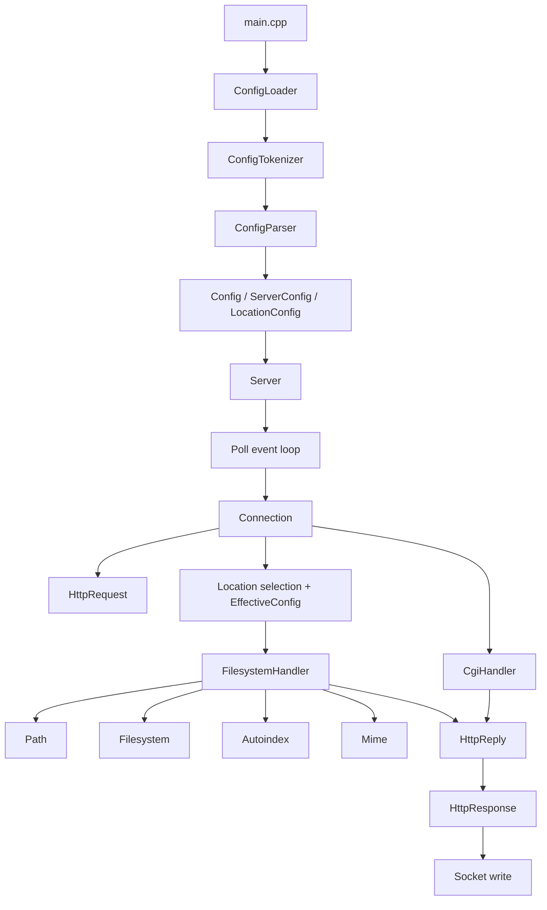
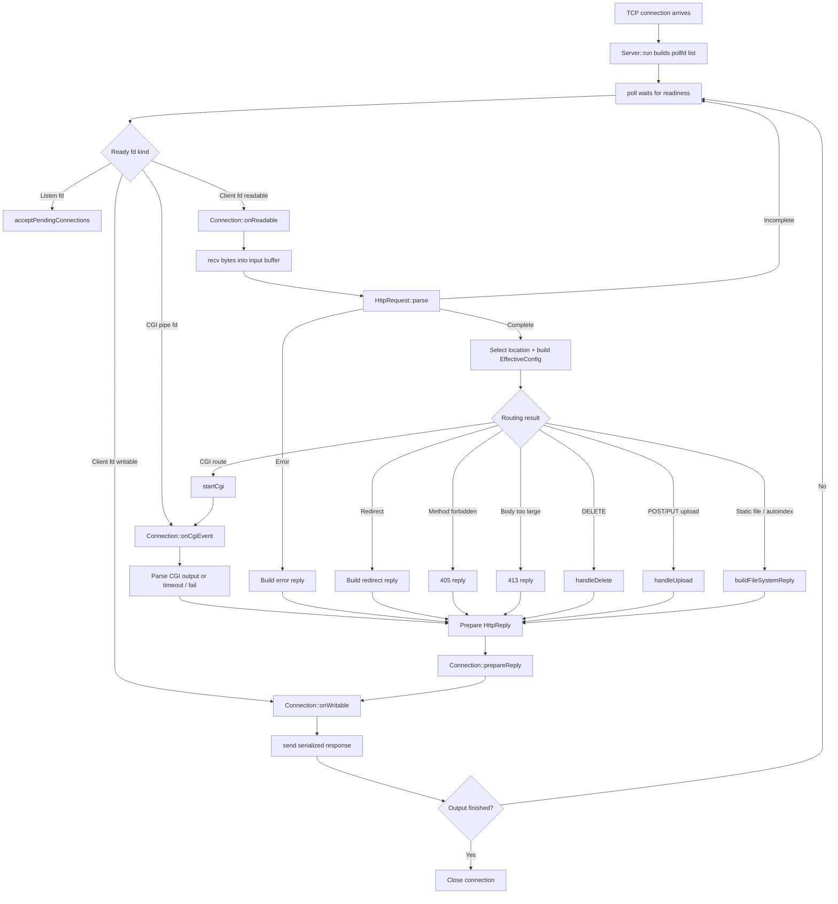
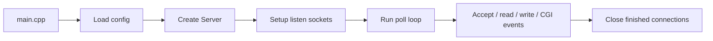
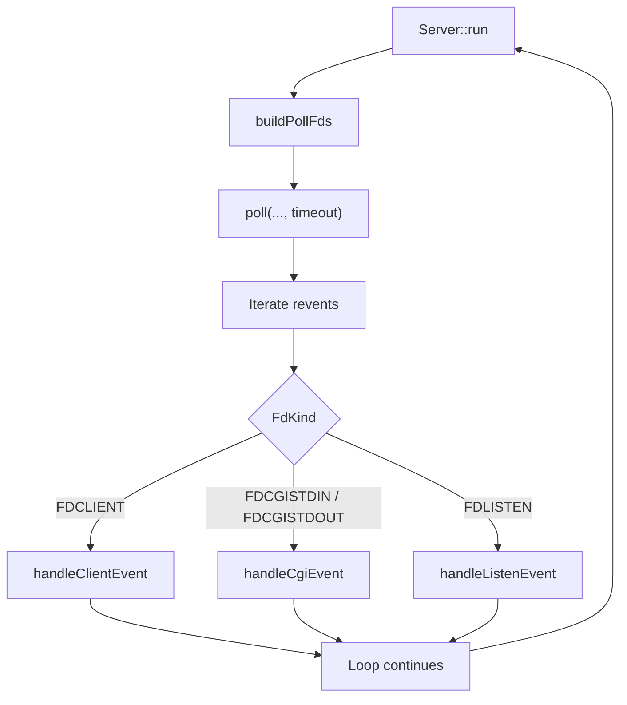
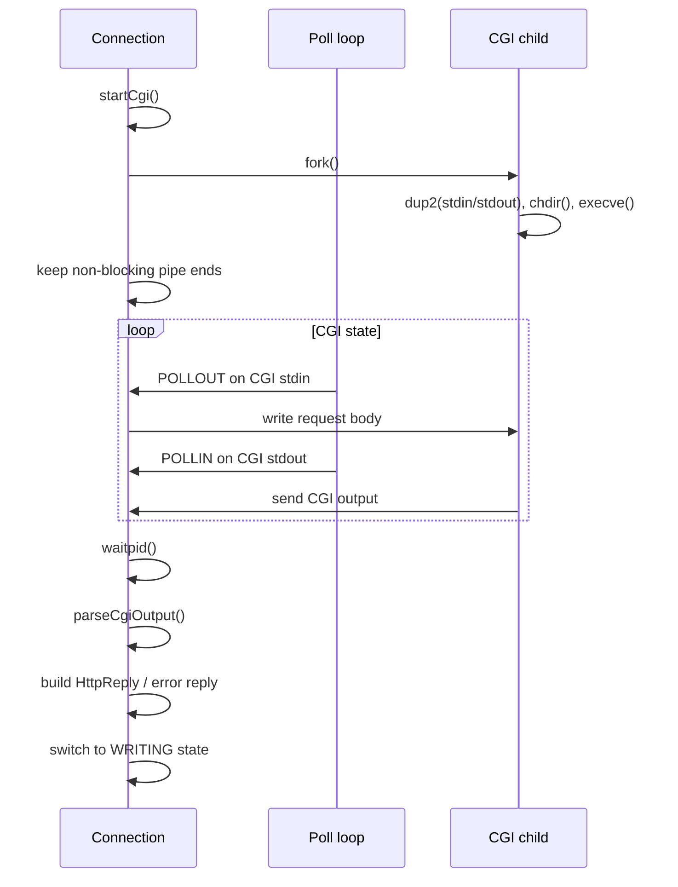

*This project has been created as part of the 42 curriculum by vdarsuye, ekakhmad, nimatura.*

# webserv

## Description

**webserv** is a custom HTTP/1.1 server written in C++98 as part of the 42 curriculum. The project focuses on rebuilding core web server behavior from low-level UNIX and network primitives instead of relying on an existing server such as Nginx or Apache. Its main educational goal is to make the request/response lifecycle concrete: opening listening sockets, accepting TCP connections, multiplexing many file descriptors with `poll()`, parsing HTTP requests, routing them through configuration rules, serving files, handling uploads and deletions, and executing CGI scripts.

The implementation described in this repository is organized around a small set of clear subsystems: configuration loading and parsing, a poll-based event loop, a per-client connection state machine, HTTP request parsing, HTTP response generation, static file serving, and CGI execution. The documented flow begins in `main.cpp`, loads configuration, opens listening sockets, enters the server loop, reacts to socket readiness events, parses a complete request, resolves the effective location/server configuration, and then dispatches to either static file handling, upload/delete logic, redirects, or CGI before writing the response back to the client.

This project is not only about returning `200 OK`. It is also about respecting the constraints of the subject and evaluator: C++98, compilation with strict warning flags, no blocking server model, correct handling of multiple clients, configuration-driven virtual servers, standard HTTP error cases, browser compatibility, and the ability to demonstrate behavior with tools such as `curl`, `nc`, and a web browser.

## Project goals

- Implement an HTTP/1.1 web server in C++98.
- Use a non-blocking, event-driven architecture based on `poll()` rather than one process or thread per client.
- Support configuration-driven behavior for servers and locations, including ports, roots, indexes, methods, redirects, error pages, upload directories, and CGI handlers.
- Correctly parse incoming requests and generate compliant responses for common success and error cases.
- Serve static content, optionally generate directory listings, support file upload/delete workflows where configured, and run CGI scripts through `fork`, `execve`, pipes, and environment variables.

## Features

### Mandatory scope

The documented project materials indicate support for the following core features:

- TCP listening sockets with non-blocking setup and `SO_REUSEADDR`.
- An event loop that builds a `pollfd` list for listening sockets, client sockets, and CGI pipes, then dispatches readiness events without blocking the whole server.
- Incremental HTTP request parsing, including request line, headers, body length handling, parser states, and error detection.
- Route resolution through server and location configuration, with effective configuration merging before request handling.
- Static file responses, MIME type mapping, path normalization/safe joining, and optional autoindex generation for directories.
- HTTP method checks and typical status handling such as `200`, `301/302`, `403`, `404`, `405`, `413`, and `500` according to the documented response layer.
- CGI execution for configured extensions such as `.py` and `.sh`, with stdin/stdout pipes, CGI environment variables, timeout handling, and output parsing.

### Typical request flow

A simplified request flow looks like this:

1. `main.cpp` loads the default or file-based configuration and creates the `Server` object.
2. The server opens and listens on all configured addresses/ports.
3. The main loop calls `poll()` on listening sockets, active client sockets, and CGI file descriptors.
4. When a client becomes readable, the server receives bytes and feeds them into the HTTP parser until the request is complete or invalid.
5. Once complete, the server selects the matching location, builds the effective config, and chooses the action: redirect, reject, serve a file, upload/delete, or execute CGI.
6. The reply is serialized and written back through the connection state machine until the socket can be closed safely.

## Architecture

The server follows a modular, event-driven design centered on a single `poll()` loop. Instead of creating one process or thread per client, the implementation keeps listening sockets, client sockets, and CGI pipes inside one readiness-driven reactor, then delegates each stage of the request lifecycle to dedicated components.

At a high level, startup begins in `main.cpp`, which loads either the default configuration or a file passed on the command line, validates it through the configuration pipeline, constructs the `Server`, opens all configured listening sockets, and enters the main event loop.

### High-level module map



This structure makes the code easier to explain during evaluation because each responsibility stays local: parsing config, multiplexing file descriptors, maintaining per-client state, parsing HTTP, building replies, resolving filesystem paths, and handling CGI all live in separate modules instead of being mixed into a single giant loop.

### Runtime flow



### Main execution scheme



### Event loop scheme



### CGI scheme



## Modules

### Configuration modules

The configuration layer is split into `ConfigLoader`, `ConfigTokenizer`, `ConfigParser`, and the resulting config structures. Together they load either a default configuration or an explicit file, tokenize directive syntax, parse `server` and `location` blocks, and build the in-memory representation used later by the server.

`EffectiveConfig` is especially important at request time because it combines server-level defaults with matching location-level overrides. That lets the request handler reason about one final configuration view when checking allowed methods, redirects, roots, upload directories, body-size limits, and CGI mappings.

Example of the documented startup path:

```cpp
Config cfg;
if (argc == 1)
 cfg = ConfigLoader::loadDefault();
else if (argc == 2)
 cfg = ConfigLoader::loadFromFile(argv);
Server s(cfg);
s.run();
```

### Server module

`Server` owns the listening sockets and the central reactor loop. According to the architecture and event-loop notes, it is responsible for creating sockets, applying `SO_REUSEADDR`, switching descriptors to non-blocking mode, binding, listening, assembling `pollfd` arrays, dispatching listen/client/CGI events, and closing dead connections safely.

A representative setup flow described in the notes looks like this:

```cpp
int listenFd = socket(AF_INET, SOCK_STREAM, 0);
setsockopt(listenFd, SOL_SOCKET, SO_REUSEADDR, &yes, sizeof(yes));
setNonBlocking(listenFd);
bind(listenFd, (struct sockaddr*)&addr, sizeof(addr));
listen(listenFd, 128);
```

Representative event-loop logic:

```cpp
while (true) {
 buildPollFds(pollFds, fdEntries);
 int eventCount = poll(&pollFds, pollFds.size(), 1000);
 if (eventCount <= 0)
 continue;
 for (size_t i = 0; i < pollFds.size(); ++i) {
 if (pollFds[i].revents == 0)
 continue;
 const FdEntry e = fdEntries[i];
 if (e.kind == FDLISTEN)
 handleListenEvent(e, pollFds[i].revents);
 else if (e.kind == FDCLIENT)
 handleClientEvent(e, pollFds[i].revents);
 else
 handleCgiEvent(e, pollFds[i].revents);
 }
}
```

### Connection module

`Connection` is the per-client state machine. It owns input and output buffers, tracks whether the client is reading, writing, or waiting on CGI, calls the request parser incrementally, selects the matching location, builds replies, and sends serialized output when `poll()` reports that the socket is writable.

The flow walkthrough describes the critical branch inside `onReadable`: receive bytes, parse, reject malformed requests, reject oversized bodies, reject disallowed methods, then dispatch to delete/upload/CGI/static handling once the request becomes complete.

Representative logic:

```cpp
ssize_t n = recv(fd, buf, sizeof(buf), 0);
if (n <= 0)
 return false;
in.append(buf, n);
HttpRequestState st = request.parse(in, maxHeaderBytes, maxBodyBytes);
if (st == HttpRequest::ERROR) {
 out = HttpResponse::buildErrorResponse(400);
 state = WRITING;
 return true;
}
if (st != HttpRequest::COMPLETE)
 return true;
```

### HttpRequest module

`HttpRequest` performs incremental parsing of the request line, headers, and body. It is designed to work with partial reads from non-blocking sockets, which means the parser must tolerate fragmented input and only declare completion when enough bytes have arrived.

This module is central to safe protocol handling because it decides when a request is malformed, incomplete, or valid enough to route. It also feeds later checks such as method handling, body length enforcement, CGI stdin forwarding, and upload processing.

### HttpReply and HttpResponse modules

The project distinguishes between a structured reply object and the final wire-format HTTP response. `HttpReply` acts as an intermediate representation carrying status, content type, body, redirect location, or cookie metadata, while `HttpResponse` serializes that data into the final `HTTP/1.1` text sent through the socket.

This split is useful because different subsystems can return one reply abstraction, and the connection layer can later normalize it into one final serialized response.

Representative response-building code:

```cpp
std::ostringstream oss;
oss << "HTTP/1.1 " << status << " " << reasonPhrase(status) << "
";
oss << "Content-Type: " << contentType << "
";
oss << "Content-Length: " << body.size() << "
";
oss << "Connection: close

";
oss << body;
return oss.str();
```

### Static file modules

Static content handling is spread across `FilesystemHandler`, `Path`, `Filesystem`, `Autoindex`, and `Mime`. Together these modules resolve request URIs to safe filesystem paths, prevent traversal, classify path types, load file content, generate directory listings when autoindex is enabled, and choose the correct content type for the response.

This group of modules is where many evaluator-visible behaviors live: serving `index.html`, returning `404` for missing files, generating an autoindex page, reading static assets like CSS or images, and ensuring that location roots or aliases are resolved safely.

### CGI module

`CgiHandler` and the CGI-related parts of `Connection` implement dynamic execution for configured extensions such as `.py` and `.sh`. The notes describe detection of CGI routes, preparation of CGI argv/env, creation of pipes, `fork()`, `execve()`, non-blocking monitoring of CGI stdin/stdout through the same poll loop, timeout enforcement, and parsing of CGI output into an HTTP reply.

Representative startup snippet from the documented flow:

```cpp
int inPipe, outPipe;
pipe(inPipe);
pipe(outPipe);
pid_t pid = fork();
if (pid == 0) {
 dup2(inPipe, STDIN_FILENO);
 dup2(outPipe, STDOUT_FILENO);
 execve(argv, argv, envp);
 exit(127);
}
```

## Code-oriented tests

### Build and config tests

```bash
make
make re
./webserv --check-config conf/tester.conf
./webserv conf/tester.conf
./webserv conf/2serv.conf
```

### Socket and port checks

```bash
ss -tlnp | grep -E '8080|8081'
lsof -iTCP -sTCP:LISTEN -P | grep webserv
```

### Base variables for manual tests

```bash
BASE=http://127.0.0.1:8080
HOST=127.0.0.1
PORT=8080
```

### Basic request tests

```bash
curl -i $BASE/
curl -i $BASE/nope
curl -s -o /dev/null -w '%{http_code}\n' $BASE/
curl -s -o /dev/null -w '%{http_code}\n' $BASE/nope
curl -I $BASE/
```

### Method tests

```bash
curl -s -o /dev/null -w '%{http_code}\n' -X POST --data 'x' $BASE/
curl -s -o /dev/null -w '%{http_code}\n' -X DELETE $BASE/uploads/a.txt
```

### Upload and delete tests

```bash
curl -i -X POST --data 'hello world' $BASE/uploads/a.txt
curl -s $BASE/uploads/a.txt -o downloaded.txt
cat downloaded.txt
curl -i -X DELETE $BASE/uploads/a.txt
curl -s -o /dev/null -w '%{http_code}\n' $BASE/uploads/a.txt
```

### Body-size test

```bash
PAYLOAD=$(head -c 200 /dev/zero | tr '\\0' 'A')
curl -s -o /dev/null -w '%{http_code}\n' -X POST --data "$PAYLOAD" $BASE/postbody
```

### CGI tests

```bash
curl -i $BASE/cgi-bin/test.py
curl -i -X POST --data 'name=42' $BASE/cgi-bin/test.py
curl -s -o /dev/null -w '%{http_code}\n' $BASE/cgi-bin/loop.py
```

### Malformed request test

```bash
printf 'WTF / HTTP/1.1\r\n\r\n' | nc -w1 $HOST $PORT
```

### Multi-port and host tests

```bash
curl -s -o /dev/null -w '%{http_code}\n' http://127.0.0.1:8080/
curl -s -o /dev/null -w '%{http_code}\n' http://127.0.0.1:8081/
curl --resolve example.com:8080:127.0.0.1 http://example.com:8080/
```

### Stress test

```bash
siege -b -t30S $BASE/
```


## Instructions

### Build

The project is expected to compile with C++98 and strict warning flags, and the architecture notes explicitly mention `-Wall -Wextra -Werror` as part of the build constraints.

A typical build sequence is:

```bash
make
```

Useful maintenance targets generally used for 42 projects:

```bash
make re
make clean
make fclean
```

If your local Makefile includes AddressSanitizer for debugging, use it during development but make sure the final evaluated target still respects the subject constraints and your repository conventions.

### Run

Start the server with the default configuration or with an explicit config file, depending on how your repository is set up. The flow documentation shows support for both default config loading and file-based config loading, plus a config-check mode.

```bash
./webserv
./webserv path/to/config.conf
./webserv --check-config path/to/config.conf
```

### Test quickly

Basic manual checks can be done with `curl`, `nc`, and a browser, which are explicitly referenced in the project notes and evaluation-oriented walkthrough.

Examples:

```bash
curl -i http://127.0.0.1:8080/
curl -i http://127.0.0.1:8080/nope
curl -i -X POST --data 'hello' http://127.0.0.1:8080/upload/file.txt
curl -i -X DELETE http://127.0.0.1:8080/upload/file.txt
curl -i http://127.0.0.1:8080/cgi-bin/test.py
printf 'WTF / HTTP/1.1\r\n\r\n' | nc -w1 127.0.0.1 8080
```

What to verify during manual testing:

- Correct success and error status codes (`200`, `404`, `405`, `413`, `500`, redirects, etc.).
- Correct `Content-Type`, `Content-Length`, and connection behavior in responses.
- Static files, directory listing behavior, uploads, deletes, and configured indexes.
- CGI execution for both GET and POST when configured, including timeout/error handling.
- Stability under repeated or concurrent requests; the walkthrough references stress testing with `siege` for this purpose.

## Configuration

The configuration layer is one of the core parts of the project. The attached documentation describes a loader/tokenizer/parser pipeline and an “effective configuration” step that merges server-level defaults with location-level overrides before the request is handled.

Depending on your exact implementation, common directives and behaviors may include:

- Listen host/port pairs.
- Server names for virtual hosting.
- Root directories and index files.
- Allowed methods per location.
- Custom error pages.
- Upload directories.
- Autoindex on/off.
- Return/redirect rules.
- CGI handler mappings by extension, such as `.py` or `.sh`.

Example of the kind of configuration concepts this project usually supports:

```conf
server {
 listen 127.0.0.1:8080;
 server_name example.com;
 root www;
 index index.html;

 location /uploads {
 allow_methods GET POST DELETE;
 upload_dir uploads;
 }

 location /cgi-bin {
 cgi.py /usr/bin/python3;
 cgi.sh /bin/bash;
 }
}
```

Adjust the actual syntax and supported directives to match the parser implemented in this repository.

## Usage notes

This project is usually evaluated through behavior, not only by reading code. That means the repository should make it easy for another student or evaluator to understand how to launch the server, what ports are used, which test files exist, and how to trigger each feature in a deterministic way.

A practical repository layout often includes:

- `conf/` for sample server configurations.
- `www/` or fixture directories for static content.
- `cgi-bin/` for executable CGI scripts.
- `uploads/` for POST/PUT targets during testing.
- `docs/` for project notes, architecture explanations, and walkthroughs.

If those folders exist in your repository, keep them populated with small, representative examples so peers and evaluators can validate all mandatory behaviors quickly.

## Evaluation hints

The provided notes emphasize checks that commonly matter during peer evaluation:

- The server must stay responsive with multiple clients instead of blocking on one connection.
- Request parsing should reject malformed input cleanly rather than crashing or hanging.
- File serving must prevent unsafe path traversal and respect configured roots/aliases.
- CGI must integrate with the event loop correctly, including child process cleanup, stdin/stdout pipe handling, and timeout/error paths.
- Different virtual servers/ports/configurations should be demonstrable with reproducible examples.

It is worth preparing a short demo scenario before defense or evaluation: one static page, one missing route, one upload/delete example, one autoindex example, one redirect, and one CGI example. That covers most of the important branches of the request lifecycle.

## Testing

The project benefits from a dedicated testing section because `webserv` is evaluated primarily through observable behavior. The attached reference material includes many practical command-line checks covering configuration validation, status codes, uploads, deletes, CGI, multi-port behavior, malformed requests, and stress tests, so the README should expose those examples directly for peers and evaluators.

### Configuration validation

Validate that the configuration file parses correctly before starting the server:

```bash
./webserv --check-config conf/tester.conf
./webserv --check-config conf/default.conf
./webserv conf/tester.conf
```

If your implementation supports a default configuration, running `./webserv` without arguments should start the server using that default path or built-in default settings, while `--check-config` should exit after reporting whether the config is valid.

### Basic HTTP checks

Define a base URL to avoid repeating host and port in each test:

```bash
BASE=http://127.0.0.1:8080
HOST=127.0.0.1
PORT=8080
```

Check a normal successful response, a missing route, and response headers:

```bash
curl -i $BASE/
curl -i $BASE/nope
curl -s -o /dev/null -w '%{http_code}\n' $BASE/
curl -s -o /dev/null -w '%{http_code}\n' $BASE/nope
curl -I $BASE/
```

These checks help confirm correct request routing, correct status lines such as `200 OK` and `404 Not Found`, and the presence of standard HTTP headers like `Content-Type` and `Content-Length`.

### Method handling

Verify that the server allows only the methods configured for a location:

```bash
curl -s -o /dev/null -w '%{http_code}\n' $BASE/
curl -s -o /dev/null -w '%{http_code}\n' -X POST --data 'x' $BASE/
curl -s -o /dev/null -w '%{http_code}\n' -X DELETE $BASE/upload/test.txt
```

A route configured for `GET` only should reject unsupported methods with `405 Method Not Allowed`, which is explicitly emphasized in the documentation and walkthrough notes.

### Upload and delete

If a location has an upload directory configured, test file creation and deletion directly:

```bash
curl -i -X POST --data 'hello world' $BASE/upload/a.txt
curl -s $BASE/upload/a.txt -o downloaded.txt
cat downloaded.txt
curl -i -X DELETE $BASE/upload/a.txt
curl -s -o /dev/null -w '%{http_code}\n' $BASE/upload/a.txt
```

The reference material specifically highlights upload and delete as mandatory behavior tied to location configuration, effective config merging, and filesystem handling.

### Request body size limit

Test `client_max_body_size` or the equivalent directive with a payload larger than the configured limit:

```bash
PAYLOAD=$(head -c 200 /dev/zero | tr '\\0' 'A')
curl -s -o /dev/null -w '%{http_code}\n' -X POST --data "$PAYLOAD" $BASE/postbody
```

When the configured limit is smaller than the submitted payload, the expected result is `413 Payload Too Large` according to the request-handling notes.

### CGI checks

When CGI is enabled for a location and extension mapping, test both GET and POST flows:

```bash
curl -i $BASE/cgi-bin/test.py
curl -i -X POST --data 'name=42' $BASE/cgi-bin/test.py
curl -s -o /dev/null -w '%{http_code}\n' $BASE/cgi-bin/test.py
```

The project notes describe CGI execution through `fork`, `execve`, pipes, environment preparation, and later parsing of CGI output into an HTTP response, so both code paths are worth demonstrating in the README.

To test CGI timeout handling, point to a script that intentionally blocks or sleeps too long:

```bash
curl -s -o /dev/null -w '%{http_code}\n' $BASE/cgi-bin/loop.py
```

Depending on your implementation, a stuck CGI should produce a timeout-related failure path such as `504` or a server-side error response after process cleanup.

### Autoindex and static files

Check directory listing and static asset serving:

```bash
curl -i $BASE/
curl -i $BASE/assets/style.css
curl -i $BASE/directory-with-autoindex/
```

Use a browser as well, because the evaluator commonly checks whether the server behaves correctly with standard browser requests and whether content types for HTML, CSS, JavaScript, images, and other files are correct.

### Malformed request test

Send an intentionally invalid request with `nc`:

```bash
printf 'WTF / HTTP/1.1\r\n\r\n' | nc -w1 $HOST $PORT
```

This is a simple way to confirm that the parser rejects malformed request lines cleanly instead of hanging or crashing the server.

### Multiple ports

If your config defines more than one server or listen socket, verify that both ports respond:

```bash
curl -s -o /dev/null -w '%{http_code}\n' http://127.0.0.1:8080/
curl -s -o /dev/null -w '%{http_code}\n' http://127.0.0.1:8081/
ss -tlnp | grep -E '8080|8081'
```

The documentation explicitly mentions listening on multiple ports and serving different content/configurations from different server blocks.

### Host header check

If your project uses server names, you can simulate host-based routing with `curl --resolve`:

```bash
curl --resolve example.com:8080:127.0.0.1 http://example.com:8080/
```

Even though the subject may limit the full RFC virtual host scope, the reference notes still mention `Host` handling and server-name-based testing patterns for practical verification.

### Browser checks

Open the server in Chrome, Firefox, or Safari and verify:

- The root page loads correctly.
- Missing pages return the expected error page.
- Redirects actually redirect in the browser.
- Static assets load with the right MIME type.
- Uploaded files can be retrieved if the route is designed for that behavior.

### Stress testing

Run concurrent requests with `siege` if it is available on your machine:

```bash
siege -b -t30S $BASE/
```

Installation examples mentioned in the notes:

```bash
sudo apt-get install -y siege
brew install siege
```

Stress testing is useful to demonstrate that the server stays available under load and that the poll-based event loop continues handling multiple clients without blocking on a single connection.

### Suggested demo checklist

A compact evaluation demo can include the following sequence:

1. Build the project with `make`.
2. Validate the config with `./webserv --check-config conf/tester.conf`.
3. Launch the server.
4. Show `200` on `/`.
5. Show `404` on `/nope`.
6. Show `405` on a disallowed method.
7. Show upload and delete on a configured route.
8. Show one CGI GET request and one CGI POST request.
9. Show autoindex or a static asset response.
10. Run a short `siege` test.

## Resources

Classic references related to the topic:

- [RFC 7230 – HTTP/1.1 Message Syntax and Routing](https://datatracker.ietf.org/doc/html/rfc7230)
- [RFC 7231 – HTTP/1.1 Semantics and Content](https://datatracker.ietf.org/doc/html/rfc7231)
- [RFC 3875 – The Common Gateway Interface (CGI) Version 1.1](https://datatracker.ietf.org/doc/html/rfc3875)
- [Beej’s Guide to Network Programming](https://beej.us/guide/bgnet/)
- [`poll(2)` Linux manual page](https://man7.org/linux/man-pages/man2/poll.2.html)
- [`socket(2)` Linux manual page](https://man7.org/linux/man-pages/man2/socket.2.html)
- [`bind(2)` Linux manual page](https://man7.org/linux/man-pages/man2/bind.2.html)
- [`listen(2)` Linux manual page](https://man7.org/linux/man-pages/man2/listen.2.html)
- [`accept(2)` Linux manual page](https://man7.org/linux/man-pages/man2/accept.2.html)
- [`execve(2)` Linux manual page](https://man7.org/linux/man-pages/man2/execve.2.html)
- [`fork(2)` Linux manual page](https://man7.org/linux/man-pages/man2/fork.2.html)
- [MDN HTTP Overview](https://developer.mozilla.org/en-US/docs/Web/HTTP/Overview)

### AI usage disclosure

AI can be used responsibly as a supporting tool, but not as a replacement for implementation ownership. A transparent README should state exactly how it was used.

Example disclosure text you can keep or adapt:

- AI was used for editing and improving documentation structure and wording.
- AI was used to help summarize HTTP, CGI, socket, and `poll()` concepts during research.
- AI was used to suggest manual test ideas and README organization.
- AI was **not** used as a blind substitute for understanding, implementing, or debugging core project logic without review.
- All generated suggestions were reviewed, adapted, and validated against the project code and subject requirements.

If AI was used more specifically, document the exact areas, for example: documentation drafting, explanation of RFC concepts, generation of sample `curl` commands, refactoring suggestions, or test checklist preparation.

## More information

For a deeper technical explanation of this implementation, consult the repository documentation under `docs/`. A good reading order is the subject and evaluation material first, then architecture, configuration, the event loop, request parsing, response generation, static files, CGI, and finally the full walkthrough.

## Documentation index

| File | Topic |
|---|---|
| [`docs/01-requirements.md`](docs/01-requirements.md) | Subject requirements, mandatory part, bonus scope, and where they map into the codebase. |
| [`docs/02-evaluation.md`](docs/02-evaluation.md) | Defense checklist and reproducible test cases (`TC-01`, `TC-02`, ...). |
| [`docs/03-architecture.md`](docs/03-architecture.md) | Repository structure, module map, and global request flow. |
| [`docs/04-config.md`](docs/04-config.md) | Configuration pipeline: Loader → Tokenizer → Parser → Config → EffectiveConfig. |
| [`docs/05-server-eventloop.md`](docs/05-server-eventloop.md) | `Server` internals, `poll()` event loop, and fd dispatching. |
| [`docs/06-connection.md`](docs/06-connection.md) | `Connection` state machine, per-client lifecycle, and routing decisions. |
| [`docs/07-http-request.md`](docs/07-http-request.md) | Incremental HTTP request parser. |
| [`docs/08-http-response.md`](docs/08-http-response.md) | `HttpReply` as reply model and `HttpResponse` as wire-format serialization. |
| [`docs/09-static-files.md`](docs/09-static-files.md) | `Path`, `Filesystem`, `FilesystemHandler`, `Autoindex`, and `Mime`. |
| [`docs/10-cgi.md`](docs/10-cgi.md) | CGI support: `CgiHandler` and the CGI branch inside `Connection` (`fork`, `execve`, `pipe`). |
| [`docs/11-flow-walkthrough.md`](docs/11-flow-walkthrough.md) | Full four-stage walkthrough, reviewer Q&A, and `siege` notes. |
