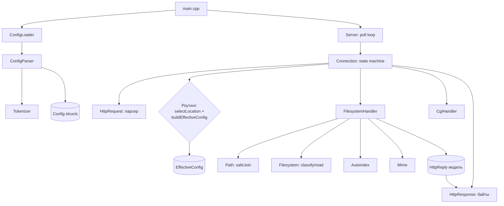
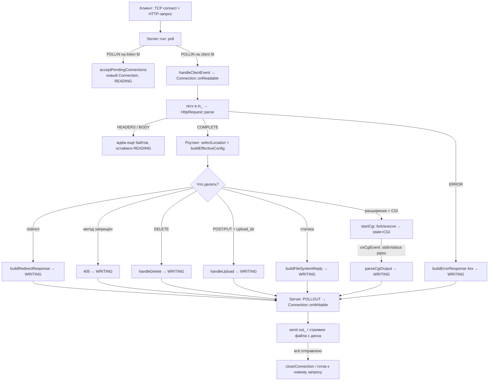

# 03 — Архитектура и общий поток запроса

## Структура репозитория

```
webserv/
├── Makefile                 # сборка (C++98, -Wall -Wextra -Werror, ASan)
├── include/                 # заголовки (.hpp)
├── src/                     # реализация (.cpp)
├── conf/                    # примеры конфигов (tester, upload, delete, 2serv, autoindex…)
├── www/                     # корень статики (index.html, cgi-bin/, uploads/, docs/)
├── YoupiBanane/             # данные для официального ./tester
├── tester, cgi_tester       # официальные бинарные тестеры 42
├── .github/workflows/ci.yml # CI: сборка + smoke-тесты curl
└── docs/                    # ← этот гайд
```

Код делится на 4 смысловых слоя:

| Слой | Модули | Ответственность |
|---|---|---|
| **Конфиг** | `ConfigLoader`, `Tokenizer`, `ConfigParser`, `Config`, `EffectiveConfig` | прочитать конфиг → дерево структур → слитые правила для запроса |
| **Транспорт / событийный цикл** | `Server` | сокеты, `poll()`, диспетчеризация событий по fd |
| **Состояние соединения** | `Connection` | state machine клиента, роутинг, выбор обработчика, CGI |
| **HTTP-логика** | `HttpRequest`, `HttpReply`, `HttpResponse`, `FilesystemHandler`, `Path`, `Filesystem`, `Autoindex`, `Mime`, `CgiHandler` | парсинг запроса, построение и сериализация ответа, файлы, CGI |

Вспомогательные: `Log` (макросы логирования), `FdUtils` (`createListenSocket`, `setNonBlocking`).

## Схема зависимостей модулей



## Общий поток одного запроса (от сокета до ответа)



### Ключевые инварианты (на что смотреть при ревью)

1. **Единственный `poll()`** на весь сервер — `src/Server.cpp:404`. Никаких `read`/`write` вне реакции на `poll`.
2. **`pollFds_[i]` и `fdEntries_[i]` синхронны по индексу** — массивы перестраиваются вместе в `buildPollFds`.
3. **`break` при закрытии клиента** — когда соединение закрылось внутри итерации, цикл по `pollFds_` прерывается,
   потому что массивы становятся невалидны (`src/Server.cpp:432`).
4. **`errno` не анализируется после I/O** — это требование сабжекта 42; любой `< 0` = прекратить операцию,
   `poll` разберётся дальше (`src/Server.cpp:367`).

## Где что искать (карта модулей → файлы)

| Модуль | Заголовок | Реализация | Документ |
|---|---|---|---|
| Конфиг | `include/Config*.hpp`, `EffectiveConfig.hpp` | `src/Config*.cpp`, `EffectiveConfig.cpp` | [`04`](04-config.md) |
| Server | `include/Server.hpp` | `src/Server.cpp` | [`05`](05-server-eventloop.md) |
| Connection | `include/Connection.hpp` | `src/Connection.cpp` | [`06`](06-connection.md) |
| HttpRequest | `include/HttpRequest.hpp` | `src/HttpRequest.cpp` | [`07`](07-http-request.md) |
| HttpReply / HttpResponse | `include/HttpReply.hpp`, `HttpResponse.hpp` | `src/HttpResponse.cpp` | [`08`](08-http-response.md) |
| Статика | `Path/Filesystem/FilesystemHandler/Autoindex/Mime` | одноимённые `.cpp` | [`09`](09-static-files.md) |
| CGI | `include/CgiHandler.hpp` | `src/CgiHandler.cpp` + CGI-ветка `Connection` | [`10`](10-cgi.md) |
