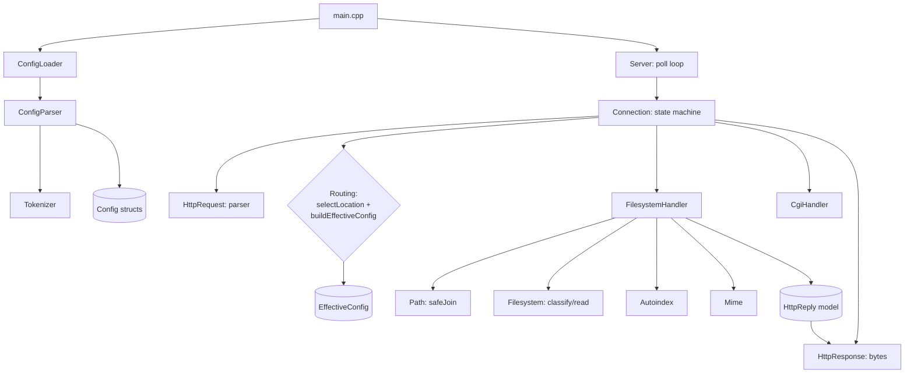
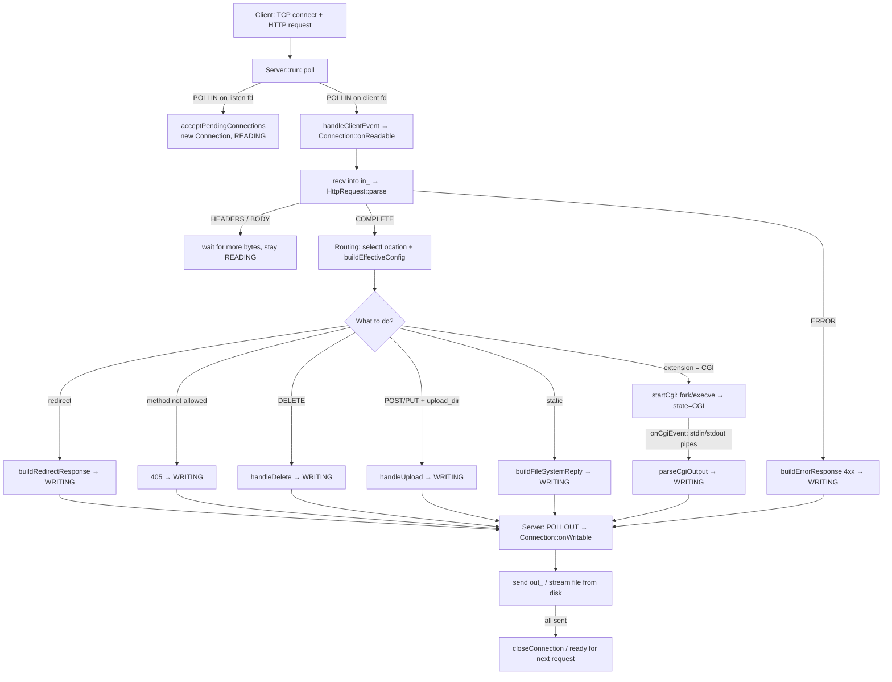

# 03 — Architecture and the end-to-end request flow

## Repository layout

```
webserv/
├── Makefile                 # build (C++98, -Wall -Wextra -Werror, ASan)
├── include/                 # headers (.hpp)
├── src/                     # implementation (.cpp)
├── conf/                    # example configs (tester, upload, delete, 2serv, autoindex…)
├── www/                     # static root (index.html, cgi-bin/, uploads/, docs/)
├── YoupiBanane/             # data for the official ./tester
├── tester, cgi_tester       # official 42 test binaries
├── .github/workflows/ci.yml # CI: build + curl smoke tests
└── docs/ , docs-en/         # ← this guide (RU / EN)
```

The code splits into 4 logical layers:

| Layer | Modules | Responsibility |
|---|---|---|
| **Config** | `ConfigLoader`, `Tokenizer`, `ConfigParser`, `Config`, `EffectiveConfig` | read the config → tree of structs → merged rules per request |
| **Transport / event loop** | `Server` | sockets, `poll()`, dispatching events per fd |
| **Connection state** | `Connection` | client state machine, routing, handler selection, CGI |
| **HTTP logic** | `HttpRequest`, `HttpReply`, `HttpResponse`, `FilesystemHandler`, `Path`, `Filesystem`, `Autoindex`, `Mime`, `CgiHandler` | request parsing, building and serializing the response, files, CGI |

Helpers: `Log` (logging macros), `FdUtils` (`createListenSocket`, `setNonBlocking`).

## Module dependency scheme



## End-to-end flow of one request (from socket to response)



### Key invariants (what to look at during review)

1. **A single `poll()`** for the whole server — `src/Server.cpp:404`. No `read`/`write` outside a `poll` reaction.
2. **`pollFds_[i]` and `fdEntries_[i]` are index-synchronized** — the arrays are rebuilt together in `buildPollFds`.
3. **`break` when a client closes** — if a connection closes inside an iteration, the loop over `pollFds_` breaks,
   because the arrays become invalid (`src/Server.cpp:432`).
4. **`errno` is not inspected after I/O** — a 42 subject rule; any `< 0` = stop the operation,
   `poll` will sort it out later (`src/Server.cpp:367`).

## Where to find what (module → files map)

| Module | Header | Implementation | Doc |
|---|---|---|---|
| Config | `include/Config*.hpp`, `EffectiveConfig.hpp` | `src/Config*.cpp`, `EffectiveConfig.cpp` | [`04`](04-config.md) |
| Server | `include/Server.hpp` | `src/Server.cpp` | [`05`](05-server-eventloop.md) |
| Connection | `include/Connection.hpp` | `src/Connection.cpp` | [`06`](06-connection.md) |
| HttpRequest | `include/HttpRequest.hpp` | `src/HttpRequest.cpp` | [`07`](07-http-request.md) |
| HttpReply / HttpResponse | `include/HttpReply.hpp`, `HttpResponse.hpp` | `src/HttpResponse.cpp` | [`08`](08-http-response.md) |
| Static | `Path/Filesystem/FilesystemHandler/Autoindex/Mime` | same-named `.cpp` | [`09`](09-static-files.md) |
| CGI | `include/CgiHandler.hpp` | `src/CgiHandler.cpp` + `Connection` CGI branch | [`10`](10-cgi.md) |
