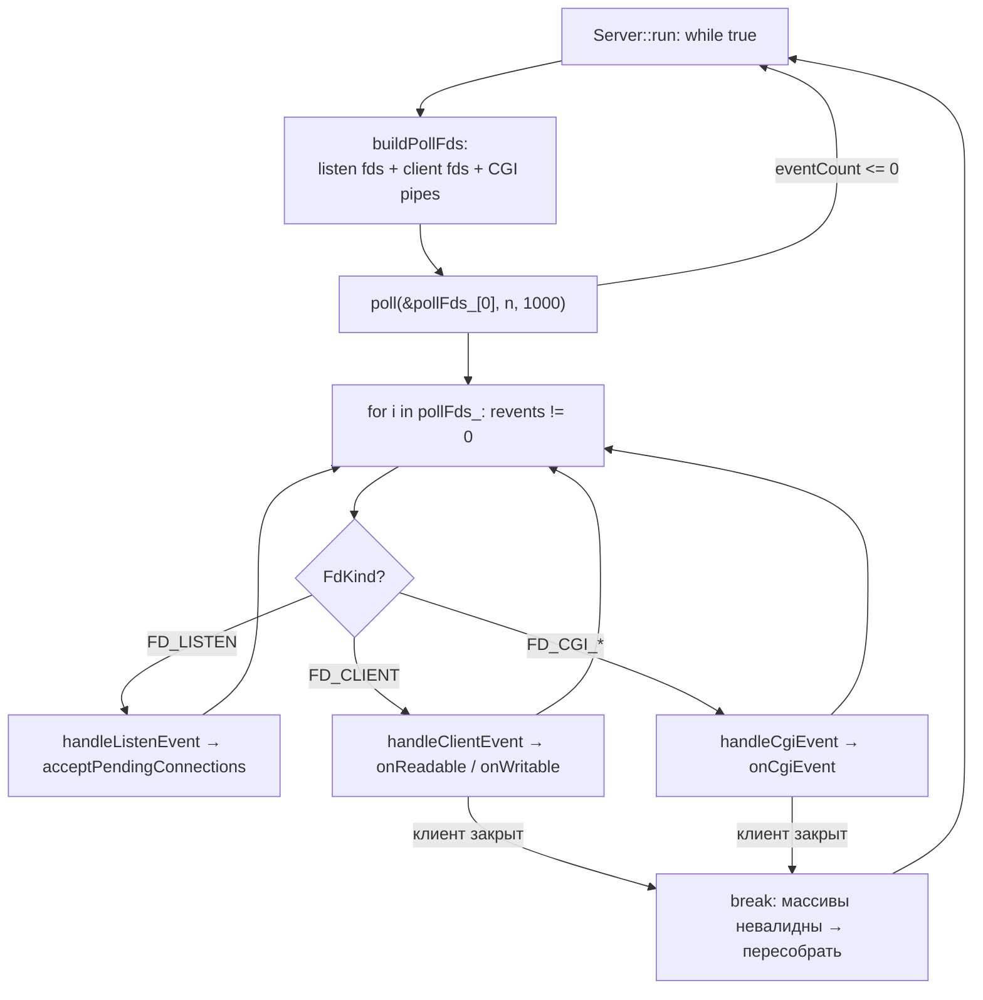

# 05 — Server: событийный цикл на `poll()`

## Назначение

`Server` владеет всеми сокетами и крутит **единственный** event loop на `poll()`. Он не знает деталей HTTP —
его задача: принимать соединения, спрашивать у каждого `Connection`, какие события ему интересны, вызывать
`poll()` и раздавать готовые события нужным обработчикам.

## Файлы и ключевые функции

| Что | Где |
|---|---|
| Класс | `include/Server.hpp` |
| Поднятие listen-сокетов | `Server::setupListenSockets` — `src/Server.cpp:122` |
| Перестроение массива fd | `Server::buildPollFds` — `src/Server.cpp:158` |
| Главный цикл | `Server::run` — `src/Server.cpp:392` |
| Accept новых клиентов | `Server::acceptPendingConnections` — `src/Server.cpp:342` |
| Диспетчеры | `handleListenEvent:248`, `handleClientEvent:256`, `handleCgiEvent:302` |
| Закрытие соединения | `Server::closeConnection` — `src/Server.cpp:327` |

Каждому `pollfd` соответствует `FdEntry` с типом (`FdKind`): `FD_LISTEN`, `FD_CLIENT`, `FD_CGI_STDIN`,
`FD_CGI_STDOUT` (`include/Server.hpp:45`). **Инвариант: `pollFds_[i]` и `fdEntries_[i]` синхронны по индексу.**

## Диаграмма: один виток event loop



## Сниппет: главный цикл

```cpp
// src/Server.cpp:392
void Server::run()
{
    while (true)
    {
        buildPollFds();                 // (1) пересобираем pollfd-массив из актуального состояния
        if (pollFds_.empty()) continue;

        int eventCount = ::poll(&pollFds_[0], pollFds_.size(), 1000);  // (2) ЕДИНСТВЕННЫЙ poll
        if (eventCount <= 0) continue;  // таймаут или ошибка — следующий виток

        bool clientClosed = false;
        for (size_t i = 0; i < pollFds_.size(); ++i)
        {
            if (pollFds_[i].revents == 0) continue;
            const FdEntry &e = fdEntries_[i];           // (3) тот же индекс, что и pollFds_[i]
            short re = pollFds_[i].revents;

            if (e.kind == FD_LISTEN)        handleListenEvent(e, re);
            else if (e.kind == FD_CLIENT)   clientClosed = handleClientEvent(e, re);
            else                            clientClosed = handleCgiEvent(e, re);

            if (clientClosed)               // (4) соединение удалено из map → массивы устарели
                break;                      // выходим и пересобираем на след. витке
        }
    }
}
```

**Объяснение по шагам.**
1. `buildPollFds` каждый виток заново строит `pollFds_`/`fdEntries_`: listen-сокеты + по каждому `Connection`
   его клиентский сокет и (если активен CGI) пайпы stdin/stdout. События, которые fd «хочет», берутся из
   `Connection::wantedPollEvents()` / `wantedCgiStdin/StdoutEvents()` — поэтому `POLLIN` и `POLLOUT`
   запрашиваются через один и тот же `poll`.
2. Один `::poll` обслуживает и чтение, и запись, и listen, и CGI-пайпы — ровно как требует сабжект.
3. По индексу `i` достаём `FdEntry` и понимаем, **что** это за fd и кому он принадлежит (`ownerClientFd`).
4. Если внутри обработки клиент закрылся (`closeConnection` стёр его из `connections_`), индексы «поехали» —
   прерываем цикл и на следующем витке строим массив заново.

## Сниппет: accept и правило «не смотреть errno»

```cpp
// src/Server.cpp:351  (внутри acceptPendingConnections)
while (true)
{
    int clientFd = ::accept(listenFd, ...);
    if (clientFd < 0)
        return;                 // ЛЮБОЙ < 0 = выход. errno НЕ анализируем (правило 42)
    setNonBlocking(clientFd);   // клиентский сокет всегда неблокирующий
    connections_.insert(std::make_pair(clientFd, Connection(clientFd, &cfg_, serverIndex)));
}
```

## На что смотреть на ревью / типичные баги

- **Только один `poll`/`select`/`epoll` во всём проекте?** `grep -rn "poll(" src` должен показать
  единственный вызов в `Server::run` (`src/Server.cpp:404`).
- **Нет I/O вне poll?** Чтение/запись сокета только в `Connection::onReadable/onWritable`, вызываемых
  из `handleClientEvent` после соответствующего `revents`.
- **errno после I/O не читается** — `accept` (`:367`), `recv`/`send` возвращают `< 0` → просто прекращаем.
- **POLLERR/POLLHUP/POLLNVAL** обрабатываются: `handleClientEvent` закрывает соединение при этих флагах
  (`src/Server.cpp:266`).
- **Double close / утечки fd**: копирование `Server` запрещено (приватные copy-ctor/assign,
  `include/Server.hpp:42`); `closeConnection` зовёт `closeAllFdsAndKillCgiIfAny()` перед `::close`.
- **`break` после закрытия клиента** обязателен — без него обращение к `fdEntries_[i]` по устаревшему
  индексу = UB. Это классический баг таких циклов.

---

Дальше: [`06-connection.md`](06-connection.md) — что происходит внутри одного `Connection`.
