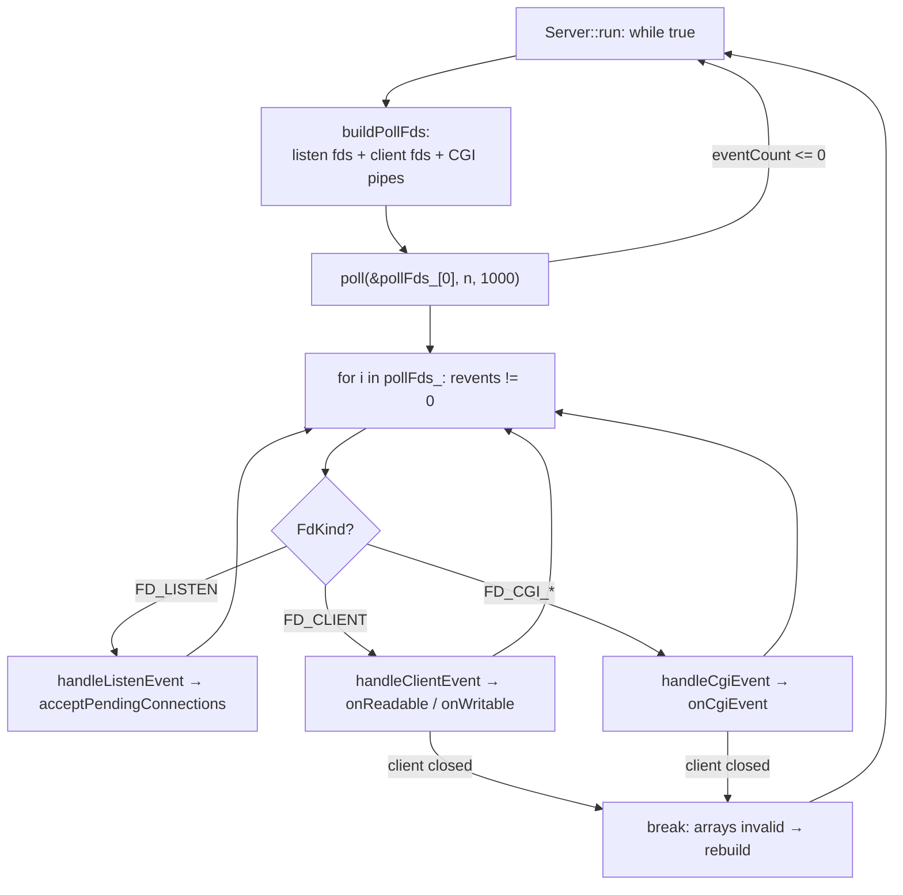

# 05 — Server: the event loop on `poll()`

## Purpose

`Server` owns all sockets and runs the **single** event loop on `poll()`. It knows nothing about HTTP details —
its job is: accept connections, ask each `Connection` which events it cares about, call `poll()`, and hand the
ready events to the right handlers.

## Files and key functions

| What | Where |
|---|---|
| Class | `include/Server.hpp` |
| Bringing up listen sockets | `Server::setupListenSockets` — `src/Server.cpp:122` |
| Rebuilding the fd array | `Server::buildPollFds` — `src/Server.cpp:158` |
| Main loop | `Server::run` — `src/Server.cpp:392` |
| Accept new clients | `Server::acceptPendingConnections` — `src/Server.cpp:342` |
| Dispatchers | `handleListenEvent:248`, `handleClientEvent:256`, `handleCgiEvent:302` |
| Closing a connection | `Server::closeConnection` — `src/Server.cpp:327` |

Each `pollfd` has a matching `FdEntry` with a type (`FdKind`): `FD_LISTEN`, `FD_CLIENT`, `FD_CGI_STDIN`,
`FD_CGI_STDOUT` (`include/Server.hpp:45`). **Invariant: `pollFds_[i]` and `fdEntries_[i]` are index-synchronized.**

## Diagram: one event-loop iteration



## Snippet: the main loop

```cpp
// src/Server.cpp:392
void Server::run()
{
    while (true)
    {
        buildPollFds();                 // (1) rebuild the pollfd array from current state
        if (pollFds_.empty()) continue;

        int eventCount = ::poll(&pollFds_[0], pollFds_.size(), 1000);  // (2) the ONE poll
        if (eventCount <= 0) continue;  // timeout or error — next iteration

        bool clientClosed = false;
        for (size_t i = 0; i < pollFds_.size(); ++i)
        {
            if (pollFds_[i].revents == 0) continue;
            const FdEntry &e = fdEntries_[i];           // (3) same index as pollFds_[i]
            short re = pollFds_[i].revents;

            if (e.kind == FD_LISTEN)        handleListenEvent(e, re);
            else if (e.kind == FD_CLIENT)   clientClosed = handleClientEvent(e, re);
            else                            clientClosed = handleCgiEvent(e, re);

            if (clientClosed)               // (4) connection removed from map → arrays stale
                break;                      // exit and rebuild next iteration
        }
    }
}
```

**Step-by-step explanation.**
1. Each iteration `buildPollFds` rebuilds `pollFds_`/`fdEntries_` from scratch: listen sockets + for every
   `Connection` its client socket and (if CGI is active) the stdin/stdout pipes. The events an fd "wants" come
   from `Connection::wantedPollEvents()` / `wantedCgiStdin/StdoutEvents()` — so `POLLIN` and `POLLOUT` are
   requested through the very same `poll`.
2. One `::poll` serves reading, writing, listening, and CGI pipes — exactly as the subject requires.
3. By index `i` we fetch the `FdEntry` and learn **what** the fd is and who owns it (`ownerClientFd`).
4. If the client closed during handling (`closeConnection` erased it from `connections_`), the indices "shifted" —
   break the loop and rebuild the array next iteration.

## Snippet: accept and the "don't read errno" rule

```cpp
// src/Server.cpp:351  (inside acceptPendingConnections)
while (true)
{
    int clientFd = ::accept(listenFd, ...);
    if (clientFd < 0)
        return;                 // ANY < 0 = exit. We do NOT inspect errno (42 rule)
    setNonBlocking(clientFd);   // the client socket is always non-blocking
    connections_.insert(std::make_pair(clientFd, Connection(clientFd, &cfg_, serverIndex)));
}
```

## What to look at during review / common bugs

- **Only one `poll`/`select`/`epoll` in the whole project?** `grep -rn "poll(" src` should show a single call
  in `Server::run` (`src/Server.cpp:404`).
- **No I/O outside poll?** Socket reads/writes only in `Connection::onReadable/onWritable`, invoked from
  `handleClientEvent` after the matching `revents`.
- **errno not read after I/O** — `accept` (`:367`), `recv`/`send` return `< 0` → just stop.
- **POLLERR/POLLHUP/POLLNVAL** are handled: `handleClientEvent` closes the connection on those flags
  (`src/Server.cpp:266`).
- **Double close / fd leaks**: copying `Server` is forbidden (private copy-ctor/assign, `include/Server.hpp:42`);
  `closeConnection` calls `closeAllFdsAndKillCgiIfAny()` before `::close`.
- **`break` after a client closes** is mandatory — without it, accessing `fdEntries_[i]` by a stale index is UB.
  That's the classic bug in such loops.

---

Next: [`06-connection.md`](06-connection.md) — what happens inside a single `Connection`.

