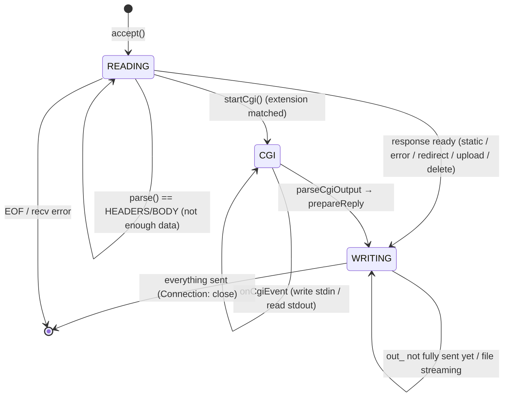

# 06 — Connection: the connection state machine

## Purpose

`Connection` is the "brain" of one client. It holds the input/output buffers, the `HttpRequest` object, the CGI
state, and the **state machine** by which `Server` understands what the connection wants from `poll()`. Routing
also lives here: choosing the location, merging the config, and dispatching to the right handler.

## Files and key functions

| What | Where |
|---|---|
| Class, fields, `enum State` | `include/Connection.hpp` |
| Which poll events are needed | `wantedPollEvents` — `src/Connection.cpp:273` |
| Read + parse + route | `onReadable` — `src/Connection.cpp:520` |
| Send response / stream a file | `onWritable` — `src/Connection.cpp:786` |
| Build `out_` from an `HttpReply` | `prepareReply` — `src/Connection.cpp:248` |
| Routing helpers | `selectLocation` / `buildEffectiveConfig` (`:59`/`:85`), `isAllowedMethod` (`:180`) |
| Directory redirect | `tryRedirectToSlashLocation` — `src/Connection.cpp:288` |
| Method handlers | `handleDelete` (`:337`), `handleUpload` (`:405`), `startCgi` (`:943`) |
| Streaming large files | `handleStartSendingFile` — `src/Connection.cpp:485` |
| CGI events | `onCgiEvent` — `src/Connection.cpp:1077` (details in [`10`](10-cgi.md)) |

## Diagram: connection states

`enum State { READING, CGI, WRITING, CLOSING }` (`include/Connection.hpp:29`).



> `wantedPollEvents()` translates the state into requested events: `READING → POLLIN`,
> `WRITING → POLLOUT` (only if there's something to send). In the `CGI` state, socket events are not requested —
> only the CGI pipes work (see `wantedCgiStdin/StdoutEvents`).

```cpp
// src/Connection.cpp:273
short Connection::wantedPollEvents() const
{
    short ev = 0;
    if (state_ == READING)                                  ev |= POLLIN;
    if (state_ == WRITING && (!out_.empty() || fileStreamFd_ >= 0)) ev |= POLLOUT;
    return ev;
}
```

## Snippet: reading and decision-making (the core of `onReadable`)

```cpp
// src/Connection.cpp:520  (abridged)
bool Connection::onReadable()
{
    char buf[8192];
    ssize_t n = ::recv(fd_, buf, sizeof(buf), 0);
    if (n <= 0) return false;          // 0 = client closed; <0 = error → Server will close the connection
    in_.append(buf, n);

    // limits: headers 16KB, body — client_max_body_size (or a default)
    HttpRequest::State st = request_.parse(in_, maxHeaderBytes, maxBodyBytes);

    if (st == HttpRequest::ERROR) {                         // broken request
        out_ = HttpResponse::buildErrorResponse(request_.getErrorStatus());
        state_ = WRITING;  return true;
    }
    if (st != HttpRequest::COMPLETE)                        // HEADERS/BODY → wait for more bytes
        return true;                                        // stay READING

    // --- the request is complete: ROUTING ---
    const ServerConfig   &srv = cfg_->servers[serverIndex_];
    const std::string     uri = request_.getUri();
    const LocationConfig *loc = selectLocation(srv.locations, uri);   // longest prefix
    EffectiveConfig       eff = buildEffectiveConfig(srv, loc);       // server → location merge

    if (eff.hasClientMaxBodySize && request_.getContentLength() > eff.clientMaxBodySize) {
        out_ = HttpResponse::buildErrorResponse(413); state_ = WRITING; return true;
    }
    if (tryRedirectToSlashLocation(srv, loc, uri))          return true;            // 301 /dir → /dir/
    if (eff.hasRedirect) { out_ = HttpResponse::buildRedirectResponse(eff.redirectCode, eff.redirectTarget);
                           state_ = WRITING; return true; }
    if (request_.getMethod() != "DELETE" && !isAllowedMethod(request_.getMethod(), eff)) {
        out_ = HttpResponse::buildErrorResponse(405); state_ = WRITING; return true; }

    if (request_.getMethod() == "DELETE")                   return handleDelete(eff);
    if ((request_.getMethod()=="POST"||request_.getMethod()=="PUT") && loc && loc->hasUploadDir)
        return handleUpload(eff, loc);
    if (Http::isCgiRequest(loc, uri)) { startCgi(eff, loc, request_); return true; } // → state CGI
    // otherwise — static:
    Http::HttpReply rep = Http::buildFileSystemReply(eff, loc, uri);
    return prepareReply(rep);                               // pack into out_, state → WRITING
}
```

**Explanation.** `onReadable` runs every time the socket has data. Until `parse` returns `COMPLETE`, the
connection stays in `READING` and decides nothing — that's the non-blocking handling of requests split across
several `recv` calls. Once the request is assembled, there's a **strict order of checks**:
body limit → redirects → method allowed → DELETE / upload / CGI / static. Each branch either sets `out_` and
`state_ = WRITING`, or (CGI) switches to `state_ = CGI`.

## Snippet: sending the response and streaming large files (`onWritable`)

```cpp
// src/Connection.cpp:786  (abridged)
bool Connection::onWritable()
{
    if (!out_.empty()) {                                   // PHASE 1: flush the buffer (headers / small reply)
        ssize_t n = ::send(fd_, out_.c_str(), out_.size(), 0);
        if (n <= 0) return false;
        out_.erase(0, n);
        if (!out_.empty()) return true;                    // not all sent — wait for next POLLOUT
        if (fileStreamFd_ < 0) return false;               // small reply fully sent → close
    }
    if (fileStreamFd_ >= 0) {                              // PHASE 2: stream a large file from disk in chunks
        char buf[8192];
        ssize_t bytesRead = ::read(fileStreamFd_, buf, sizeof(buf));
        ssize_t bytesSent = ::send(fd_, buf, bytesRead, 0);
        fileStreamBytesLeft_ -= bytesSent;
        if (fileStreamBytesLeft_ == 0) { ::close(fileStreamFd_); fileStreamFd_ = -1; return false; }
        return true;                                       // more data left — wait for next POLLOUT
    }
    return false;
}
```

**Explanation.** Small responses (errors, autoindex, index.html) sit entirely in `out_` and are sent in chunks
until empty. Large files are not loaded into memory: `handleStartSendingFile` (`:485`) puts only the headers
into `out_` and opens `fileStreamFd_`; then `onWritable` reads the file in 8KB blocks and sends them as the
socket becomes writable (`POLLOUT`). Returning `false` means "the response is done, close the connection".

## What to look at during review / common bugs

- **Split request**: send the headers over two `recv` calls (see TC-13) — the connection must stay `READING`,
  not return a 400.
- **Order of checks**: body limit → 405 → DELETE/upload/CGI/static. E.g. a disallowed method must give 405
  **before** trying to open a file.
- **`Connection: close`**: the current implementation closes the connection after the response (the
  `Connection: close` header in `HttpResponse`). Keep-alive is a likely defense question (`HttpRequest::reset()`
  is ready for it).
- **Partial write**: `send` may write fewer bytes than requested — the code correctly does `out_.erase(0, n)`
  and waits for the next `POLLOUT`.
- **Streaming**: `fileStreamBytesLeft_` and `Content-Length` must match; otherwise the client hangs waiting.
- **The CGI branch** switches to `state_ = CGI`, after which everything goes through `onCgiEvent` —
  see [`10-cgi.md`](10-cgi.md).

---

Next: [`07-http-request.md`](07-http-request.md) — exactly how the incoming request is parsed.
