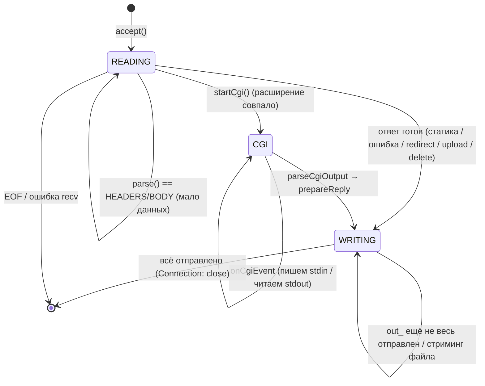

# 06 — Connection: машина состояний соединения

## Назначение

`Connection` — это «мозг» одного клиента. Он хранит входной/выходной буферы, объект `HttpRequest`, состояние
CGI и **state machine**, по которой `Server` понимает, чего соединение хочет от `poll()`. Здесь же — роутинг:
выбор location, слияние конфига и диспетчеризация в нужный обработчик.

## Файлы и ключевые функции

| Что | Где |
|---|---|
| Класс, поля, `enum State` | `include/Connection.hpp` |
| Какие события нужны от poll | `wantedPollEvents` — `src/Connection.cpp:273` |
| Чтение + парсинг + роутинг | `onReadable` — `src/Connection.cpp:520` |
| Отправка ответа / стриминг файла | `onWritable` — `src/Connection.cpp:786` |
| Сборка `out_` из `HttpReply` | `prepareReply` — `src/Connection.cpp:248` |
| Роутинг-хелперы | `selectLocation` / `buildEffectiveConfig` (`:59`/`:85`), `isAllowedMethod` (`:180`) |
| Редирект каталога | `tryRedirectToSlashLocation` — `src/Connection.cpp:288` |
| Обработчики методов | `handleDelete` (`:337`), `handleUpload` (`:405`), `startCgi` (`:943`) |
| Потоковая отдача больших файлов | `handleStartSendingFile` — `src/Connection.cpp:485` |
| CGI-события | `onCgiEvent` — `src/Connection.cpp:1077` (детали в [`10`](10-cgi.md)) |

## Диаграмма: состояния соединения

`enum State { READING, CGI, WRITING, CLOSING }` (`include/Connection.hpp:29`).



> `wantedPollEvents()` переводит состояние в запрашиваемые события: `READING → POLLIN`,
> `WRITING → POLLOUT` (только если есть что слать). В состоянии `CGI` события сокета не запрашиваются —
> работают только пайпы CGI (см. `wantedCgiStdin/StdoutEvents`).

```cpp
// src/Connection.cpp:273
short Connection::wantedPollEvents() const
{
    short ev = 0;
    if (state_ == READING)                                  ev |= POLLIN;
    if (state_ == WRITING && (!out_.empty() || fileStreamFd_ >= 0)) ev |= POLLOUT;
    return ev;
}
```

## Сниппет: чтение и принятие решения (ядро `onReadable`)

```cpp
// src/Connection.cpp:520  (сокращённо)
bool Connection::onReadable()
{
    char buf[8192];
    ssize_t n = ::recv(fd_, buf, sizeof(buf), 0);
    if (n <= 0) return false;          // 0 = клиент закрыл; <0 = ошибка → Server закроет соединение
    in_.append(buf, n);

    // лимиты: заголовки 16KB, тело — client_max_body_size (или дефолт)
    HttpRequest::State st = request_.parse(in_, maxHeaderBytes, maxBodyBytes);

    if (st == HttpRequest::ERROR) {                         // битый запрос
        out_ = HttpResponse::buildErrorResponse(request_.getErrorStatus());
        state_ = WRITING;  return true;
    }
    if (st != HttpRequest::COMPLETE)                        // HEADERS/BODY → ждём ещё байтов
        return true;                                        // остаёмся READING

    // --- запрос собран целиком: РОУТИНГ ---
    const ServerConfig   &srv = cfg_->servers[serverIndex_];
    const std::string     uri = request_.getUri();
    const LocationConfig *loc = selectLocation(srv.locations, uri);   // самый длинный префикс
    EffectiveConfig       eff = buildEffectiveConfig(srv, loc);       // server → location merge

    if (eff.hasClientMaxBodySize && request_.getContentLength() > eff.clientMaxBodySize) {
        out_ = HttpResponse::buildErrorResponse(413); state_ = WRITING; return true;
    }
    if (tryRedirectToSlashLocation(srv, loc, uri))          return true;            // 301 /dir → /dir/
    if (eff.hasRedirect) { out_ = HttpResponse::buildRedirectResponse(eff.redirectCode, eff.redirectTarget);
                           state_ = WRITING; return true; }
    if (request_.getMethod() != "DELETE" && !isAllowedMethod(request_.getMethod(), eff)) {
        out_ = HttpResponse::buildErrorResponse(405); state_ = WRITING; return true; }

    if (request_.getMethod() == "DELETE")                   return handleDelete(eff);
    if ((request_.getMethod()=="POST"||request_.getMethod()=="PUT") && loc && loc->hasUploadDir)
        return handleUpload(eff, loc);
    if (Http::isCgiRequest(loc, uri)) { startCgi(eff, loc, request_); return true; } // → state CGI
    // иначе — статика:
    Http::HttpReply rep = Http::buildFileSystemReply(eff, loc, uri);
    return prepareReply(rep);                               // упаковать в out_, state → WRITING
}
```

**Объяснение.** `onReadable` вызывается каждый раз, когда на сокете есть данные. Пока `parse` не вернул
`COMPLETE`, соединение остаётся в `READING` и ничего не решает — это и есть неблокирующая обработка
разорванных на несколько `recv` запросов. Как только запрос собран, идёт **строгий порядок проверок**:
лимит тела → редиректы → разрешённость метода → DELETE / upload / CGI / статика. Каждая ветка либо ставит
`out_` и `state_ = WRITING`, либо (CGI) переводит в `state_ = CGI`.

## Сниппет: отправка ответа и стриминг больших файлов (`onWritable`)

```cpp
// src/Connection.cpp:786  (сокращённо)
bool Connection::onWritable()
{
    if (!out_.empty()) {                                   // ФАЗА 1: отдать буфер (заголовки/мелкий ответ)
        ssize_t n = ::send(fd_, out_.c_str(), out_.size(), 0);
        if (n <= 0) return false;
        out_.erase(0, n);
        if (!out_.empty()) return true;                    // не всё ушло — ждём след. POLLOUT
        if (fileStreamFd_ < 0) return false;               // мелкий ответ отправлен целиком → закрыть
    }
    if (fileStreamFd_ >= 0) {                              // ФАЗА 2: стримим большой файл с диска чанками
        char buf[8192];
        ssize_t bytesRead = ::read(fileStreamFd_, buf, sizeof(buf));
        ssize_t bytesSent = ::send(fd_, buf, bytesRead, 0);
        fileStreamBytesLeft_ -= bytesSent;
        if (fileStreamBytesLeft_ == 0) { ::close(fileStreamFd_); fileStreamFd_ = -1; return false; }
        return true;                                       // ещё есть данные — ждём след. POLLOUT
    }
    return false;
}
```

**Объяснение.** Мелкие ответы (ошибки, autoindex, index.html) целиком лежат в `out_` и отправляются по кускам,
пока не опустеют. Большие файлы не грузятся в память целиком: `handleStartSendingFile` (`:485`) кладёт в `out_`
только заголовки и открывает `fileStreamFd_`; дальше `onWritable` читает файл блоками по 8KB и шлёт их по мере
готовности сокета к записи (`POLLOUT`). Возврат `false` означает «ответ завершён, закрывайте соединение».

## На что смотреть на ревью / типичные баги

- **Разорванный запрос**: отправь заголовки двумя `recv` (см. TC-13) — соединение должно остаться `READING`,
  а не отдать 400.
- **Порядок проверок**: лимит тела → 405 → DELETE/upload/CGI/статика. Например, запрещённый метод должен
  давать 405 **до** попытки открыть файл.
- **`Connection: close`**: текущая реализация закрывает соединение после ответа (заголовок `Connection: close`
  в `HttpResponse`). Keep-alive — потенциальная точка вопросов на защите (`HttpRequest::reset()` для этого готов).
- **Частичная запись**: `send` может записать меньше, чем просили — код корректно делает `out_.erase(0, n)`
  и ждёт следующего `POLLOUT`.
- **Стриминг**: `fileStreamBytesLeft_` и `Content-Length` должны совпадать; иначе клиент зависнет в ожидании.
- **CGI-ветка** переводит в `state_ = CGI` и дальше всё идёт через `onCgiEvent` — см. [`10-cgi.md`](10-cgi.md).

---

Дальше: [`07-http-request.md`](07-http-request.md) — как именно парсится входящий запрос.
