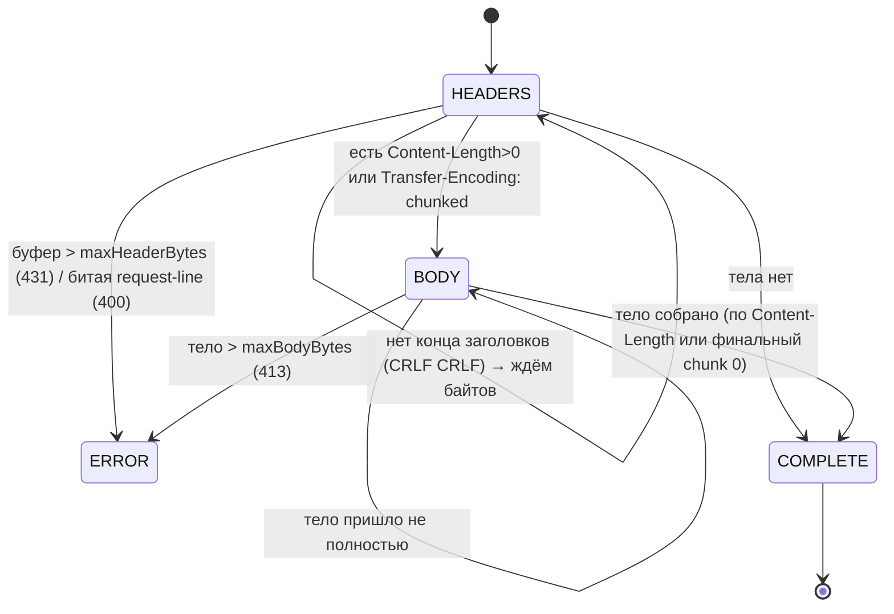

# 07 — HttpRequest: инкрементальный парсер запроса

## Назначение

Превратить поток байтов из сокета в структурированный HTTP-запрос (method / uri / version / headers / body).
Главная особенность — **инкрементальность**: данные приходят не целиком, поэтому состояние парсинга хранится
между вызовами `parse()` и каждый вызов «доедает» столько, сколько пришло.

## Файлы и ключевые функции

| Что | Где |
|---|---|
| Класс, `enum State`, поля | `include/HttpRequest.hpp` |
| Главный метод | `HttpRequest::parse` — `src/HttpRequest.cpp:119` |
| Поиск конца заголовков | `findEndOfHeaders` (`"\r\n\r\n"`) — `src/HttpRequest.cpp:114` |
| Разбор блока заголовков | `parseHeadersBlock` / `parseRequestLine` / `parseHeaderField` |
| Chunked body | `parseChunkedBody` / `parseChunkSizeHex` |
| Доступ к данным | `getMethod/getUri/getHeader/getBody/getContentLength` |
| Cookies (bonus) | `getCookieValue` |
| Сброс под keep-alive | `reset` — `src/HttpRequest.cpp:46` |

## Диаграмма: состояния парсера

`enum State { HEADERS, BODY, COMPLETE, ERROR }` (`include/HttpRequest.hpp:24`).



## Сниппет: ядро `parse` (стадия HEADERS)

```cpp
// src/HttpRequest.cpp:119  (сокращённо)
HttpRequest::State HttpRequest::parse(std::string &buffer,
        std::size_t maxHeaderBytes, std::size_t maxBodyBytes)
{
    if (state_ == COMPLETE || state_ == ERROR) return state_;   // уже всё решено

    if (state_ == HEADERS) {
        // guard: заголовки слишком большие и конца всё нет → 431
        if (findEndOfHeaders(buffer) == std::string::npos && buffer.size() > maxHeaderBytes) {
            setError(431); return state_;
        }
        std::string::size_type termPos = findEndOfHeaders(buffer);   // ищем "\r\n\r\n"
        if (termPos == std::string::npos)
            return HEADERS;                                          // ещё не пришли все заголовки

        std::string headersBlock = buffer.substr(0, termPos + 2);
        buffer.erase(0, termPos + 4);                               // «съедаем» заголовки из буфера
        if (!parseHeadersBlock(headersBlock)) { setError(400); return state_; }

        if (hasContentLength_ && contentLength_ > maxBodyBytes) { setError(413); return state_; }

        if (hasChunked_)                          state_ = BODY;
        else if (hasContentLength_ && contentLength_ > 0) state_ = BODY;
        else { state_ = COMPLETE; return state_; }                  // тела нет → готово
    }

    if (state_ == BODY) {
        if (hasChunked_) {                                          // chunked: размер в hex + данные
            if (!parseChunkedBody(buffer, maxBodyBytes)) return BODY;
            return state_;                                          // COMPLETE или ERROR
        }
        if (buffer.size() < contentLength_) return BODY;           // тело пришло не целиком
        body_.assign(buffer, 0, contentLength_);
        buffer.erase(0, contentLength_);
        state_ = COMPLETE;
    }
    return state_;
}
```

**Объяснение.** `parse` берёт ссылку на буфер `Connection::in_` и **изменяет** его — съеденные байты удаляются
(`buffer.erase`). Пока нет `\r\n\r\n`, парсер сидит в `HEADERS` и возвращает управление, не блокируя сервер.
После заголовков выбирается ветка по `Content-Length` / `Transfer-Encoding: chunked`. Тело по `Content-Length`
копится, пока `buffer.size()` не достигнет нужного размера. Все лимиты (`maxHeaderBytes`, `maxBodyBytes`)
проверяются здесь же, защищая от исчерпания памяти.

## Заголовки: регистронезависимость и cookies

Ключи заголовков приводятся к нижнему регистру при разборе, поэтому `getHeader` ищет по `lowercase`:

```cpp
// src/HttpRequest.cpp:88
std::string HttpRequest::getHeader(const std::string &key) const {
    std::string lc = key; toLower(lc);
    std::map<std::string,std::string>::const_iterator it = headers_.find(lc);
    return (it == headers_.end()) ? "" : it->second;
}
```

`getCookieValue("session_id")` (bonus) разбирает заголовок `Cookie:` и достаёт значение по имени —
используется веткой `/session` (см. [`08`](08-http-response.md) и TC-07).

## На что смотреть на ревью / типичные баги

- **Инкрементальность**: запрос, разорванный на два `recv`, должен корректно достроиться (TC-13).
  Состояние между вызовами хранится в полях, а не в локальных переменных.
- **Точный конец тела по `Content-Length`**: лишние байты (начало следующего запроса) не должны попадать
  в `body_` — обрати внимание на `body_.assign(buffer, 0, contentLength_)` и последующий `erase`.
- **Chunked**: проверь `Transfer-Encoding: chunked` (`parseChunkedBody`) — размер chunk'а в hex, финальный
  `0\r\n\r\n` завершает тело.
- **Лимиты → коды**: заголовки слишком большие → 431, тело больше лимита → 413, кривая request-line → 400.
- **Регистр заголовков**: `Host`, `host`, `HOST` должны читаться одинаково (`toLower`).
- **`reset()`** обнуляет всё (включая `body_`) для повторного использования соединения — важно, чтобы тело
  предыдущего запроса не «протекло» в следующий.

---

Дальше: [`08-http-response.md`](08-http-response.md) — как из решения строится ответ.
