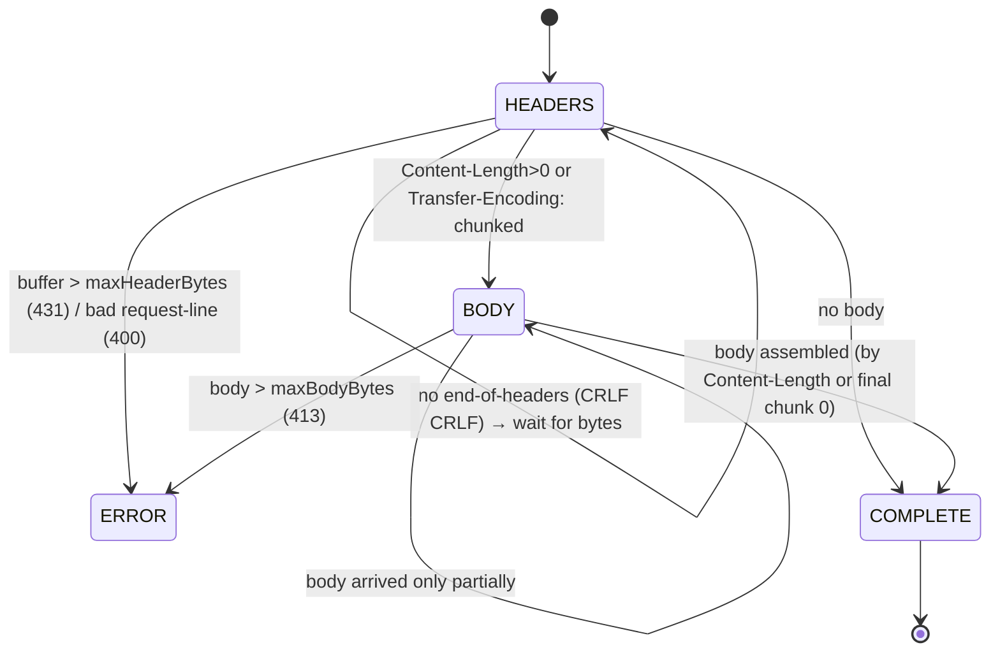

# 07 — HttpRequest: the incremental request parser

## Purpose

Turn the byte stream from the socket into a structured HTTP request (method / uri / version / headers / body).
The main feature is **incrementality**: data does not arrive all at once, so the parsing state is kept between
`parse()` calls and each call consumes only as much as has arrived.

## Files and key functions

| What | Where |
|---|---|
| Class, `enum State`, fields | `include/HttpRequest.hpp` |
| The main method | `HttpRequest::parse` — `src/HttpRequest.cpp:119` |
| Finding the end of headers | `findEndOfHeaders` (`"\r\n\r\n"`) — `src/HttpRequest.cpp:114` |
| Parsing the header block | `parseHeadersBlock` / `parseRequestLine` / `parseHeaderField` |
| Chunked body | `parseChunkedBody` / `parseChunkSizeHex` |
| Data access | `getMethod/getUri/getHeader/getBody/getContentLength` |
| Cookies (bonus) | `getCookieValue` |
| Reset for keep-alive | `reset` — `src/HttpRequest.cpp:46` |

## Diagram: parser states

`enum State { HEADERS, BODY, COMPLETE, ERROR }` (`include/HttpRequest.hpp:24`).



## Snippet: the core of `parse` (the HEADERS stage)

```cpp
// src/HttpRequest.cpp:119  (abridged)
HttpRequest::State HttpRequest::parse(std::string &buffer,
        std::size_t maxHeaderBytes, std::size_t maxBodyBytes)
{
    if (state_ == COMPLETE || state_ == ERROR) return state_;   // already decided

    if (state_ == HEADERS) {
        // guard: headers too big and still no end → 431
        if (findEndOfHeaders(buffer) == std::string::npos && buffer.size() > maxHeaderBytes) {
            setError(431); return state_;
        }
        std::string::size_type termPos = findEndOfHeaders(buffer);   // look for "\r\n\r\n"
        if (termPos == std::string::npos)
            return HEADERS;                                          // headers not fully arrived

        std::string headersBlock = buffer.substr(0, termPos + 2);
        buffer.erase(0, termPos + 4);                               // "consume" the headers from the buffer
        if (!parseHeadersBlock(headersBlock)) { setError(400); return state_; }

        if (hasContentLength_ && contentLength_ > maxBodyBytes) { setError(413); return state_; }

        if (hasChunked_)                          state_ = BODY;
        else if (hasContentLength_ && contentLength_ > 0) state_ = BODY;
        else { state_ = COMPLETE; return state_; }                  // no body → done
    }

    if (state_ == BODY) {
        if (hasChunked_) {                                          // chunked: size in hex + data
            if (!parseChunkedBody(buffer, maxBodyBytes)) return BODY;
            return state_;                                          // COMPLETE or ERROR
        }
        if (buffer.size() < contentLength_) return BODY;           // body not fully arrived
        body_.assign(buffer, 0, contentLength_);
        buffer.erase(0, contentLength_);
        state_ = COMPLETE;
    }
    return state_;
}
```

**Explanation.** `parse` takes a reference to the `Connection::in_` buffer and **mutates** it — consumed bytes
are removed (`buffer.erase`). Until there's a `\r\n\r\n`, the parser sits in `HEADERS` and returns control
without blocking the server. After the headers, the branch is chosen by `Content-Length` /
`Transfer-Encoding: chunked`. A `Content-Length` body accumulates until `buffer.size()` reaches the needed size.
All limits (`maxHeaderBytes`, `maxBodyBytes`) are checked right here, protecting against memory exhaustion.

## Headers: case-insensitivity and cookies

Header keys are lowercased during parsing, so `getHeader` looks up by `lowercase`:

```cpp
// src/HttpRequest.cpp:88
std::string HttpRequest::getHeader(const std::string &key) const {
    std::string lc = key; toLower(lc);
    std::map<std::string,std::string>::const_iterator it = headers_.find(lc);
    return (it == headers_.end()) ? "" : it->second;
}
```

`getCookieValue("session_id")` (bonus) parses the `Cookie:` header and extracts a value by name —
used by the `/session` branch (see [`08`](08-http-response.md) and TC-07).

## What to look at during review / common bugs

- **Incrementality**: a request split across two `recv` calls must reassemble correctly (TC-13). State between
  calls lives in fields, not in local variables.
- **Exact body end by `Content-Length`**: extra bytes (the start of the next request) must not leak into
  `body_` — note `body_.assign(buffer, 0, contentLength_)` and the subsequent `erase`.
- **Chunked**: check `Transfer-Encoding: chunked` (`parseChunkedBody`) — chunk size in hex, final
  `0\r\n\r\n` ends the body.
- **Limits → codes**: headers too big → 431, body over the limit → 413, malformed request-line → 400.
- **Header case**: `Host`, `host`, `HOST` must read identically (`toLower`).
- **`reset()`** clears everything (including `body_`) so the connection can be reused — important so the
  previous request's body doesn't "leak" into the next one.

---

Next: [`08-http-response.md`](08-http-response.md) — how a decision becomes a response.
