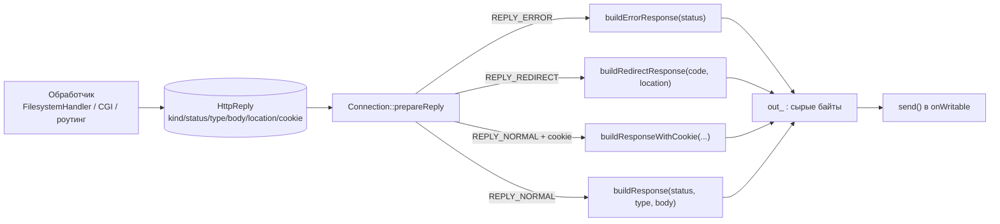

# 08 — HttpReply (модель) + HttpResponse (сериализация)

## Назначение

Две разные ответственности разнесены по двум модулям:

- **`HttpReply`** — это «решение» обработчика в виде данных: *что* отдать (статус, тип, тело, редирект, cookie).
  Никаких байтов и сокетов — чистая структура. Её возвращают `FilesystemHandler`, CGI-парсер и т.д.
- **`HttpResponse`** — «фабрика байтов»: берёт решение и превращает его в готовую HTTP-строку
  (`HTTP/1.1 ... \r\n` + заголовки + пустая строка + тело), которую `Connection` просто шлёт в `send()`.

Между ними — `Connection::prepareReply`, который раскладывает `HttpReply` по нужной функции `HttpResponse`.

## Файлы и ключевые функции

| Что | Где |
|---|---|
| Модель ответа + фабрики | `Http::HttpReply`, `makeErrorReply/makeRedirectReply/makeOkReply/makeReply` — `include/HttpReply.hpp` |
| Сериализация | `HttpResponse::buildResponse/buildErrorResponse/buildRedirectResponse/buildResponseWithCookie` — `src/HttpResponse.cpp` |
| Reason-phrase по коду | `reasonPhrase` (анон. ns) — `src/HttpResponse.cpp:26` |
| Раскладка Reply → Response | `Connection::prepareReply` — `src/Connection.cpp:248` |

`HttpReply` различает три вида ответа (`enum ReplyKind`): `REPLY_NORMAL`, `REPLY_REDIRECT`, `REPLY_ERROR`
(`include/HttpReply.hpp:20`).

## Диаграмма: от решения к байтам



## Сниппет: модель и её фабрики

```cpp
// include/HttpReply.hpp
struct HttpReply {
    ReplyKind   kind;            // NORMAL / REDIRECT / ERROR
    int         status;
    std::string contentType;
    std::string body;
    int         redirectCode;
    std::string location;
    std::string cookieHeader;    // непустой → добавится Set-Cookie
    HttpReply();
};

inline HttpReply makeErrorReply(int status) {            // удобные конструкторы-обёртки
    HttpReply r; r.kind = REPLY_ERROR; r.status = status; return r;
}
inline HttpReply makeOkReply(const std::string &type, const std::string &body) {
    HttpReply r; r.kind = REPLY_NORMAL; r.status = 200; r.contentType = type; r.body = body; return r;
}
```

## Сниппет: сериализация (структура любого ответа одинакова)

```cpp
// src/HttpResponse.cpp:101
std::string buildResponse(int status, const std::string &contentType, const std::string &body)
{
    std::ostringstream oss;
    oss << "HTTP/1.1 " << status << " " << reasonPhrase(status) << "\r\n"; // статус-строка
    oss << "Content-Type: "   << contentType << "\r\n";                    // заголовки
    oss << "Content-Length: " << body.size()  << "\r\n";                   // ← ровно размер тела
    oss << "Connection: close\r\n";
    oss << "\r\n";                                                         // пустая строка = конец заголовков
    oss << body;                                                          // тело ровно Content-Length байт
    return oss.str();
}
```

Редирект добавляет `Location:`, а cookie-вариант — `Set-Cookie:` (только если значение непустое):

```cpp
// src/HttpResponse.cpp:136  (фрагмент buildResponseWithCookie)
oss << "Connection: close\r\n";
if (!cookieHeaderValue.empty())
    oss << "Set-Cookie: " << cookieHeaderValue << "\r\n";   // ← bonus: session
oss << "\r\n" << body;
```

**Объяснение.** Любой ответ строится по одной схеме: статус-строка → заголовки → пустая строка → тело.
Критично, что `Content-Length` равен `body.size()` — иначе клиент либо зависнет в ожидании недостающих байтов,
либо обрежет тело. `reasonPhrase` отдаёт текстовую фразу для известных кодов (200 OK, 404 Not Found, 413
Payload Too Large, 500 Internal Server Error…), а для неизвестных — `"Error"`. Default error page — это
маленькое тело вида `"<code> <reason>\r\n"` из `errorBody()` (`src/HttpResponse.cpp:56`), оно используется,
когда нет пользовательского `error_page`.

## На что смотреть на ревью / типичные баги

- **`Content-Length` = размеру тела** для всех веток. Несоответствие — самый частый баг (зависший curl/браузер).
- **`reasonPhrase` для всех используемых кодов**: проверь, что коды, которые сервер реально возвращает
  (301/403/404/405/413/431/500…), есть в `reasonPhrase` (`src/HttpResponse.cpp:26`), иначе вернётся «Error».
- **Default error pages**: при ошибке без `error_page` тело всё равно непустое и осмысленное.
- **Разделение модели и байтов**: обработчики не должны сами клеить `"HTTP/1.1 ..."` — они возвращают
  `HttpReply`, а сериализация одна на всех. Исключение по дизайну — `handleStartSendingFile`, который сам
  пишет заголовки потоковой отдачи (см. [`06`](06-connection.md)).
- **`Set-Cookie` только когда нужно**: пустой `cookieHeader` не должен порождать пустой заголовок.

---

Дальше: [`09-static-files.md`](09-static-files.md) — как URI превращается в файл на диске.
