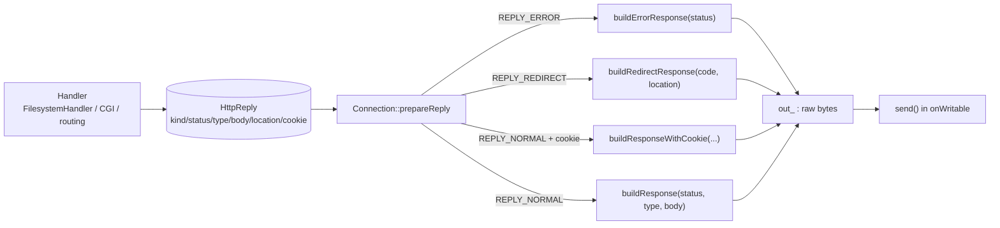

# 08 — HttpReply (model) + HttpResponse (serialization)

## Purpose

Two distinct responsibilities are split into two modules:

- **`HttpReply`** — the handler's "decision" as data: *what* to return (status, type, body, redirect, cookie).
  No bytes, no sockets — a pure struct. It's returned by `FilesystemHandler`, the CGI parser, etc.
- **`HttpResponse`** — the "byte factory": it takes the decision and turns it into a ready HTTP string
  (`HTTP/1.1 ... \r\n` + headers + blank line + body) that `Connection` simply `send()`s.

Between them sits `Connection::prepareReply`, which routes an `HttpReply` to the right `HttpResponse` function.

## Files and key functions

| What | Where |
|---|---|
| Response model + factories | `Http::HttpReply`, `makeErrorReply/makeRedirectReply/makeOkReply/makeReply` — `include/HttpReply.hpp` |
| Serialization | `HttpResponse::buildResponse/buildErrorResponse/buildRedirectResponse/buildResponseWithCookie` — `src/HttpResponse.cpp` |
| Reason-phrase by code | `reasonPhrase` (anon. ns) — `src/HttpResponse.cpp:26` |
| Reply → Response mapping | `Connection::prepareReply` — `src/Connection.cpp:248` |

`HttpReply` distinguishes three response kinds (`enum ReplyKind`): `REPLY_NORMAL`, `REPLY_REDIRECT`, `REPLY_ERROR`
(`include/HttpReply.hpp:20`).

## Diagram: from decision to bytes



## Snippet: the model and its factories

```cpp
// include/HttpReply.hpp
struct HttpReply {
    ReplyKind   kind;            // NORMAL / REDIRECT / ERROR
    int         status;
    std::string contentType;
    std::string body;
    int         redirectCode;
    std::string location;
    std::string cookieHeader;    // non-empty → a Set-Cookie is added
    HttpReply();
};

inline HttpReply makeErrorReply(int status) {            // handy wrapper constructors
    HttpReply r; r.kind = REPLY_ERROR; r.status = status; return r;
}
inline HttpReply makeOkReply(const std::string &type, const std::string &body) {
    HttpReply r; r.kind = REPLY_NORMAL; r.status = 200; r.contentType = type; r.body = body; return r;
}
```

## Snippet: serialization (the structure of any response is the same)

```cpp
// src/HttpResponse.cpp:101
std::string buildResponse(int status, const std::string &contentType, const std::string &body)
{
    std::ostringstream oss;
    oss << "HTTP/1.1 " << status << " " << reasonPhrase(status) << "\r\n"; // status line
    oss << "Content-Type: "   << contentType << "\r\n";                    // headers
    oss << "Content-Length: " << body.size()  << "\r\n";                   // ← exactly the body size
    oss << "Connection: close\r\n";
    oss << "\r\n";                                                         // blank line = end of headers
    oss << body;                                                          // body of exactly Content-Length bytes
    return oss.str();
}
```

A redirect adds `Location:`, and the cookie variant adds `Set-Cookie:` (only if the value is non-empty):

```cpp
// src/HttpResponse.cpp:136  (fragment of buildResponseWithCookie)
oss << "Connection: close\r\n";
if (!cookieHeaderValue.empty())
    oss << "Set-Cookie: " << cookieHeaderValue << "\r\n";   // ← bonus: session
oss << "\r\n" << body;
```

**Explanation.** Every response is built the same way: status line → headers → blank line → body. It is critical
that `Content-Length` equals `body.size()` — otherwise the client either hangs waiting for missing bytes or
truncates the body. `reasonPhrase` returns the text phrase for known codes (200 OK, 404 Not Found,
413 Payload Too Large, 500 Internal Server Error…), and `"Error"` for unknown ones. A default error page is a
tiny body of the form `"<code> <reason>\r\n"` from `errorBody()` (`src/HttpResponse.cpp:56`), used when there is
no user-provided `error_page`.

## What to look at during review / common bugs

- **`Content-Length` = body size** for all branches. A mismatch is the most common bug (a hung curl/browser).
- **`reasonPhrase` for every used code**: verify the codes the server actually returns (301/403/404/405/413/431/500…)
  are present in `reasonPhrase` (`src/HttpResponse.cpp:26`), otherwise "Error" is returned.
- **Default error pages**: on an error with no `error_page`, the body is still non-empty and meaningful.
- **Model/bytes separation**: handlers must not glue `"HTTP/1.1 ..."` themselves — they return an `HttpReply`,
  and serialization is shared. The by-design exception is `handleStartSendingFile`, which writes the streaming
  headers itself (see [`06`](06-connection.md)).
- **`Set-Cookie` only when needed**: an empty `cookieHeader` must not produce an empty header.

---

Next: [`09-static-files.md`](09-static-files.md) — how a URI becomes a file on disk.
