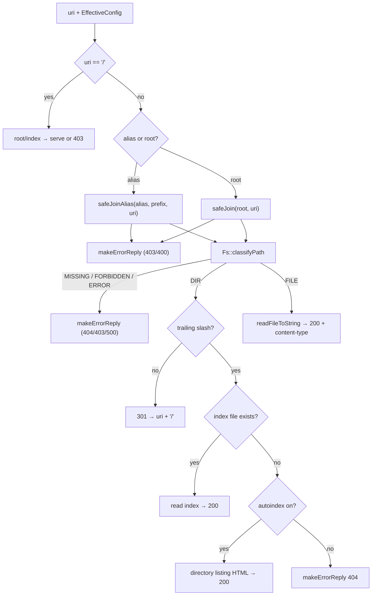

# 09 — Static files: Path / Filesystem / FilesystemHandler / Autoindex / Mime

## Purpose

The group of modules responsible for serving files from disk: safely turn a URI into a path, classify it
(file / directory / missing / forbidden), read the file or generate a directory listing, and pick a `Content-Type`.

| Module | Role | Where |
|---|---|---|
| `Path` | URI helpers + **safe** path joining (traversal protection) | `src/Path.cpp` |
| `Filesystem` (`Fs`) | `stat`-classification and file reading | `src/Filesystem.cpp` |
| `FilesystemHandler` | orchestrator: URI → `HttpReply` | `src/FilesystemHandler.cpp` |
| `Autoindex` | HTML directory listing | `src/Autoindex.cpp` |
| `Mime` | extension → `Content-Type` | `src/Mime.cpp` |

## Diagram: serving a static GET



## Snippet: safe path joining (`safeJoin`)

This is the **most security-critical** function: it blocks path traversal (`../`), including URL-encoded.

```cpp
// src/Path.cpp:132  (abridged)
bool safeJoin(const std::string &root, const std::string &rawUri,
              std::string &outFsPath, int &outStatus)
{
    std::string uriNoQuery = uriPathOnly(rawUri);     // strip "?query"
    std::string decoded;
    if (!urlDecodePath(uriNoQuery, decoded)) { outStatus = 400; return false; }  // %2e%2e → ..
    if (decoded.empty() || decoded[0] != '/') { outStatus = 400; return false; }

    std::vector<std::string> segments;                // split by '/' and normalize
    // ... for each segment:
    //   ""  or "."  → skip
    //   ".."          → segments.pop_back(); if empty — this escapes root:
    if (current == "..") {
        if (segments.empty()) { outStatus = 403; return false; }  // ← traversal blocked
        segments.pop_back();
    } else segments.push_back(current);

    outFsPath = root;                                 // assemble a safe path inside root
    for (std::size_t i = 0; i < segments.size(); ++i)
        outFsPath = Fs::joinPath(outFsPath, segments[i]);
    outStatus = 200; return true;
}
```

**Explanation.** Decoding happens **before** normalization, so `/%2e%2e/etc/passwd` becomes `/../etc/passwd`
and is blocked just like plain `../`. When `..` tries to "rise" above root, `segments` is already empty → 403.
`safeJoinAlias` does the same but replaces the location prefix with the `alias` directory (for
`location /directory/ { alias ./YoupiBanane/; }`).

## Snippet: path classification via `stat`

```cpp
// src/Filesystem.cpp:79
PathKind classifyPath(const std::string &path) {
    struct stat st;
    if (::stat(path.c_str(), &st) == 0)
        return S_ISDIR(st.st_mode) ? PATH_DIR : PATH_FILE;
    if (errno == ENOENT || errno == ENOTDIR) return PATH_MISSING;   // → 404
    if (errno == EACCES)                     return PATH_FORBIDDEN;  // → 403
    return PATH_ERROR;                                               // → 500
}
```

## Snippet: picking the Content-Type

```cpp
// src/Mime.cpp  guessContentType — by extension, lower-case
if (ext == "html" || ext == "htm") return "text/html";
if (ext == "css")  return "text/css";
if (ext == "png")  return "image/png";
// ... otherwise:
return "application/octet-stream";
```

## What to look at during review / common bugs

- **Path traversal**: `GET /../../etc/passwd` and `GET /%2e%2e/...` must return 4xx, not system files (TC-11).
  This is critical — check it first.
- **Directory redirect**: `/dir` without a trailing slash → 301 to `/dir/` (`FilesystemHandler.cpp:81`), so that
  relative links in the listing/HTML work.
- **index vs autoindex**: if the directory has an `index` — it's served; if not, but `autoindex on` — a listing;
  otherwise 404 (`FilesystemHandler.cpp:84-121`).
- **`Content-Type`**: html is served as `text/html`, unknown extensions — `application/octet-stream`.
- **alias vs root**: with `alias`, `loc` is required (otherwise 500, `FilesystemHandler.cpp:50`); the path is
  built via `safeJoinAlias`, not `safeJoin`.
- **Reading into memory**: `readFileToString` loads the whole file — for large files the streaming path in
  `Connection` is used (see [`06`](06-connection.md)) to avoid holding gigabytes in RAM.

---

Next: [`10-cgi.md`](10-cgi.md) — running external scripts.
---

Дальше: [`10-cgi.md`](10-cgi.md) — запуск внешних скриптов.
