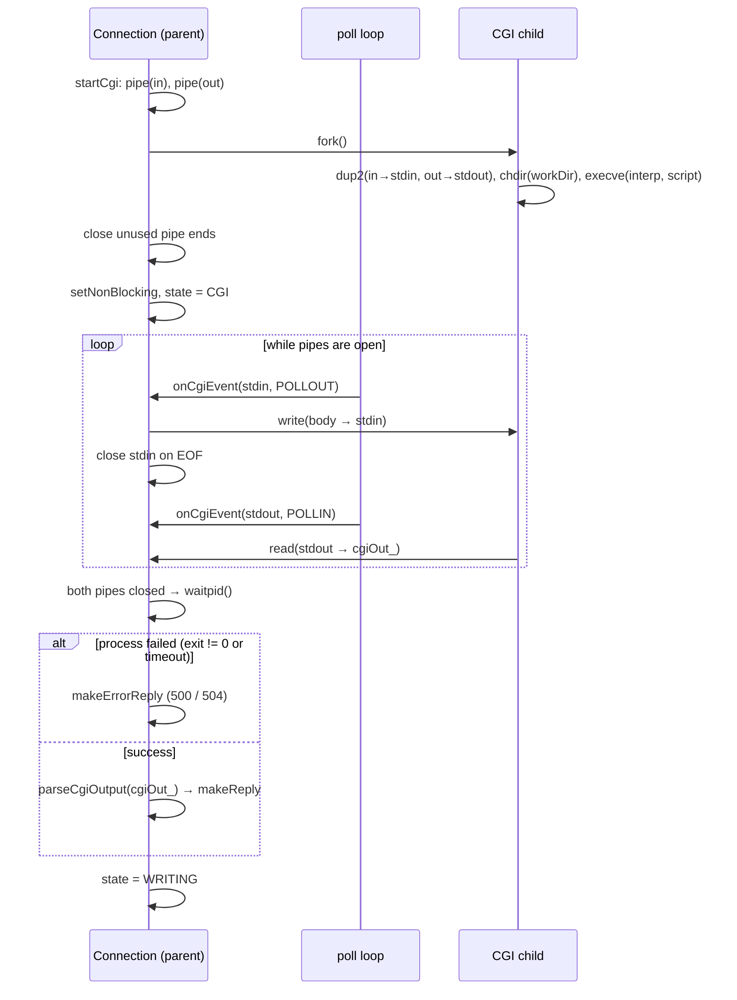

# 10 — CGI: CgiHandler + the Connection CGI branch

## Purpose

Run external scripts (Python, Bash, …) by CGI/1.1 rules: prepare the environment and arguments, fork a process,
feed the request body to its `stdin`, read its `stdout`, and parse that as an HTTP response. Everything is
**non-blocking** — the CGI pipes take part in the same `poll()` as the sockets.

The logic is split across two places:

- **`CgiHandler`** (`namespace Http`) — pure functions with no processes: "is this CGI?", preparing
  arguments/environment, parsing the output.
- **The `Connection` CGI branch** — process and pipe management through the state machine (`state_ == CGI`).

## Files and key functions

| What | Where |
|---|---|
| Is it a CGI request? (by extension) | `Http::isCgiRequest` — `src/CgiHandler.cpp:264` |
| Prepare exe/script/workdir/env | `Http::prepareCgiArgs` — `src/CgiHandler.cpp:56` |
| Parse the script's output | `Http::parseCgiOutput` — `src/CgiHandler.cpp:184` |
| Launch the process (fork/execve/pipe) | `Connection::startCgi` — `src/Connection.cpp:943` |
| Non-blocking exchange with the process | `Connection::onCgiEvent` — `src/Connection.cpp:1077` |
| Which pipe events poll needs | `wantedCgiStdinEvents` / `wantedCgiStdoutEvents` — `src/Connection.cpp:893/906` |
| Cleanup (kill + close) | `closeAllFdsAndKillCgiIfAny` — `src/Connection.cpp:917` |

**Bonus "multiple CGI"**: the interpreter is chosen dynamically by extension from `loc->cgiHandlers`
(a map `ext → exe`), so `.py` and `.sh` work simultaneously in the same `location` (`CgiHandler.cpp:71`).

## Diagram: the lifecycle of a CGI request



## Snippet: fork + execve (the core of `startCgi`)

```cpp
// src/Connection.cpp:943  (abridged)
int inPipe[2], outPipe[2];
::pipe(inPipe); ::pipe(outPipe);
setNonBlocking(inPipe[1]);   // the SERVER-SIDE ends are non-blocking (for poll)
setNonBlocking(outPipe[0]);

pid_t pid = ::fork();
if (pid == 0) {                              // ── CHILD PROCESS ──
    ::close(inPipe[1]); ::close(outPipe[0]);
    ::dup2(inPipe[0],  STDIN_FILENO);        // the request body will arrive on stdin
    ::dup2(outPipe[1], STDOUT_FILENO);       // the script's output goes into the pipe
    if (!workDir.empty()) ::chdir(workDir.c_str());  // the script's relative paths
    char **envp = buildEnvp(cgiEnv);
    char *argv[3] = { (char*)exeAbs.c_str(), (char*)scriptFile.c_str(), 0 };
    ::execve(argv[0], argv, envp);
    ::_exit(127);                            // execve did not return → launch error
}
// ── PARENT (the web server) ──
::close(inPipe[0]); ::close(outPipe[1]);
cgiDeadline_ = std::time(0) + 120;           // timeout against hung scripts
cgiStdinFd_  = inPipe[1];  cgiStdoutFd_ = outPipe[0];  cgiPid_ = pid;
cgiInData_   = req.getBody();                // send the body gradually via poll
state_ = CGI;
if (cgiInData_.empty()) { ::close(cgiStdinFd_); cgiStdinFd_ = -1; cgiStdinClosed_ = true; } // GET: EOF now
```

**Explanation.** Two pipes are created: `inPipe` (server → script's stdin) and `outPipe` (script's stdout →
server). After `fork`, the child redirects its `stdin/stdout` to the right ends, does a `chdir` into the script's
directory (so relative paths inside the script work), and `execve` replaces its image with the interpreter. The
parent stores the **non-blocking** ends in `Connection` fields and switches to `state_ = CGI`. The body is not
written immediately — it's delivered in chunks in `onCgiEvent` on `POLLOUT`. For a request with no body (GET),
stdin is closed immediately, otherwise the script would wait for input forever.

## Snippet: finalization and output parsing (`onCgiEvent`)

```cpp
// src/Connection.cpp:1184  (when both pipes are closed)
if (cgiStdinClosed_ && cgiStdoutClosed_) {
    int st = 0; bool processFailed = false;
    if (cgiPid_ > 0) {
        ::waitpid(cgiPid_, &st, 0);                            // reap the zombie
        if (WIFEXITED(st) && WEXITSTATUS(st) != 0) processFailed = true;
        else if (WIFSIGNALED(st))                  processFailed = true;
        cgiPid_ = -1;
    }
    if (processFailed) { prepareReply(Http::makeErrorReply(500)); state_ = WRITING; return true; }

    int status = 200; std::string type = "text/plain", body;
    if (!Http::parseCgiOutput(status, type, body, cgiOut_))    // parse "Status:/Content-Type:\n\n body"
        prepareReply(Http::makeErrorReply(500));
    else
        prepareReply(Http::makeReply(status, type, body));     // → state_ = WRITING
    return true;
}
```

`parseCgiOutput` separates the CGI headers from the body at the first `\r\n\r\n` (or `\n\n`) and reads `Status:` /
`Content-Type:` (`src/CgiHandler.cpp:184`). The environment for the script (`REQUEST_METHOD`, `QUERY_STRING`,
`CONTENT_LENGTH`, `SCRIPT_FILENAME`, `PATH_INFO`, …) is built in `prepareCgiArgs` (`src/CgiHandler.cpp:113-139`).

## What to look at during review / common bugs

- **Non-blocking CGI**: the server must not hang on a slow/stuck script. Check the `cgiDeadline_` timeout (120s)
  → 504/500 (`src/Connection.cpp:1084`), and that concurrent requests are still served.
- **Stdin is closed** after the body is sent (or immediately for an empty body) — otherwise the script waits for
  EOF forever (`src/Connection.cpp:1065` and `:1164`).
- **`waitpid` is present** — otherwise zombie processes pile up. The `WIFEXITED/WIFSIGNALED` check → 500 on failure.
- **Relative paths**: `chdir(workDir)` before `execve` (`:1027`); the script path is built via
  `safeJoin/safeJoinAlias` (the same traversal shield as static files).
- **CGI/1.1 environment**: `REQUEST_METHOD`, `QUERY_STRING`, `CONTENT_LENGTH` (for POST), `SCRIPT_FILENAME` must
  be present. Compare with the list in `prepareCgiArgs`.
- **Does the interpreter from the config exist?** If `cgi .py /opt/pyenv/shims/python3` but that path is missing —
  `execve` fails, the child does `_exit(127)`, the parent returns 500. That's correct behavior (the server is
  alive), but it's easy to mistake for a "CGI bug" at the defense — check the environment.
- **Multi-CGI (bonus)**: `.py` and `.sh` in the same `location` → different interpreters from `cgiHandlers`
  (`conf/tester.conf:27-28`).

---

Back to the table of contents: [`README.md`](README.md).
