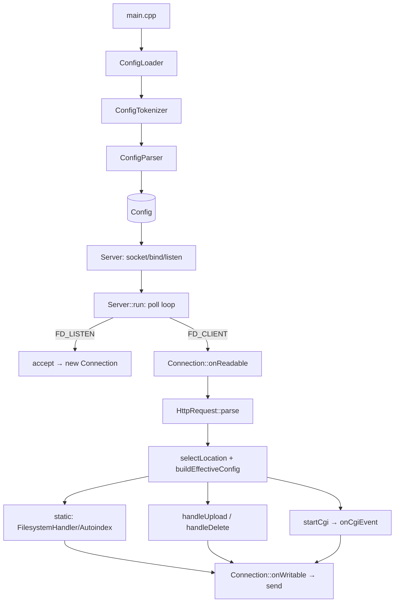

# 11 — Разбор модулей и flow программы (по этапам)

Этот файл — «сквозной прогон» webserv: как запрос проходит через модули от запуска процесса до
байтов в сокете клиента. Полезно и для понимания архитектуры, и для защиты (в конце — лист
вопросов-ответов ревьюера 42).

## Карта глобального flow (4 этапа)

```
[ЭТАП 1: Создание и Парсинг]
main.cpp ──> ConfigLoader ──> ConfigTokenizer ──> ConfigParser ──> Config / структуры

[ЭТАП 2: Инициализация ядра]
Server (конструктор) ──> createListenSocket: socket → setsockopt(SO_REUSEADDR)
                          → setNonBlocking → bind → listen ──> мастер-сокеты + pollfd

[ЭТАП 3: Жизненный цикл (Reactor-цикл — «мясо» сервера)]
Server::run() ──> poll()  ──┬──> новое подключение?  ──> accept() ──> new Connection
                            └──> активность клиента?  ──> Connection::onReadable()

[ЭТАП 4: Конвейер HTTP и генерация ответа]
onReadable ──> HttpRequest::parse()                 (парсинг)
           ──> selectLocation + EffectiveConfig     (роутинг/матчинг)
           ──> ┌ статика  ──> FilesystemHandler / Autoindex / потоковый стриминг
               ├ методы   ──> handleDelete / handleUpload
               └ динамика ──> startCgi ──> onCgiEvent (пайпы, неблокирующий waitpid)
           ──> Connection::onWritable() ──> send() клиенту
```



---

## ЭТАП 1 — Создание и парсинг

`main.cpp` → `ConfigLoader` → `ConfigTokenizer` (лексемы) → `ConfigParser` (грамматика) →
`Config` (дерево структур `ServerConfig`/`LocationConfig`/`ListenConfig`).

**Как это сделано.** По числу аргументов выбирается источник конфига; путь к файлу разбирается
лексером и парсером, дефолт строится в памяти. Подробно про сам конфиг-слой — в
[`04-config.md`](04-config.md).

**Сниппет** (`src/main.cpp:34-57`):

```cpp
Config cfg;
if (argc == 1)
    cfg = ConfigLoader::loadDefault();             // дефолтный server{} на :8080
else if (argc == 2)
{
    if (std::string(argv[1]) == "--check-config")  // только проверить синтаксис и выйти
    { cfg = ConfigLoader::loadDefault(); std::cout << "OK: default config\n"; return 0; }
    cfg = ConfigLoader::loadFromFile(argv[1]);     // Tokenizer + Parser → Config
}
// ...
Server s(cfg);   // ← ЭТАП 2
s.run();         // ← ЭТАП 3
```

**Пример проверки.**

```bash
./webserv --check-config conf/tester.conf   # синтаксис ок → "OK: ...", exit 0
./webserv conf/broken.conf                  # ошибка в конфиге → "Fatal: ...", exit 1 (не падает в кор)
```

---

## ЭТАП 2 — Инициализация ядра

Для каждой пары `host:port` из конфига создаётся **мастер-сокет** (слушающий). Шаги классические:
`socket → setsockopt(SO_REUSEADDR) → setNonBlocking → bind → listen`.

**Как это сделано.** `createListenSocket` создаёт неблокирующий TCP-сокет, разрешает
переиспользование адреса (чтобы не ждать `TIME_WAIT` после рестарта), привязывает к адресу и
переводит в режим прослушивания. Все слушающие fd попадут в `pollfd`-массив этапа 3.

**Сниппет** (`src/Server.cpp:48-114`, сокращённо):

```cpp
int listenFd = ::socket(AF_INET, SOCK_STREAM, 0);          // TCP/IPv4
if (listenFd < 0) throw std::runtime_error("socket failed");

int yes = 1;
::setsockopt(listenFd, SOL_SOCKET, SO_REUSEADDR, &yes, sizeof(yes));  // быстрый рестарт
setNonBlocking(listenFd);                                   // ← ключ к неблокирующей модели

struct sockaddr_in addr = {};
addr.sin_family = AF_INET;
addr.sin_port   = htons(static_cast<unsigned short>(port)); // host→network byte order
::inet_pton(AF_INET, host.c_str(), &addr.sin_addr);

if (::bind(listenFd, (struct sockaddr *)&addr, sizeof(addr)) < 0)
    throw std::runtime_error("bind failed");
if (::listen(listenFd, 128) < 0)                            // backlog очереди = 128
    throw std::runtime_error("listen failed");
```

**Пример проверки.**

```bash
./webserv conf/2serv.conf &                  # два server{} с разными портами
ss -tlnp | grep -E ':8080|:8081'             # оба порта в LISTEN
# дубль порта в конфиге должен падать на старте:
./webserv conf/dup_port.conf                 # bind failed → "Fatal: ...", exit 1
```

---

## ЭТАП 3 — Жизненный цикл (Reactor-цикл)

Сердце сервера: **единственный** `poll()` в `Server::run()`. Он одновременно следит за чтением и
записью на всех fd (слушающие сокеты, клиентские сокеты, CGI-пайпы) и раздаёт события обработчикам.

**Как это сделано.** На каждой итерации `buildPollFds()` собирает актуальный массив `pollfd` (у
каждого `Connection` спрашивается, какие события ему интересны), затем один `::poll()` ждёт до 1 с.
По `revents` событие диспетчеризуется по типу fd: `FD_LISTEN` → `accept`, `FD_CLIENT` →
`onReadable/onWritable`, иначе → CGI-пайп. При закрытии клиента цикл прерывается (`break`), потому
что массивы `pollFds_`/`fdEntries_` нужно пересобрать.

**Сниппет — цикл** (`src/Server.cpp:392-438`, сокращённо):

```cpp
while (true)
{
    buildPollFds();                                       // pollFds_[i] ↔ fdEntries_[i]
    if (pollFds_.empty()) continue;

    int eventCount = ::poll(&pollFds_[0], pollFds_.size(), 1000);  // ЕДИНСТВЕННЫЙ poll
    if (eventCount <= 0) continue;

    for (size_t i = 0; i < pollFds_.size(); ++i)
    {
        if (pollFds_[i].revents == 0) continue;
        const FdEntry &e = fdEntries_[i];
        short re = pollFds_[i].revents;

        if      (e.kind == FD_LISTEN) handleListenEvent(e, re);     // accept()
        else if (e.kind == FD_CLIENT) clientClosed = handleClientEvent(e, re);
        else                          clientClosed = handleCgiEvent(e, re);

        if (clientClosed) break;     // fdEntries_ инвалидирован → пересобрать на следующей итерации
    }
}
```

**Сниппет — accept** (`src/Server.cpp:351-389`, сокращённо):

```cpp
while (true)                                          // принимаем всех из очереди за один poll
{
    int clientFd = ::accept(listenFd, ...);
    if (clientFd < 0)                                 // правило 42: НЕ смотрим errno —
        return;                                       // просто выходим, poll разбудит снова
    setNonBlocking(clientFd);
    connections_.insert(std::make_pair(clientFd, Connection(clientFd, &cfg_, serverIndex)));
}
```

**Пример проверки.**

```bash
# параллельные клиенты обслуживаются одним poll, сервер не блокируется:
curl -s "$BASE/" & curl -s "$BASE/" & curl -s "$BASE/" & wait
```

---

## ЭТАП 4 — Конвейер HTTP и генерация ответа

Когда на клиентском fd есть данные, `Connection::onReadable` дочитывает их, парсит запрос и —
если запрос собран целиком — маршрутизирует в одну из веток. Ответ уходит в `onWritable → send`.

**Как это сделано.** `recv` → `HttpRequest::parse` (инкрементально, см. [`07`](07-http-request.md))
→ при `COMPLETE` выбирается location (`selectLocation`) и сливается конфиг (`buildEffectiveConfig`)
→ строгий порядок проверок: лимит тела (413) → редирект → метод (405) → DELETE / upload / CGI /
статика. Каждая ветка кладёт ответ в `out_` и переводит соединение в `WRITING` (или в `CGI`).

**Сниппет — роутинг** (`src/Connection.cpp:520-655`, сокращённо):

```cpp
ssize_t n = ::recv(fd_, buf, sizeof(buf), 0);
if (n <= 0) return false;                                   // 0/<0 → Server закроет соединение
in_.append(buf, n);

HttpRequest::State st = request_.parse(in_, maxHeaderBytes, maxBodyBytes);
if (st == HttpRequest::ERROR)    { out_ = HttpResponse::buildErrorResponse(...); state_ = WRITING; return true; }
if (st != HttpRequest::COMPLETE) return true;              // ещё не всё пришло — остаёмся READING

const LocationConfig *loc = selectLocation(srv.locations, uri);   // самый длинный префикс
EffectiveConfig       eff = buildEffectiveConfig(srv, loc);       // server → location

if (eff.hasClientMaxBodySize && request_.getContentLength() > eff.clientMaxBodySize)
    { out_ = HttpResponse::buildErrorResponse(413); state_ = WRITING; return true; }
if (eff.hasRedirect)                 { out_ = HttpResponse::buildRedirectResponse(...); state_ = WRITING; return true; }
if (!isAllowedMethod(method, eff))   { out_ = HttpResponse::buildErrorResponse(405); state_ = WRITING; return true; }

if (method == "DELETE")              return handleDelete(eff);            // src/Connection.cpp:337
if ((method=="POST"||method=="PUT") && loc && loc->hasUploadDir)
                                     return handleUpload(eff, loc);       // src/Connection.cpp:405
if (Http::isCgiRequest(loc, uri))    { startCgi(eff, loc, request_); return true; }  // → state CGI
Http::HttpReply rep = Http::buildFileSystemReply(eff, loc, uri);          // статика
return prepareReply(rep);
```

**Сниппет — отправка** (`src/Connection.cpp:786`, две фазы):

```cpp
if (!out_.empty()) {                            // фаза 1: заголовки/маленький ответ из буфера
    ssize_t n = ::send(fd_, out_.c_str(), out_.size(), 0);
    if (n <= 0) return false;
    out_.erase(0, n);
    if (!out_.empty()) return true;             // частичная запись — ждём след. POLLOUT
}
if (fileStreamFd_ >= 0) { /* фаза 2: большой файл стримим по 8KB, не держим в памяти */ }
```

**Пример проверки.**

```bash
curl -s -o /dev/null -w "%{http_code}\n" "$BASE/"                 # 200 (статика)
curl -s -o /dev/null -w "%{http_code}\n" "$BASE/notfound"         # 404
curl -s -o /dev/null -w "%{http_code}\n" -X POST --data x "$BASE/" # 405 (location / только GET)
curl -s "$BASE/cgi-bin/test.py"                                   # вывод CGI, 200
```

---


# Лист защиты: вопросы ревьюера 42 и ответы (с кодом)

Ниже — вопросы из официального оценочного листа и короткие ответы со ссылкой на код. Это шпаргалка
«что показать пальцем» на защите.

## Установка siege и базовые вопросы

```bash
# Установка siege (для стресс-теста, см. раздел «Siege» ниже)
sudo apt-get install -y siege      # Debian/Ubuntu
brew install siege                 # macOS
```

**В: Объясните основы HTTP-сервера.**
О: Сервер слушает TCP-порт, принимает соединения, читает HTTP-запрос (request line + заголовки +
тело), маршрутизирует по URI/методу, формирует HTTP-ответ (статус + заголовки + тело) и отправляет
обратно. Подробно — в [`../README.md`](../README.md) и [`03-architecture.md`](03-architecture.md).

**В: Какую функцию I/O-мультиплексирования использует команда?**
О: `poll()` — `src/Server.cpp:404`. (Допустимы `select/poll/epoll/kqueue`; у нас `poll`.)

**В: Как работает `select()`/эквивалент?**
О: `poll()` принимает массив `pollfd` (fd + интересующие события `POLLIN/POLLOUT`), блокируется до
готовности хотя бы одного fd или таймаута, и в `revents` помечает готовые. Мы обрабатываем только
готовые fd — без блокировок на конкретном сокете.

**В: Один ли `poll()`? Как сервер одновременно и accept-ит, и read/write-ит клиента?**
О: Да, **единственный** `poll()` в главном цикле `Server::run()` (`src/Server.cpp:404`). В один и
тот же массив попадают и слушающие сокеты, и клиентские, и CGI-пайпы. `buildPollFds()` для каждого
`Connection` выставляет `POLLIN` (когда читаем) или `POLLOUT` (когда есть что слать) —
`wantedPollEvents()`, `src/Connection.cpp:273`. То есть чтение и запись проверяются **одновременно**
в одном `poll`.

> ⚠️ Критерий 0 баллов: если `poll` не в главном цикле или не проверяет read и write
> одновременно. У нас — проверяет (`POLLIN|POLLOUT` в одном массиве).

**В: Не более одного read/write на клиента за один `poll()`?**
О: Да. За одно событие `onReadable` делает один `::recv` (`src/Connection.cpp:525`), `onWritable` —
один `::send` (`src/Connection.cpp:786`). Никаких циклов «читать до конца» на сокете.

**В: При ошибке read/recv/write/send клиент удаляется?**
О: Да. `onReadable`/`onWritable` возвращают `false` при `n <= 0`, и `Server` закрывает соединение
(`closeConnection`, `src/Server.cpp:327`).

**В: Проверяется ли возвращаемое значение (и 0, и -1)?**
О: Да: `if (n == 0) return false;` (клиент закрыл) и `if (n < 0) return false;` (ошибка) —
`src/Connection.cpp:526-532`. Оба случая обработаны.

**В: Проверяется ли `errno` после read/write?**
О: **Нет** — это правило сабжекта (проверка `errno` после I/O = 0 баллов). Любой `< 0` просто
завершает операцию, мы доверяем `poll`. См. комментарий в `acceptPendingConnections`
(`src/Server.cpp:367-371`).

**В: Есть ли I/O мимо `poll()`?**
О: На сокетах/пайпах — нет, всё через `poll`. Чтение файлов с диска (`read`/`open` для статики и
upload) — это не сокеты; большие файлы стримятся кусками в `onWritable` под `POLLOUT`.

**В: Проект компилируется без re-link проблем?**
О: `make re` собирает с `-Wall -Wextra -Werror -std=c++98 -fsanitize=address` без варнингов;
`make` повторно — без перекомпиляции/re-link (корректные зависимости в Makefile).

## Configuration

| Что проверить | Команда / конфиг | Где в коде |
|---|---|---|
| Несколько серверов на разных портах | `conf/2serv.conf`; `curl :8080/`, `curl :8081/` | `ServerConfig.listens`, `Server::run` |
| Разные hostname | `curl --resolve example.com:8080:127.0.0.1 http://example.com/` | `server_name` / выбор сервера |
| Своя страница 404 | `error_page 404 /404.html;` → `curl -i $BASE/nope` | `buildErrorResponse` |
| Лимит тела | `curl -X POST -H "Content-Type: plain/text" --data "..." $BASE/post_body` → 413 | `Connection.cpp:604` |
| Маршруты в разные каталоги | `root`/`alias` в `location` | `safeJoin`/`safeJoinAlias`, `Path.cpp:132` |
| Индекс-файл для каталога | `index index.html;` | `FilesystemHandler` |
| Список методов на маршрут | `allow_methods GET;` → DELETE с/без прав | `isAllowedMethod`, `Connection.cpp:180` |

> Замечание ревьюера: статус-коды должны быть **корректными**. Сверь `reasonPhrase`
> (`src/HttpResponse.cpp:26`) — там 200/301/403/404/405/413/500 и т.д.

## Basic checks

```bash
curl -s -o /dev/null -w "%{http_code}\n" "$BASE/"                  # GET   → 200
curl -s -o /dev/null -w "%{http_code}\n" -X POST --data x "$BASE/upload/a.txt"  # POST → 201
curl -s -o /dev/null -w "%{http_code}\n" -X DELETE "$BASE/upload/a.txt"         # DELETE → 200/204
printf 'WTF / HTTP/1.1\r\n\r\n' | nc -w1 "$HOST" "$PORT"           # UNKNOWN-метод → НЕ крашит
curl -s -o up.txt "$BASE/upload/a.txt"                            # выгрузили файл обратно
```
Каждый тест возвращает корректный статус; неизвестный запрос не роняет сервер
(`HttpRequest::parse` → 400/405, не краш).

## Check CGI

```bash
curl -s "$BASE/cgi-bin/test.py"                       # GET-CGI → 200, вывод скрипта
curl -s -X POST --data "name=42" "$BASE/cgi-bin/test.py"   # POST-CGI: тело идёт скрипту на stdin
```
- Запуск в правильном каталоге: перед `execve` дочерний процесс делает `chdir(workDir)`
  (см. [`10-cgi.md`](10-cgi.md), `startCgi`).
- GET и POST: переменные окружения CGI/1.1, `CONTENT_LENGTH` для POST (`CgiHandler.cpp:131-135`).
- Ошибки/бесконечный цикл: таймаут `cgiDeadline_` (120с) → 504/500; падение скрипта (`_exit(127)` /
  сигнал) ловится `waitpid` → 500. **Сервер не падает**, ошибка видна клиенту.

```bash
# скрипт с бесконечным циклом → сервер выживает, возвращает 504/500 по таймауту
curl -s -o /dev/null -w "%{http_code}\n" "$BASE/cgi-bin/loop.py"
```

## Check with a browser

Открыть DevTools → Network, зайти на `$BASE/`:
- Request/Response headers видны (`Content-Type`, `Content-Length`, `Connection: close`).
- Статический сайт отдаётся целиком (html/css/png — корректные `Content-Type`, `Mime.cpp`).
- Неверный URL → страница 404; каталог → autoindex (если включён); редирект-URL → 301/302 с
  `Location`.

## Port issues

- Несколько портов + разные сайты в браузере — каждый порт отдаёт свой `root`.
- Один и тот же порт дважды в конфиге → старт падает (`bind failed`).
- Несколько инстансов с общим портом — второй `bind` на занятый порт не пройдёт; если одна из
  конфигураций нерабочая — сервер не должен «магически» работать на её порту.

## Siege & stress test

```bash
siege -b -t30S "$BASE/"          # бенчмарк 30 секунд на пустую страницу
```
- **Availability ≥ 99.5%** на простом GET (`siege -b`).
- **Нет утечек памяти**: следи за RSS процесса — не должен расти бесконечно
  (`ps -o rss= -p $(pgrep webserv)` в цикле; либо сборка с ASan уже ловит leaks).
- **Нет зависших соединений**: после `siege` нет «висящих» в `ESTABLISHED` без активности.
- `siege -b` можно гонять **бесконечно** без рестарта сервера.

---

Назад к оглавлению: [`README.md`](README.md).
---

Назад к оглавлению: [`README.md`](README.md).
